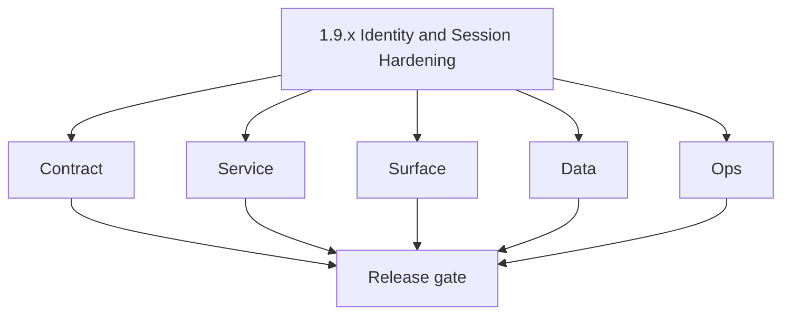
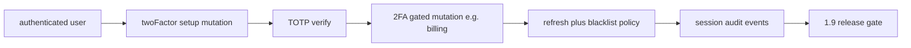

# Version 1.9 — Identity and Session Hardening

- **Status:** ✅ Completed
- **Codename:** Identity and Session Hardening  
- **Era:** 1.x  
- **Roadmap:** **`twoFactor`**, **profile** security — extends **1.1** user auth  
- **Summary:** **2FA** setup/verify mutations, **TOTP** flow, optional **step-up** for billing/admin actions, **session** lifecycle hardening (refresh, blacklist).  
- **Patch closure:** Every codenamed patch file includes **Micro-gate** + **Service task slices**. Era hub: [`versions.md`](../versions.md).

## Scope

- **Target:** `1.9.x` — reduce account takeover risk for billed users.

## Flowchart

### Runtime focus (unique to this minor)

## Task tracks

### Contract

- ✅ Completed: 📌 Planned: `twoFactor` module in schema — align with `docs/backend/apis` stubs.

### Service

- ✅ Completed: 📌 Planned: Secure secret storage for TOTP seed; constant-time verify.
- ✅ Completed: 📌 Planned: Recovery codes policy (optional).

### Surface

- ✅ Completed: 📌 Planned: Enrollment UX; QR display; backup codes download.

### Data

- ✅ Completed: 📌 Planned: `two_factor_secrets` or column on users — encrypted at rest.

### Ops

- ✅ Completed: 📌 Planned: Lockout / support reset runbook.

## Task Breakdown

- Appointment360: `twoFactor` mutations per analysis schema list.

## Immediate next execution queue

- 📌 Planned: Negative test: wrong TOTP; ensure no oracle timing leaks in logs.

## Cross-service ownership

| Owner | Role |
| --- | --- |
| API | 2FA backend |
| App | Enrollment UX |
| Security | Threat model |

## References

- [`docs/codebases/appointment360-codebase-analysis.md`](../codebases/appointment360-codebase-analysis.md) — `twoFactor` in schema  
- [`docs/codebases/app-codebase-analysis.md`](../codebases/app-codebase-analysis.md)

## Backend API and Endpoint Scope

- `twoFactor`, `profile` mutations; step-up on `billing` if product requires.

## Database and Data Lineage Scope

- 2FA secrets, audit of enable/disable.

## Frontend UX Surface Scope

- Security settings page, confirmations.

## UI Elements Checklist

- 📌 Planned: QR code panel  
- 📌 Planned: OTP input  
- 📌 Planned: Recovery codes  

## Flow / Graph Delta for This Minor

- **Delta:** **Second factor** and **step-up** — distinct from rate limiting (`1.7`).

## Audit and Compliance Notes

- Audit **2fa_enabled**, **2fa_disabled**, failed attempts (careful with PII).

## Patch ladder (`1.9.0` – `1.9.9`)

### Micro-gate reference (apply at every `1.N.P`)

| Track | Gate question (must answer Yes or document waiver) |
| --- | --- |
| **Contract** | Did any GraphQL / REST contract change? Diff vs `docs/backend/apis/`; billing idempotency keys documented? |
| **Service** | Auth, credit deduction, and billing paths still smoke for affected services? |
| **Surface** | App, admin, root, or extension billing UX changed? Role + entitlement checks? |
| **Frontend** | Which routes/components apply for this minor (see **Frontend UX Surface Scope**)? |
| **Data** | Migrations or lineage for credits, subscriptions, usage/ledger, payment proofs? |
| **Ops** | Observability, rollback, secrets; fraud/abuse runbooks where relevant? |

**Patch intent bands:** `.0` charter · `.1`–`.2` P0-heavy **Service task slices** · `.3`–`.6` P1 / surface-data · `.7`–`.9` ops + minor freeze.

Theme: **Key**.

| Patch | Codename | Focus |
| --- | --- | --- |
| `1.9.0` | Factor | Charter |
| `1.9.1` | Secret | Storage |
| `1.9.2` | Code | TOTP |
| `1.9.3` | Verify | Server |
| `1.9.4` | Challenge | Step-up |
| `1.9.5` | Session | Refresh |
| `1.9.6` | Token | Blacklist tie-in |
| `1.9.7` | Revoke | Device logout |
| `1.9.8` | Enforce | Policy |
| `1.9.9` | Seal | Seal freeze |

### 1.9.0 — Factor (Charter)

**Contract**

- Freeze 2FA contract surface:
  - `TwoFactorQuery.get2FAStatus`,
  - `TwoFactorMutation.setup2FA`, `verify2FA`, `disable2FA`,
  - backup codes flow: `regenerateBackupCodes`.
  (per [`docs/backend/apis/27_TWO_FACTOR_MODULE.md`](../backend/apis/27_TWO_FACTOR_MODULE.md).)

**Service**

- Implement TOTP setup with secure secret hashing and record creation/update behavior for the authenticated user only.

**Surface**

- Profile/security UX includes 2FA status + enable/disable flows:
  - endpoints bind to `twoFactorService` via `use2FA`,
  - UI includes `TwoFactorModal` (QR + OTP).

**Data**

- Validate 2FA data lineage for the 2FA record:
  - secret hash storage,
  - enabled/verified flags,
  - backup codes hash.

**Ops**

- Enrollment happy-path smoke test:
  - Setup2FA → Verify2FA → enabled+verified state reflected in profile.

Codebases: `[appointment360][app]`

### 1.9.1 — Secret (Storage)

**Contract**

- Secret storage contract:
  - secret and backup codes are stored as hashes (no raw secret persisted).

**Service**

- Ensure `setup2FA` writes secure values:
  - `secret_hash`, `backup_codes_hash`,
  - sets `enabled=false` until verification succeeds (verified flag semantics per module doc).

**Surface**

- Ensure QR/secret is shown only once (UI does not re-render secret after refresh).

**Data**

- Confirm 2FA record schema supports:
  - `enabled`, `verified`, and hashed codes.

**Ops**

- Negative test:
  - secret/backup codes never appear in logs/audit bodies.

Codebases: `[appointment360]`

### 1.9.2 — Code (TOTP)

**Contract**

- Define the OTP verification variable contract:
  - `verify2FA(code: String!)` expects correct code format.

**Service**

- Implement constant-time verify behavior (avoid oracle timing leaks).
- Confirm placeholder TOTP generation caveats are documented in implementation notes (module doc indicates placeholder; ensure it won’t leak in production config).

**Surface**

- OTP input UI accepts digits with correct validation and clear “try again” on mismatch.

**Data**

- No new schema required; verification updates the `verified` flag.

**Ops**

- Negative tests:
  - wrong TOTP must not enable 2FA and must be logged safely.

Codebases: `[appointment360][app]`

### 1.9.3 — Verify (Server)

**Contract**

- Verify contract:
  - `verify2FA` returns `verified: Boolean` and, when successful, optional `backup_codes`.

**Service**

- Verification succeeds → set `enabled=true`, `verified=true`.
- On success, backup codes regenerate if policy requires.

**Surface**

- After verification, UI shows:
  - enabled state,
  - backup codes once (if returned) and encourages secure storage.

**Data**

- Backup codes hashes update and old hashes become invalid.

**Ops**

- Smoke:
  - Verify2FA end-to-end and confirm profile shows `enabled=true, verified=true`.

Codebases: `[appointment360][app]`

### 1.9.4 — Challenge (Step-up)

**Contract**

- Define step-up gating rules:
  - billing/admin mutations require a “2FA verified” challenge for certain actions.

**Service**

- Implement step-up decision:
  - if user has 2FA enabled+verified, allow;
  - otherwise require step-up path before executing sensitive mutations.

**Surface**

- UI triggers step-up challenge before:
  - credit/admin actions,
  - payment approval/review flows where policy demands it.

**Data**

- Store/derive challenge state without persisting sensitive OTP/code.

**Ops**

- Test:
  - 2FA disabled user cannot call billing/admin critical mutations.

Codebases: `[appointment360][app][admin]`

### 1.9.5 — Session (Refresh)

**Contract**

- Session refresh contract:
  - refresh after 2FA enrollment remains valid and does not implicitly bypass step-up.

**Service**

- Refresh token behavior aligns with JWT refresh contract and blacklist checks.

**Surface**

- AuthContext/session UI handles re-auth prompts cleanly (no infinite refresh loops).

**Data**

- No schema changes required; ensure challenge state does not break session refresh.

**Ops**

- Test:
  - enable 2FA → refresh session → verify step-up behavior remains enforced for sensitive actions.

Codebases: `[appointment360][app]`

### 1.9.6 — Token (Blacklist tie-in)

**Contract**

- Ensure token blacklist semantics remain compatible with 2FA:
  - revoked tokens never get access on refresh.

**Service**

- Logout should:
  - add JWT tokens to `token_blacklist`,
  - invalidate session behavior regardless of 2FA state.

**Surface**

- UI after logout and then refresh requires login (safe error messages).

**Data**

- `token_blacklist` lineage:
  - `token_hash` hashed token string,
  - `expires_at` derived from JWT exp (per `appointment360_data_lineage`).

**Ops**

- Negative test:
  - logout → refresh_token → access is denied (even with valid refresh).

Codebases: `[appointment360]`

### 1.9.7 — Revoke (Device logout)

**Contract**

- Define session revocation surface:
  - profile session list includes `RevokeSession` mutation.

**Service**

- Ensure `RevokeSession` invalidates session tokens and produces consistent behavior in subsequent authenticated requests.

**Surface**

- Profile/security:
  - “Revoke All Other Sessions” and per-session revoke actions update UI state.

**Data**

- Session revocation ties back to token/session storage mechanism used by auth layer.

**Ops**

- Smoke:
  - revoke session → attempt to use token fails.

Codebases: `[appointment360][app]`

### 1.9.8 — Enforce (Policy)

**Contract**

- Freeze enforcement policy:
  - step-up rules and 2FA required states do not drift during patch.

**Service**

- Ensure policy enforcement does not break:
  - `me` query,
  - `usage` query,
  - non-sensitive routes.

**Surface**

- UI remains consistent:
  - users only see challenge where required.

**Data**

- Confirm no leakage:
  - secrets are never returned by `get2FAStatus`.

**Ops**

- OWASP-aligned spot checks:
  - no oracle/timing leaks,
  - correct authorization boundaries.

Codebases: `[appointment360][app]`

### 1.9.9 — Seal (Seal freeze)

**Contract**

- Freeze 1.9 contract for handoff to `1.10` ops exit gate.

**Service**

- Integration gates:
  - setup/verify,
  - step-up gating,
  - refresh + blacklist behavior.

**Surface**

- Enrollment UX:
  - QR panel + OTP input + backup codes download is consistent across reload.

**Data**

- Evidence:
  - sample 2FA enabled/disabled transitions exist for auditing.

**Ops**

- Release sign-off before moving to `1.10` operational maturity.

Codebases: `[appointment360][app][admin]`

## Release Gate and Evidence

### Master Task Checklist

- 📌 Planned: security review note

### Backend API and Endpoints

- 📌 Planned: 2FA contract

### Database and Data Lineage

- 📌 Planned: encryption note

### Frontend UX

- 📌 Planned: enrollment demo

### UI Elements

- 📌 Planned: checklist

### Flow and Graph

- 📌 Planned: step-up diagram

### Validation

- 📌 Planned: OWASP-aligned spot checks

### Release Gate

- 📌 Planned: `1.10`

## Patches

| Patch | Codename | Doc |
| --- | --- | --- |
| `1.9.0` | Factor | [`1.9.0` — Factor](1.9.0 — Factor.md) |
| `1.9.1` | Secret | [`1.9.1` — Secret](1.9.1 — Secret.md) |
| `1.9.2` | Code | [`1.9.2` — Code](1.9.2 — Code.md) |
| `1.9.3` | Verify | [`1.9.3` — Verify](1.9.3 — Verify.md) |
| `1.9.4` | Challenge | [`1.9.4` — Challenge](1.9.4 — Challenge.md) |
| `1.9.5` | Session | [`1.9.5` — Session](1.9.5 — Session.md) |
| `1.9.6` | Token | [`1.9.6` — Token](1.9.6 — Token.md) |
| `1.9.7` | Revoke | [`1.9.7` — Revoke](1.9.7 — Revoke.md) |
| `1.9.8` | Enforce | [`1.9.8` — Enforce](1.9.8 — Enforce.md) |
| `1.9.9` | Seal | [`1.9.9` — Seal](1.9.9 — Seal.md) |
