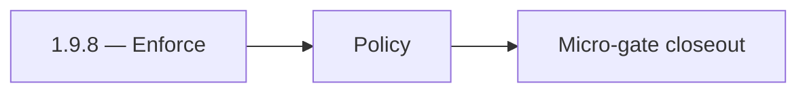

# 1.9.8 — Enforce

- **Era:** `1.x` User/billing/credit — hub [`versions.md`](../versions.md) · minors start at [`1.0 — User Genesis`](1.0%20%E2%80%94%20User%20Genesis.md)
- **Minor:** [1.9 — Identity and Session Hardening](./1.9 — Identity and Session Hardening.md)
- **Codename:** Enforce
- **Status:** ✅ Completed
## Focus
Policy

## Flowchart

## Micro-gate

| Track | Gate question | Answer / Evidence (fill at patch closeout) |
| --- | --- | --- |
| **Contract** | GraphQL / REST changes? Diff vs `docs/backend/apis/` or task pack; billing idempotency keys if mutations touched. | Document at patch closeout. |
| **Service** | Auth, credit deduction, billing state machine, and downstream Lambdas still pass smoke? | Document smoke paths. |
| **Surface** | App / admin / root / extension billing UX changed? Role + entitlement checks? | Document UX delta or N/A. |
| **Frontend** | Which routes/components must render or change for this patch? | 2FA enrollment, security settings surfaces. Document at closeout. |
| **Data** | `credits`, `subscriptions`, `plans`, `payment_submissions`, usage/ledger — migrations + lineage? | Document migrations/lineage or N/A. |
| **Ops** | Billing observability, rollback, secret rotation; fraud/abuse delta for `1.10` patches. | Document ops delta or N/A. |

## Tasks
### Contract
- ✅ Completed: Freeze enforcement policy:
- ✅ Completed: step-up rules and 2FA required states do not drift during patch.

### Service
- ✅ Completed: Ensure policy enforcement does not break:
- ✅ Completed: `me` query,
- ✅ Completed: `usage` query,
- ✅ Completed: non-sensitive routes.

### Surface
- ✅ Completed: UI remains consistent:
- ✅ Completed: users only see challenge where required.

### Data
- ✅ Completed: Confirm no leakage:
- ✅ Completed: secrets are never returned by `get2FAStatus`.

### Ops
- ✅ Completed: OWASP-aligned spot checks:
- ✅ Completed: no oracle/timing leaks,
- ✅ Completed: correct authorization boundaries.

Codebases: `[appointment360][app]`

## Service task slices
> Merged from era `1.x` user/billing task packs (P0→`.0`–`.2`, P1→`.3`–`.6`, Ops→`.7`–`.9`).

### Appointment360 (gateway)
- Wire GraphQL Idempotency-Key to billing mutations in Postman collection
- Write test: login → me → logout → me → error flow
- Write test: register → consume credit → query usage → low-credit guard

### contact.ai
- [ ] Rotate `API_KEY` secret in secrets manager alongside other `1.x` secret rotation.
- [ ] Add `LAMBDA_AI_API_URL` to `appointment360` deploy environment (value may be placeholder in `1.x`).
- [ ] IAM policy review: Lambda execution role for contact.ai has least-privilege RDS/Secrets access.
- [ ] Add contact.ai health endpoint to monitoring dashboard health grid.

## Evidence gate
Patch closeout includes contract diff, smoke output, data lineage delta, and ops note
