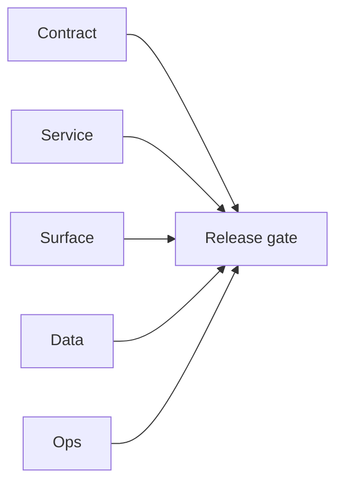

# 1.x Era Docs

Execution guide for Contact360 `1.x.x` era delivery.

## Era objective

- Define and deliver a stable era contract across Contract/Service/Surface/Data/Ops tracks.
- Ensure every patch packet carries closeout evidence before release handoff.

## Minor index

| Minor | Title | Status | Doc |
| --- | --- | --- | --- |
| `1.0` | User Genesis | ✅ Completed | [`1.0 - User Genesis`](1.0%20—%20User%20Genesis.md) |
| `1.1` | Billing Maturity | in_progress | [`1.1 - Billing Maturity`](1.1%20—%20Billing%20Maturity.md) |
| `1.2` | Analytics Bedrock | planned | [`1.2 - Analytics Bedrock`](1.2%20—%20Analytics%20Bedrock.md) |
| `1.3` | Payment Gateway | planned | [`1.3 - Payment Gateway`](1.3%20—%20Payment%20Gateway.md) |
| `1.4` | Usage Ledger | planned | [`1.4 - Usage Ledger`](1.4%20—%20Usage%20Ledger.md) |
| `1.5` | Notification Rail | planned | [`1.5 - Notification Rail`](1.5%20—%20Notification%20Rail.md) |
| `1.6` | Admin Control Plane | planned | [`1.6 - Admin Control Plane`](1.6%20—%20Admin%20Control%20Plane.md) |
| `1.7` | Security Hardening | planned | [`1.7 - Security Hardening`](1.7%20—%20Security%20Hardening.md) |
| `1.8` | Credit Pack Maturity | planned | [`1.8 - Credit Pack Maturity`](1.8%20—%20Credit%20Pack%20Maturity.md) |
| `1.9` | Identity and Session Hardening | planned | [`1.9 - Identity and Session Hardening`](1.9%20—%20Identity%20and%20Session%20Hardening.md) |
| `1.10` | Billing and User Ops Exit Gate | planned | [`1.10 - Billing and User Ops Exit Gate`](1.10%20—%20Billing%20and%20User%20Ops%20Exit%20Gate.md) |

## Patch ladder overview

- `1.0.x`: Genesis, Spark, Flame, Kindle, Blaze, Torch, Ember, Fuel, Flare, Ignite
- `1.1.x`: Channel, Intake, Valve, Pump, Flow, Pressure, Surge, Vent, Drain, Release
- `1.2.x`: Bearing, Heading, North, Chart, Course, Horizon, Waypoint, Drift, True, Anchor
- `1.3.x`: Keycard, Lock, Ledger, Proof, Submit, Review, Approve, Credit, Record, Close
- `1.4.x`: Gauge, Read, Sum, Total, Quota, Limit, Alert, Reset, Sync, Balance
- `1.5.x`: Pulse, Wave, Frequency, Trigger, Dispatch, Relay, Notify, Confirm, Quiet, Silence
- `1.6.x`: Switch, Lever, Panel, Override, Grant, Revoke, Audit, Log, Report, Close
- `1.7.x`: Wall, Filter, Guard, Rate, Throttle, Block, Allow, Score, Warn, Harden
- `1.8.x`: Pack, Tier, Quota, Expiry, Lapse, Renewal, Grace, Reset, Archive, Rotate
- `1.9.x`: Factor, Secret, Code, Verify, Challenge, Session, Token, Revoke, Enforce, Seal
- `1.10.x`: Matrix, Probe, Observe, Alert, Runbook, Handoff, Certify, Freeze, Promote, Exit

## Universal task breakdown

- `Task 1 - Contract`: freeze API contracts, auth boundaries, and error envelopes.
- `Task 2 - Service`: validate runtime health and integration behavior.
- `Task 3 - Surface`: verify UI/UX/admin/extension surface behavior.
- `Task 4 - Data`: verify migrations, index mappings, and lineage references.
- `Task 5 - Ops`: verify CI, rollback path, secrets, and runbooks.
- `Task 6 - Evidence`: close patch gates with links in era docs and versions index.

## Stack references

Framework and stack reference material (rename-safe paths under `docs/tech/`):

- [Go/Gin — why & practices](../tech/tech-go-gin-why-practices.md)
- [Go/Gin — 100-point checklist](../tech/tech-go-gin-checklist-100.md)
- [Next.js — why & practices](../tech/tech-nextjs-why-practices.md)
- [Next.js — 100-point checklist](../tech/tech-nextjs-checklist-100.md)

## Cross-links

- [`docs/README.md`](../README.md)
- [`docs/versions.md`](../versions.md)
- [`docs/architecture.md`](../architecture.md)
- [`contact360.io/root/docs/imported/analysis/README.md`](../../contact360.io/root/docs/imported/analysis/README.md)
## Tasks

### Contract

- ✅ Completed: ✅ Completed: 📌 Planned: **[appointment360]** — Diff and document schema for operations like ConnectraClient, LAMBDA_AI_API_URL, LAMBDA_CONNECTRA_API_URL; align with roadmap | area: `backend-api` | files: `docs/backend/apis/*.md`, `contact360.io/api/app/graphql/schema.py` | reason: Keep GraphQL/REST contracts aligned for era 1.0 patch 0.0.0

### Service

- ✅ Completed: ✅ Completed: 📌 Planned: **[appointment360]** — Service slice: - [x] ✅ Completed: auth, billing, usage, and credit mutation/query pathways are present. | area: `backend-api` | files: `contact360.io/api/app/graphql/modules/`, `contact360.io/api/app/clients/` | reason: Implement or verify runtime behavior for - [x] ✅ Completed: auth, billing, usage, and credit mutation/query pathways are
- ✅ Completed: ✅ Completed: 📌 Planned: **[admin]** — Harden primary worker/gateway integration and failure envelopes | area: `backend-api` | files: `docs/codebases/admin-codebase-analysis.md` | reason: P0 band: critical path and idempotency

### Surface

- ✅ Completed: ✅ Completed: 📌 Planned: **[app]** — Verify UX for route `/email` and bindings (patch 0.0.0 band 0) | area: `frontend-page` | files: `contact360.io/app/...` | reason: Dashboard/extension surface for era 1 must match gateway contracts

### Data

- ✅ Completed: ✅ Completed: 📌 Planned: **[appointment360]** — Update PostgreSQL/ES/S3 lineage notes if this patch touches persistence or exports | area: `data-lineage` | files: `docs/backend/database/`, `migrations/` | reason: Migrations, indexes, and lineage evidence for this patch

### Ops

- ✅ Completed: ✅ Completed: 📌 Planned: **[platform]** — Record smoke evidence, rollback, and alerts (patch band 0: charter/P0) | area: `ops` | files: `docs/commands/`, `.github/workflows/` | reason: Smoke, rollback, and observability for patch 0.0.0

## Flowchart

Five-track delivery (contract / service / surface / data / ops) for this doc:

**Master hub:** [`docs/docs/flowchart.md`](../docs/flowchart.md) — cross-system diagrams and era strip (`0.x` → `10.x`).
