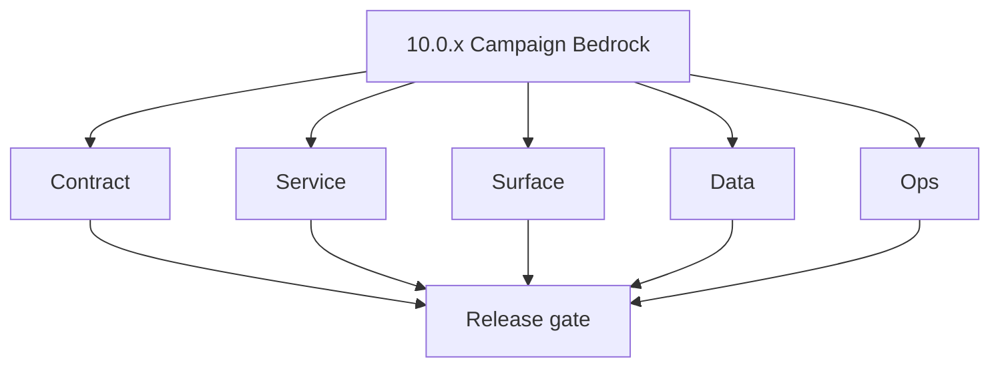
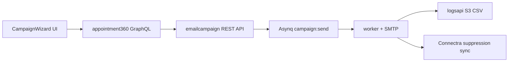

# Version 10.0 — Campaign Bedrock

- **Status:** ✅ Completed
- **Codename:** Campaign Bedrock
- **Era:** 10.x (Contact360 email campaign)
- **Roadmap:** Foundation hardening for campaign service infrastructure — ships as **`10.0.0`** per [`docs/versions.md`](../versions.md)
- **Summary:** Wire the **campaign backbone** end-to-end: `CampaignWizard` UI → Appointment360 GraphQL (`campaigns`/`sequences`/`templates` modules) → `emailcampaign` REST API → Asynq `campaign:send` worker → SMTP delivery → `logsapi` event sink. Establish the `completed_with_errors` terminal state, idempotency key tracking, and suppression list sync with Connectra.
- **Owner:** Email Campaign Engineering + Platform API
- **Patch closure:** Every codenamed patch file includes **Micro-gate** + **Service task slices**. Era hub: [`versions.md`](../versions.md).

## Scope

- **Target:** `10.0.x` patches — stable campaign service and shared contract surfaces before deep slices in `10.1+`.
- **In scope:** Campaign CRUD, sequence GraphQL contracts, template management, Asynq queue state machine, SMTP auth baseline, suppression merge, compliance event fields.
- **Out of scope:** Full audience segmentation maturity (`10.2`); A/B testing (`10.5`); advanced analytics (`10.8`).
- **Owners:** Email Campaign Engineering + Platform API.

## Flowchart

### Runtime focus (unique to this minor)

## Task tracks

### Contract

- ✅ Completed: 📌 Planned: Freeze **campaign** GraphQL module types: `CampaignMutation { createCampaign, updateCampaign, deleteCampaign, pauseCampaign, resumeCampaign }` and `CampaignQuery { campaigns, campaign(id) }` per [`docs/backend/apis/`](../backend/apis/).
- ✅ Completed: 📌 Planned: Freeze **sequence** module types: `SequenceMutation { createSequence, addStep, removeStep }` and `SequenceQuery { sequences, sequence(id) }`.
- ✅ Completed: 📌 Planned: Freeze **template** module types: `TemplateMutation { createTemplate, updateTemplate }` and `TemplateQuery { templates }`.
- ✅ Completed: 📌 Planned: Lock `emailcampaign` REST routes: `POST /campaigns`, `GET /campaigns/:id`, `POST /campaigns/:id/send`, `GET /campaigns/:id/status`.
- ✅ Completed: 📌 Planned: Document **status vocabulary**: `draft`, `scheduled`, `sending`, `completed`, `completed_with_errors`, `paused`, `cancelled`.
- ✅ Completed: 📌 Planned: **s3storage:** Define campaign artifact contracts (audiences, suppressions, templates, evidence bundles); enforce compliance-grade immutability (S3 Object Lock or equivalent) for campaign execution artifacts.

### Service

- ✅ Completed: 📌 Planned: Fix JWT middleware auth in `emailcampaign` service (per codebase analysis).
- ✅ Completed: 📌 Planned: Fix SMTP auth token query bug.
- ✅ Completed: 📌 Planned: Implement **idempotency key tracking** for campaign creation and enqueue paths to prevent duplicate outreach.
- ✅ Completed: 📌 Planned: Construct the definitive **`completed_with_errors`** terminal state for campaigns to handle partial delivery failures.
- ✅ Completed: 📌 Planned: Wire Asynq `campaign:send` worker with SMTP concurrency limits and queue lag monitoring.
- ✅ Completed: 📌 Planned: **s3storage:** Store consent/opt-out/suppression lineage evidence references in `metadata.json` for campaign-related objects.

### Surface

- ✅ Completed: 📌 Planned: **app:** `CampaignWizard` UI bound to campaign creation GraphQL — step-based form (audience → template → schedule → review).
- ✅ Completed: 📌 Planned: **app:** `CampaignList` page with status badges, progress bars, and action buttons (pause/resume/cancel).
- ✅ Completed: 📌 Planned: **app:** `SequenceBuilder` drag-and-drop step editor (if applicable in `10.0`, otherwise stub).
- ✅ Completed: 📌 Planned: **app:** Template preview and variable insertion UI.

### Data

- ✅ Completed: 📌 Planned: Validate schema: `campaigns`, `sequences`, `templates`, `recipients`, `campaign_events` tables aligned.
- ✅ Completed: 📌 Planned: Add `templates` table migration and `unsub_token` column per codebase analysis.
- ✅ Completed: 📌 Planned: Bridge Unsubscribe tokens to Connectra's global suppression lists.
- ✅ Completed: 📌 Planned: Campaign event lineage: `emailcampaign` → `logsapi` S3 CSV archiving.

### Ops

- ✅ Completed: 📌 Planned: Smoke: create campaign → schedule → send → verify delivery event in `logsapi`.
- ✅ Completed: 📌 Planned: Document rollback: pause + cancel campaign if SMTP delivery regresses.
- ✅ Completed: 📌 Planned: SMTP concurrency and queue lag baseline metrics.
- ✅ Completed: 📌 Planned: Deliverability preflight gate: suppression merge before send.
- ✅ Completed: ⬜ Incomplete: **contact360.io/jobs** — no campaign-specific job processors exist in `processors/registry.py`; the current registry handles `email_finder_export_stream`, `email_verify_export_stream`, `email_pattern_import_stream`, `contact360_import_prepare`, `contact360_export_stream` but has no `campaign_send_batch` or `campaign_bounce_check` job types; add these two processors to the registry to make the jobs scheduler the backbone of email campaign delivery.
- ✅ Completed: 📌 Planned: **contact360.io/jobs** — implement `campaign_send_batch` processor: read recipient batch from S3 (input key in job `data`), dispatch emails via the campaign email send API, write per-recipient delivery events to `job_response`; integrate with `emailcampaign` service via HTTP client similar to `email_api.py`.
- ✅ Completed: 📌 Planned: **contact360.io/jobs** — implement `campaign_bounce_check` processor: fetch bounce and complaint events from the email provider (SES SNS, Mailgun webhook, etc.), update recipient status in the `emailcampaign` PostgreSQL database, and emit a `campaign_bounce_processed` event to `job_events`.
- ✅ Completed: 📌 Planned: **contact360.io/jobs** — implement `campaign_suppression_sync` processor: on each campaign send job, fetch the global suppression list from Connectra's `/contacts/suppressed` endpoint and filter recipients before sending; record suppressed recipient count in `job_response`.
- ✅ Completed: 📌 Planned: **contact360.io/jobs** — wire campaign send jobs to the DAG engine: create a campaign DAG with `campaign_send_batch` child jobs (one per recipient batch) fanned out from a parent `campaign_prepare` node; use the existing `edges` table and DAG degree-decrement logic to finalize the campaign when all batches complete.

## Task Breakdown

| Slice | Outcome |
| --- | --- |
| emailcampaign | REST routes + Asynq worker + SMTP auth fixes |
| appointment360 | GraphQL campaign/sequence/template modules wired |
| App | CampaignWizard + CampaignList + SequenceBuilder |
| Compliance | Immutable event fields + suppression sync + unsub tokens |

## Immediate next execution queue

- 📌 Planned: Golden path test: create campaign → add recipients → send → verify `campaign_events` rows.
- 📌 Planned: Status mapping table: emailcampaign states ↔ GraphQL ↔ UI badges.
- 📌 Planned: Compliance checklist: CAN-SPAM unsubscribe token flow documented.

## Cross-service ownership

| Service | Focus |
| --- | --- |
| `backend(dev)/emailcampaign` | Campaign REST API + Asynq worker + SMTP |
| `contact360.io/api` | GraphQL campaign/sequence/template modules |
| `contact360.io/app` | CampaignWizard, CampaignList, SequenceBuilder |
| `contact360.io/sync` | Suppression list sync via Connectra |
| `lambda/logs.api` | Campaign event archiving (S3 CSV) |
| `lambda/s3storage` | Template asset storage |

## References

- [`docs/versions.md`](../versions.md)
- [`docs/roadmap.md`](../roadmap.md) — VERSION 10.x
- [`docs/codebases/emailcampaign-codebase-analysis.md`](../codebases/emailcampaign-codebase-analysis.md)
- [`docs/codebases/appointment360-codebase-analysis.md`](../codebases/appointment360-codebase-analysis.md)
- [`docs/frontend/pages/campaigns_page.json`](../frontend/pages/campaigns_page.json)

## Backend API and Endpoint Scope

- **GraphQL:** `campaigns`, `sequences`, `templates` modules — CRUD + send lifecycle.
- **REST (emailcampaign):** Campaign lifecycle routes + worker status endpoints.
- **Endpoint matrix:** `docs/backend/endpoints/emailcampaign_endpoint_era_matrix.json`.

## Database and Data Lineage Scope

- **PostgreSQL (emailcampaign):** `campaigns`, `sequences`, `templates`, `recipients`, `campaign_events`.
- **S3:** Template assets via `s3storage`; campaign event CSVs via `logsapi`.
- **Data lineage reference:** `docs/backend/database/emailcampaign_data_lineage.md`.

## Frontend UX Surface Scope

- Campaign management pages: wizard, list, detail, analytics.
- Sequence builder: step editor, timing configuration.
- Template management: preview, variable insertion, asset upload.

Frontend components and hooks (10.0 baseline):

- **Components:** `CampaignWizard`, `CampaignList`, `CampaignStatusBadge`, `SequenceBuilder`, `TemplatePreview`
- **Hooks:** `useCampaignCreate`, `useCampaignList`, `useCampaignStatus`, `useSequenceBuilder`, `useTemplateManager`
- **Pages:** [`docs/frontend/pages/campaigns_page.json`](../frontend/pages/campaigns_page.json)

## UI Elements Checklist

- 📌 Planned: Campaign wizard step form (audience → template → schedule → review)
- 📌 Planned: Campaign list with status badges and progress bars
- 📌 Planned: Pause/Resume/Cancel action buttons with confirmation modals
- 📌 Planned: Template preview with variable highlighting
- 📌 Planned: Recipient count and suppression summary display
- 📌 Planned: Delivery progress bar with `completed_with_errors` state
- 📌 Planned: Unsubscribe link preview

## Flow / Graph Delta for This Minor

- **Delta:** Introduces the **campaign lifecycle state machine** (draft → scheduled → sending → completed/completed_with_errors) and the Asynq worker delivery pipeline.

## Audit and Compliance Notes

- Immutable campaign event fields: `campaign_id`, `recipient_email`, `event_type`, `timestamp`, `message_id`.
- CAN-SPAM compliance: Unsubscribe token generation and suppression list sync.
- PII handling: recipient emails encrypted at rest; no PII in `logsapi` event bodies.
- See [`docs/audit-compliance.md`](../audit-compliance.md).

## Patch ladder (`10.0.0` – `10.0.9`)

### Micro-gate reference (apply at every `10.N.P`)

| Track | Gate question (must answer Yes or document waiver) |
| --- | --- |
| **Contract** | Campaign/sequence/template schema — modules + `emailcampaign_endpoint_era_matrix.json` updated? |
| **Service** | Send worker, SMTP/queue, webhooks, tracking — smoke + parity documented? |
| **Surface** | Campaign builder, audience, template UX — delta? |
| **Frontend** | Campaign UI, hooks, extension/email surfaces — delta? |
| **Data** | Recipients, events, suppression — `emailcampaign_data_lineage` / DB docs updated? |
| **Ops** | Deliverability runbooks, compliance evidence, metrics — recorded? |

**Patch intent bands:** `.0` charter · `.1`–`.2` scaffold · `.3`–`.5` hardening · `.6`–`.8` integration · `.9` minor freeze / handoff.

Theme: **Forge** — codenames in per-patch `10.0.P — *.md` files.

| Patch | Codename | Focus | Evidence gate |
| --- | --- | --- | --- |
| `10.0.0` | Void | Contract freeze: routes, GraphQL module names, status vocab | Charter artifact linked; status vocabulary table frozen |
| `10.0.1` | Seed | Service fixes: JWT middleware, SMTP auth, token query bug | JWT auth smoke passing; SMTP test send succeeds |
| `10.0.2` | Sprout | Schema drift: add `templates` table and `unsub_token` | Migration applied; `templates` table present in DB |
| `10.0.3` | Roots | UI bind: campaigns list + wizard base wiring | `CampaignList` renders; `CampaignWizard` step 1 works |
| `10.0.4` | Soil | Flow: queue state machine + worker path documented | Asynq `campaign:send` processes one test campaign |
| `10.0.5` | Rain | Deliverability: suppression merge + preflight gate | Suppressed recipients excluded from send batch |
| `10.0.6` | Stem | Reliability: idempotency, retry budget, pause/resume baseline | Duplicate campaign create returns same ID; pause/resume works |
| `10.0.7` | Branch | Compliance: immutable event fields and audit linkages | `campaign_events` rows match immutable field spec |
| `10.0.8` | Leaf | Performance: SMTP concurrency and queue lag baseline | Concurrency limit enforced; lag metric emitted |
| `10.0.9` | Bloom | Release gate: Postman, docs sync, rollback proof | Postman collection passing; rollback steps documented |

## Release Gate and Evidence

### Master Task Checklist
- 📌 Planned: `emailcampaign` baseline fixes merged
- 📌 Planned: `appointment360` campaign/sequence/template modules visible
- 📌 Planned: `app` campaign pages mapped to service contracts
- 📌 Planned: Observability + compliance evidence generated

### Backend API and Endpoints
- 📌 Planned: Endpoint/contract parity verified
- ⬜ Incomplete: **contact360.io/api** — `app/graphql/modules/campaigns/` directory is **completely empty** — there are no Python files, not even an `__init__.py`; the campaigns module does not exist in the API backend; this is the only domain module directory with zero content.
- 📌 Planned: **contact360.io/api** — Scaffold the campaigns GraphQL module: create `__init__.py`, `types.py` (Campaign, Sequence, CampaignStats), `inputs.py` (CreateCampaignInput, UpdateCampaignInput), `queries.py` (campaigns, campaign), `mutations.py` (createCampaign, updateCampaign, deleteCampaign, launchCampaign, pauseCampaign) — all backed by a new `CampaignService`.
- 📌 Planned: **contact360.io/api** — Add `campaigns`, `campaign_sequences`, `campaign_contacts`, `campaign_events` tables to `app/models/` with Alembic migrations to support email campaign persistence layer.
- 📌 Planned: **contact360.io/api** — Wire campaign execution to `TkdjobClient` — campaign sends should be scheduled as tkdjob jobs; create `CreateCampaignJobInput` in `app/graphql/modules/jobs/inputs.py` parallel to existing export/import inputs.
- ⬜ Incomplete: **contact360.io/admin** — Admin has no email campaign management UI — there is no campaign list, campaign creation wizard, sequence editor, or campaign analytics page in any of the 22 Django apps; the admin needs a dedicated campaigns section (backed by the planned `contact360.io/api` campaigns GraphQL module) for operators to manage campaigns.
- 📌 Planned: **contact360.io/admin** — Once the campaigns GraphQL module is implemented in `contact360.io/api`, add a campaign admin page: list campaigns by status (draft/scheduled/running/completed/paused), show send stats (sent/opened/clicked/bounced), and expose pause/resume/delete controls for SuperAdmin operators.
- ✅ Completed: **backend(dev)/email campaign** — Core campaign engine fully implemented in Go: `POST /campaign` creates a DB record and enqueues an Asynq `campaign:send` task to Redis; `HandleCampaignTask` (worker) loads recipients from CSV, creates DB records with JWT unsubscribe tokens, fans out to 5 concurrent `EmailWorker` goroutines; status lifecycle: `pending` → `sending` → `completed`/`failed`.
- ✅ Completed: **backend(dev)/email campaign** — Asynq distributed task queue wired: API server creates tasks via `asynq.NewClient`; `cmd/worker/main.go` runs `asynq.NewServer` with `Concurrency: 10`; task type `campaign:send` (`tasks/campaign.go`) carries `JobID`, `Filepath`, `TemplateID` — clean separation between API and worker processes.
- ✅ Completed: **backend(dev)/email campaign** — JWT-signed unsubscribe tokens: `utils/token.go` generates 30-day HS256 JWT tokens per recipient per campaign; `GET /unsub?token=...` validates token, cross-checks against stored `unsub_token` in DB to prevent token reuse/forgery, adds to suppression list, and updates recipient status — full CAN-SPAM/GDPR unsubscribe compliance flow.
- ✅ Completed: **backend(dev)/email campaign** — Schema migrations in `db/migrations/`: `001_init.sql` creates `campaigns`, `recipients`, `templates`, `suppression_list` tables (idempotent `IF NOT EXISTS`); `002_seed_test_data.sql` seeds test template, campaign, recipients, and suppression entry for local dev verification.
- ⬜ Incomplete: **backend(dev)/email campaign** — **No campaign scheduling** — campaigns start immediately when the Asynq task is enqueued; the `campaigns` table has no `scheduled_at` field; Asynq supports `asynq.ProcessIn(duration)` for delayed tasks but this is not used; add `scheduled_at` to the campaign model and support `process_in` for scheduled sends.
- ⬜ Incomplete: **backend(dev)/email campaign** — **No email sequence / drip campaign support** — the system only supports one-shot campaign blasts; there is no `campaign_sequences` table, no multi-step email series, no delay between sequence steps; this is a core feature gap for B2B outreach workflows.
- ⬜ Incomplete: **backend(dev)/email campaign** — **No bounce handling** — SMTP `SendMail` errors are caught and marked as `failed` in recipients, but there is no automatic bounce→suppression path; hard bounces should auto-add to `suppression_list` with reason `"hard_bounce"` to prevent repeat sends; add bounce type classification and auto-suppression.
- ⬜ Incomplete: **backend(dev)/email campaign** — **No `contact360.io/api` integration** — the `campaigns` GraphQL module in `contact360.io/api` is empty; there is no `CampaignClient` to call the email campaign service from the GraphQL API; the campaign engine exists as a standalone service not connected to the Contact360 product layer.
- 📌 Planned: **backend(dev)/email campaign** — Add email open tracking: inject `` in rendered HTML; implement `GET /track/open?token=...` handler that records open event in a new `campaign_events` table (`campaign_id`, `email`, `event_type`, `timestamp`) and returns a 1×1 transparent GIF.
- 📌 Planned: **backend(dev)/email campaign** — Add click tracking: wrap all `<a href="...">` links in rendered HTML with redirect URLs (`{{APP_URL}}/track/click?token=...&url=...`); implement `GET /track/click?token=...&url=...` handler that records click event and redirects to original URL — enables click-through rate measurement.
- 📌 Planned: **backend(dev)/email campaign** — Add `campaign_events` table migration: `(id TEXT PK, campaign_id TEXT REFERENCES campaigns(id), recipient_email TEXT, event_type TEXT, metadata JSONB, created_at TIMESTAMP)` — stores open, click, bounce, and unsubscribe events; expose `GET /campaign/:id/analytics` endpoint returning open_rate, click_rate, bounce_rate, unsubscribe_rate.
- 📌 Planned: **backend(dev)/email campaign** — Switch from direct SMTP (`net/smtp`) to AWS SES (`aws-sdk-go-v2/service/ses`) or a provider like SendGrid for production sends — direct SMTP from a non-dedicated IP has high deliverability risk; SES provides bounce/complaint webhooks, reputation monitoring, and sending rate management that the current SMTP approach lacks.

### Database and Data Lineage
- 📌 Planned: Migration and lineage references linked

### Frontend UX
- 📌 Planned: UX/route behavior evidence linked

### UI Elements
- 📌 Planned: Components/checklist closeout captured

### Flow and Graph
- 📌 Planned: Runtime graph reflects implementation

### Validation
- 📌 Planned: Smoke/CI/lint checks recorded

### Release Gate
- 📌 Planned: Minor ready for handoff to **`10.1` Contract Spine**

## Patches

| Patch | Codename | Doc |
| --- | --- | --- |
| `10.0.0` | Void | [`10.0.0` — Void](10.0.0 — Void.md) |
| `10.0.1` | Seed | [`10.0.1` — Seed](10.0.1 — Seed.md) |
| `10.0.2` | Sprout | [`10.0.2` — Sprout](10.0.2 — Sprout.md) |
| `10.0.3` | Roots | [`10.0.3` — Roots](10.0.3 — Roots.md) |
| `10.0.4` | Soil | [`10.0.4` — Soil](10.0.4 — Soil.md) |
| `10.0.5` | Rain | [`10.0.5` — Rain](10.0.5 — Rain.md) |
| `10.0.6` | Stem | [`10.0.6` — Stem](10.0.6 — Stem.md) |
| `10.0.7` | Branch | [`10.0.7` — Branch](10.0.7 — Branch.md) |
| `10.0.8` | Leaf | [`10.0.8` — Leaf](10.0.8 — Leaf.md) |
| `10.0.9` | Bloom | [`10.0.9` — Bloom](10.0.9 — Bloom.md) |
