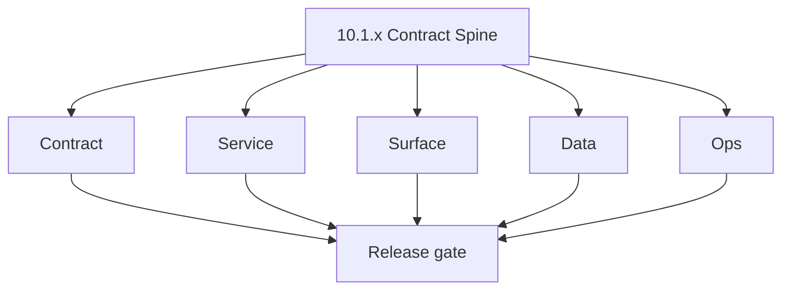
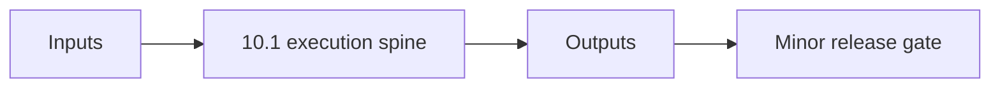

# Version 10.1 - Contract Spine

Focus: lock GraphQL/REST contract between `app`, `appointment360`, and `emailcampaign`.

## Patch checklist (`10.1.x`)
- `10.1.0` freeze campaigns/sequences/templates module names and inputs.
- `10.1.1` add `EmailCampaignClient` and remove debug query writes.
- `10.1.2` align DB field names used by contract payloads.
- `10.1.3` bind hooks/services: `useCampaigns`, `useCampaignTemplates`, `useSequences`.
- `10.1.4` publish contract flow graph.
- `10.1.5` include suppression + verifier status fields in contract.
- `10.1.6` add retry-safe contract error codes.
- `10.1.7` enforce authz and audit metadata in contract.
- `10.1.8` optimize payload size and query fan-out.
- `10.1.9` run contract regression + release sign-off.
- **Patch closure:** Every codenamed patch file includes **Micro-gate** + **Service task slices**. Era hub: [`versions.md`](../versions.md).
### Micro-gate reference (apply at every `10.N.P`)

| Track | Gate question (must answer Yes or document waiver) |
| --- | --- |
| **Contract** | Campaign/sequence/template schema — modules + `emailcampaign_endpoint_era_matrix.json` updated? |
| **Service** | Send worker, SMTP/queue, webhooks, tracking — smoke + parity documented? |
| **Surface** | Campaign builder, audience, template UX — delta? |
| **Frontend** | Campaign UI, hooks, extension/email surfaces — delta? |
| **Data** | Recipients, events, suppression — `emailcampaign_data_lineage` / DB docs updated? |
| **Ops** | Deliverability runbooks, compliance evidence, metrics — recorded? |
| **Architecture** | Go/Gin satellites only via Python GraphQL gateway (`contact360.io/api`); Next.js `NEXT_PUBLIC_GRAPHQL_URL`; Postgres-first / Redis exit per `docs/docs/data-stores-postgres.md`. |

**Patch ladder:** Codenames per minor — see patch table below (`Void`→`Bloom` unless minor defines a custom ladder).

## Patches

| Patch | Codename | Doc |
| --- | --- | --- |
| `10.1.0` | Void | [`10.1.0` — Void](10.1.0 — Void.md) |
| `10.1.1` | Seed | [`10.1.1` — Seed](10.1.1 — Seed.md) |
| `10.1.2` | Sprout | [`10.1.2` — Sprout](10.1.2 — Sprout.md) |
| `10.1.3` | Roots | [`10.1.3` — Roots](10.1.3 — Roots.md) |
| `10.1.4` | Soil | [`10.1.4` — Soil](10.1.4 — Soil.md) |
| `10.1.5` | Rain | [`10.1.5` — Rain](10.1.5 — Rain.md) |
| `10.1.6` | Stem | [`10.1.6` — Stem](10.1.6 — Stem.md) |
| `10.1.7` | Branch | [`10.1.7` — Branch](10.1.7 — Branch.md) |
| `10.1.8` | Leaf | [`10.1.8` — Leaf](10.1.8 — Leaf.md) |
| `10.1.9` | Bloom | [`10.1.9` — Bloom](10.1.9 — Bloom.md) |

## Flowchart

### Runtime focus (unique to this minor)

## Patch ladder (10.1.0 - 10.1.9)

### Micro-gate reference (apply at every patch)

| Track | Gate question (must answer Yes or waiver) |
| --- | --- |
| **Contract** | Contract/API change captured with diff or explicit no-change note |
| **Service** | Service health and smoke for affected paths pass |
| **Surface** | UI/admin/extension impact documented or N/A |
| **Frontend** | Routes/components/hooks affected listed or N/A |
| **Data** | Migrations/index/lineage deltas linked or N/A |
| **Ops** | Rollback/secrets/CI/runbook delta linked or N/A |

**Patch intent bands:** `.0` charter, `.1-.2` scaffold, `.3-.5` hardening, `.6-.8` integration, `.9` freeze/handoff.

| Patch | Codename | Focus | Evidence gate |
| --- | --- | --- | --- |
| `10.1.0` | Void | patch focus | charter artifact linked |
| `10.1.1` | Seed | patch focus | closeout evidence attached |
| `10.1.2` | Sprout | patch focus | closeout evidence attached |
| `10.1.3` | Roots | patch focus | closeout evidence attached |
| `10.1.4` | Soil | patch focus | closeout evidence attached |
| `10.1.5` | Rain | patch focus | closeout evidence attached |
| `10.1.6` | Stem | patch focus | closeout evidence attached |
| `10.1.7` | Branch | patch focus | closeout evidence attached |
| `10.1.8` | Leaf | patch focus | closeout evidence attached |
| `10.1.9` | Bloom | patch focus | handoff documented |

## Release Gate and Evidence

### Master Task Checklist
- 📌 Planned: Track-level closure evidence linked

### Backend API and Endpoints
- 📌 Planned: Endpoint/contract parity verified

### Database and Data Lineage
- 📌 Planned: Migration and lineage references linked

### Frontend UX
- 📌 Planned: UX/route behavior evidence linked

### UI Elements
- 📌 Planned: Components/checklist closeout captured

### Flow and Graph
- 📌 Planned: Runtime graph reflects implementation

### Validation
- 📌 Planned: Smoke/CI/lint checks recorded

### Release Gate
- 📌 Planned: Minor ready for handoff to next minor
## Tasks

### Contract

- ✅ Completed: ✅ Completed: 📌 Planned: **[emailcampaign]** — Diff and document schema for operations like ConnectraClient, LAMBDA_AI_API_URL, LAMBDA_CONNECTRA_API_URL; align with roadmap | area: `backend-api` | files: `docs/backend/apis/*.md`, `contact360.io/api/app/graphql/schema.py` | reason: Keep GraphQL/REST contracts aligned for era 10.0 patch 10.1.0

- ✅ Completed: 📌 Planned: **[emailcampaign]** — refine duplicate task (was: 📌 planned: **[architecture]** — product **graphql** remains …) | patch `10.1.0` band `0` | reason: specialize this file vs sibling patches; see docs/codebases/emailcampaign-codebase-analysis.md
### Service

- ✅ Completed: 📌 Planned: **[emailcampaign]** — refine duplicate task (was: ✅ completed: 📌 planned: **[emailcampaign]** — service slice:…) | patch `10.1.0` band `0` | reason: specialize this file vs sibling patches; see docs/codebases/emailcampaign-codebase-analysis.md
- ✅ Completed: 📌 Planned: **[emailcampaign]** — refine duplicate task (was: ✅ completed: 📌 planned: **[jobs]** — harden primary worker/g…) | patch `10.1.0` band `0` | reason: specialize this file vs sibling patches; see docs/codebases/emailcampaign-codebase-analysis.md

- ✅ Completed: 📌 Planned: **[emailcampaign]** — refine duplicate task (was: 📌 planned: **[architecture]** — **go/gin satellites** in sco…) | patch `10.1.0` band `0` | reason: specialize this file vs sibling patches; see docs/codebases/emailcampaign-codebase-analysis.md
### Surface

- ✅ Completed: 📌 Planned: **[emailcampaign]** — refine duplicate task (was: 📌 planned: **[emailcampaign]** — refine duplicate task (was:…) | patch `10.1.0` band `0` | reason: specialize this file vs sibling patches; see docs/codebases/emailcampaign-codebase-analysis.md

### Data

- ✅ Completed: 📌 Planned: **[emailcampaign]** — refine duplicate task (was: 📌 planned: **[emailcampaign]** — refine duplicate task (was:…) | patch `10.1.0` band `0` | reason: specialize this file vs sibling patches; see docs/codebases/emailcampaign-codebase-analysis.md

- ✅ Completed: 📌 Planned: **[emailcampaign]** — refine duplicate task (was: 📌 planned: **[architecture]** — **postgresql-first** per `do…) | patch `10.1.0` band `0` | reason: specialize this file vs sibling patches; see docs/codebases/emailcampaign-codebase-analysis.md
- ✅ Completed: 📌 Planned: **[emailcampaign]** — refine duplicate task (was: 📌 planned: **[architecture]** — **redis exit**: campaign (as…) | patch `10.1.0` band `0` | reason: specialize this file vs sibling patches; see docs/codebases/emailcampaign-codebase-analysis.md
### Ops

- ✅ Completed: 📌 Planned: **[emailcampaign]** — refine duplicate task (was: 📌 planned: **[emailcampaign]** — refine duplicate task (was:…) | patch `10.1.0` band `0` | reason: specialize this file vs sibling patches; see docs/codebases/emailcampaign-codebase-analysis.md

- ✅ Completed: 📌 Planned: **[emailcampaign]** — refine duplicate task (was: 📌 planned: **[architecture]** — **observability**: correlate…) | patch `10.1.0` band `0` | reason: specialize this file vs sibling patches; see docs/codebases/emailcampaign-codebase-analysis.md
