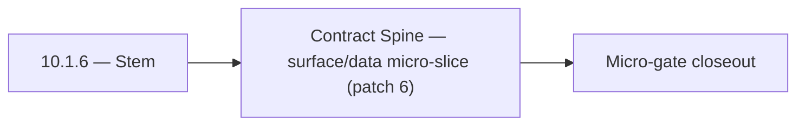

# 10.1.6 — Stem

- **Era:** `10.x` email campaign — hub [`versions.md`](../versions.md) · minors start at [`10.0 — Campaign Bedrock`](10.0%20%E2%80%94%20Campaign%20Bedrock.md)
- **Minor:** [10.1 — Contract Spine](./10.1 — Contract Spine.md)
- **Codename:** Stem
- **Status:** ✅ Completed
## Focus
Contract Spine — surface/data micro-slice (patch 6)

## Flowchart

## Micro-gate

| Track | Gate question | Answer / Evidence (fill at patch closeout) |
| --- | --- | --- |
| **Contract** | Campaign/sequence/template schema — `22_CAMPAIGNS_MODULE` / matrices / `emailcampaign_endpoint_era_matrix.json` updated? | Document at patch closeout. |
| **Service** | Send worker, SMTP/Asynq, webhooks, tracking — parity + smoke documented? | Document smoke paths. |
| **Surface** | Campaign builder, audience, template UX — delta? | Document UX delta or N/A. |
| **Frontend** | Campaign UI, hooks, extension/email campaign surfaces touched? | Contract spine — GraphQL/REST modules, idempotency, authz on send paths. Document at closeout. |
| **Data** | Recipients, campaigns, events, suppression — `docs/backend/database/emailcampaign_data_lineage.md`? | Document lineage or N/A. |
| **Ops** | Deliverability runbooks, compliance evidence, metrics/dashboards — delta? | Document ops delta or N/A. |

## Tasks
### Surface
- ✅ Completed: TBD for exit gate

### Data
- ✅ Completed: TBD for exit gate

### Contract

- ✅ Completed: 📌 Planned: **[emailcampaign]** — Diff and document schema for operations like ConnectraClient, LAMBDA_AI_API_URL, LAMBDA_CONNECTRA_API_URL; align with roadmap | area: `backend-api` | files: `docs/backend/apis/*.md`, `contact360.io/api/app/graphql/schema.py` | reason: Keep GraphQL/REST contracts aligned for era 10.6 patch 10.1.6

### Service

- ✅ Completed: 📌 Planned: **[emailcampaign]** — Service slice: Era 10 scope per docs/codebases/emailcampaign-codebase-analysis.md | area: `backend-api` | files: `contact360.io/api/app/graphql/modules/`, `contact360.io/api/app/clients/` | reason: Implement or verify runtime behavior for Era 10 scope per docs/codebases/emailcampaign-codebase-analysis.md

### Ops

- ✅ Completed: 📌 Planned: **[platform]** — Record smoke evidence, rollback, and alerts (patch band 6: surface/data) | area: `ops` | files: `docs/commands/`, `.github/workflows/` | reason: Smoke, rollback, and observability for patch 10.1.6

## Service task slices
> Merged from era task packs and analysis docs for this domain.

- Confirm contract and runtime slices are mapped to the parent minor objective.
- Attach service-level smoke evidence and known waivers in patch closeout.

## Evidence gate
Patch closeout includes contract diff, smoke output, data lineage delta, and ops note
