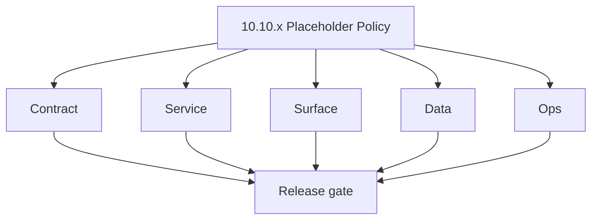
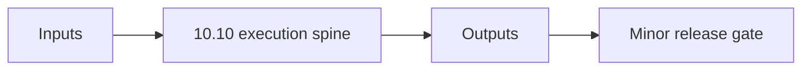

# Version 10.10 - Placeholder Policy

`10.10.x` is reserved as a controlled sub-minor lane in the 10.x campaign era.

## Purpose

- Prevent ad-hoc scope from entering after `10.9 Governance Lock`.
- Define how a `10.10.x` patch can be approved and documented.
- Enforce reproducibility and release evidence before any `10.10.x` population.

## Approval gate

A `10.10.x` patch is allowed only when all are true:

- `docs/versions.md` records the patch intent and owner.
- `docs/roadmap.md` has explicit dependency and rollback notes.
- Backend/API contract delta is frozen (GraphQL + REST + status vocab).
- Data lineage impact is documented.
- Compliance and audit review sign-off exists.

## Required doc updates when opening 10.10.x

- Create or update `10.10.n` section in this file.
- Update `README.md` in this folder with patch pointer.
- Cross-link impacted task packs and operational docs.
- Add evidence links: Postman run, migration output, UI smoke screenshots, logsapi event sample.

## Standard patch template (`10.10.n`)

Use this structure for each approved patch:

1. Scope statement
2. Services changed
3. API/endpoint deltas
4. DB/storage lineage deltas
5. UI/UX deltas
6. Flow graph delta (Mermaid)
7. Risks and mitigations
8. Release gate checklist

## 10.10.x checklist

- 📌 Planned: Owner + approver assigned
- 📌 Planned: Contract freeze complete
- 📌 Planned: Service implementation complete
- 📌 Planned: Data lineage updates complete
- 📌 Planned: UI bindings updated
- 📌 Planned: Observability and alerting updated
- 📌 Planned: Compliance review complete
- 📌 Planned: Rollback validated
- 📌 Planned: Docs synced (`versions`, `roadmap`, this folder)
- **Patch closure:** Every codenamed patch file includes **Micro-gate** + **Service task slices**. Era hub: [`versions.md`](../versions.md).
### Micro-gate reference (apply at every `10.N.P`)

| Track | Gate question (must answer Yes or document waiver) |
| --- | --- |
| **Contract** | Campaign/sequence/template schema — modules + `emailcampaign_endpoint_era_matrix.json` updated? |
| **Service** | Send worker, SMTP/queue, webhooks, tracking — smoke + parity documented? |
| **Surface** | Campaign builder, audience, template UX — delta? |
| **Frontend** | Campaign UI, hooks, extension/email surfaces — delta? |
| **Data** | Recipients, events, suppression — `emailcampaign_data_lineage` / DB docs updated? |
| **Ops** | Deliverability runbooks, compliance evidence, metrics — recorded? |

**Patch ladder:** Codenames per minor — see patch table below (`Void`→`Bloom` unless minor defines a custom ladder).

## Patches

| Patch | Codename | Doc |
| --- | --- | --- |
| `10.10.0` | Void | [`10.10.0` — Void](10.10.0 — Void.md) |
| `10.10.1` | Seed | [`10.10.1` — Seed](10.10.1 — Seed.md) |
| `10.10.2` | Sprout | [`10.10.2` — Sprout](10.10.2 — Sprout.md) |
| `10.10.3` | Roots | [`10.10.3` — Roots](10.10.3 — Roots.md) |
| `10.10.4` | Soil | [`10.10.4` — Soil](10.10.4 — Soil.md) |
| `10.10.5` | Rain | [`10.10.5` — Rain](10.10.5 — Rain.md) |
| `10.10.6` | Stem | [`10.10.6` — Stem](10.10.6 — Stem.md) |
| `10.10.7` | Branch | [`10.10.7` — Branch](10.10.7 — Branch.md) |
| `10.10.8` | Leaf | [`10.10.8` — Leaf](10.10.8 — Leaf.md) |
| `10.10.9` | Bloom | [`10.10.9` — Bloom](10.10.9 — Bloom.md) |

## Flowchart

### Runtime focus (unique to this minor)

## Patch ladder (10.10.0 - 10.10.9)

### Micro-gate reference (apply at every patch)

| Track | Gate question (must answer Yes or waiver) |
| --- | --- |
| **Contract** | Contract/API change captured with diff or explicit no-change note |
| **Service** | Service health and smoke for affected paths pass |
| **Surface** | UI/admin/extension impact documented or N/A |
| **Frontend** | Routes/components/hooks affected listed or N/A |
| **Data** | Migrations/index/lineage deltas linked or N/A |
| **Ops** | Rollback/secrets/CI/runbook delta linked or N/A |

**Patch intent bands:** `.0` charter, `.1-.2` scaffold, `.3-.5` hardening, `.6-.8` integration, `.9` freeze/handoff.

| Patch | Codename | Focus | Evidence gate |
| --- | --- | --- | --- |
| `10.10.0` | Void | patch focus | charter artifact linked |
| `10.10.1` | Seed | patch focus | closeout evidence attached |
| `10.10.2` | Sprout | patch focus | closeout evidence attached |
| `10.10.3` | Roots | patch focus | closeout evidence attached |
| `10.10.4` | Soil | patch focus | closeout evidence attached |
| `10.10.5` | Rain | patch focus | closeout evidence attached |
| `10.10.6` | Stem | patch focus | closeout evidence attached |
| `10.10.7` | Branch | patch focus | closeout evidence attached |
| `10.10.8` | Leaf | patch focus | closeout evidence attached |
| `10.10.9` | Bloom | patch focus | handoff documented |

## Release Gate and Evidence

### Master Task Checklist
- 📌 Planned: Track-level closure evidence linked

### Backend API and Endpoints
- 📌 Planned: Endpoint/contract parity verified

### Database and Data Lineage
- 📌 Planned: Migration and lineage references linked

### Frontend UX
- 📌 Planned: UX/route behavior evidence linked

### UI Elements
- 📌 Planned: Components/checklist closeout captured

### Flow and Graph
- 📌 Planned: Runtime graph reflects implementation

### Validation
- 📌 Planned: Smoke/CI/lint checks recorded

### Release Gate
- 📌 Planned: Minor ready for handoff to next minor
