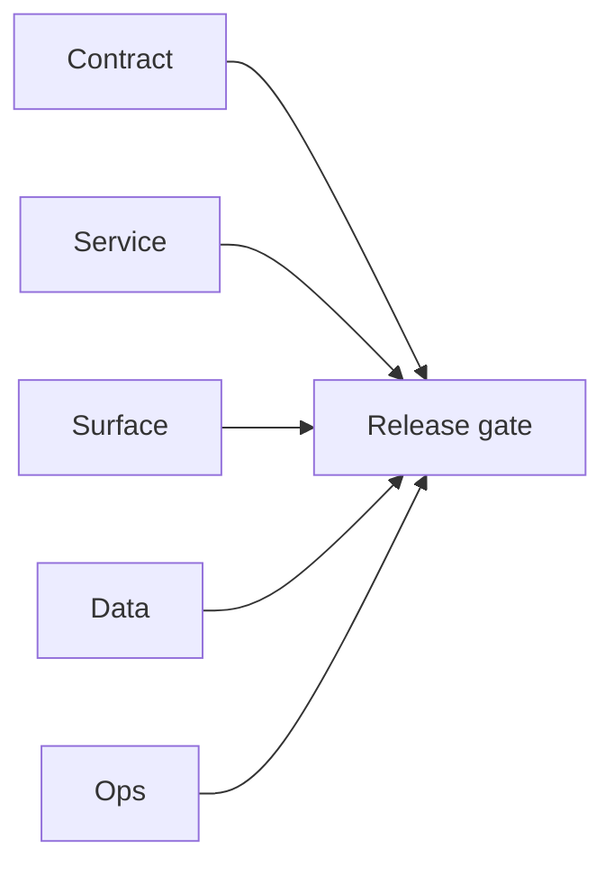

# 10.11.100 — EC2 email server campaign-adjacent patch linkage

## Scope

Campaign-era linkage notes for runtime patches that support campaign email quality and processing.

## Included patch intents

- `003-parallel-bulk-verification.patch`: higher-throughput verification for large campaign datasets.
- `004-endpoint-contract-fixes.patch`: stable pattern learning contract used by campaign data prep.
- `006-error-handling.patch`: improved bulk/job diagnostics and metrics access.

## Campaign outcome

- Better readiness for high-volume verification and pattern workflows in campaign pipelines.

## Flowchart

Five-track delivery (contract / service / surface / data / ops) for this doc:

**Master hub:** [`docs/docs/flowchart.md`](../docs/flowchart.md) — cross-system diagrams and era strip (`0.x` → `10.x`).
