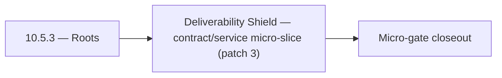

# 10.5.3 — Roots

- **Era:** `10.x` email campaign — hub [`versions.md`](../versions.md) · minors start at [`10.0 — Campaign Bedrock`](10.0%20%E2%80%94%20Campaign%20Bedrock.md)
- **Minor:** [10.5 — Deliverability Shield](./10.5 — Deliverability Shield.md)
- **Codename:** Roots
- **Status:** ✅ Completed
## Focus
Deliverability Shield — contract/service micro-slice (patch 3)

## Flowchart

## Micro-gate

| Track | Gate question | Answer / Evidence (fill at patch closeout) |
| --- | --- | --- |
| **Contract** | Campaign/sequence/template schema — `22_CAMPAIGNS_MODULE` / matrices / `emailcampaign_endpoint_era_matrix.json` updated? | Document at patch closeout. |
| **Service** | Send worker, SMTP/Asynq, webhooks, tracking — parity + smoke documented? | Document smoke paths. |
| **Surface** | Campaign builder, audience, template UX — delta? | Document UX delta or N/A. |
| **Frontend** | Campaign UI, hooks, extension/email campaign surfaces touched? | Deliverability shield — Mailvetter preflight, bounces, DNS, reputation. Document at closeout. |
| **Data** | Recipients, campaigns, events, suppression — `docs/backend/database/emailcampaign_data_lineage.md`? | Document lineage or N/A. |
| **Ops** | Deliverability runbooks, compliance evidence, metrics/dashboards — delta? | Document ops delta or N/A. |

## Tasks
### Contract
- 📌 Planned: **[emailcampaign]** — refine duplicate task (was: ✅ completed: tbd for exit gate) | patch `10.5.3` band `3` | reason: specialize this file vs sibling patches; see docs/codebases/emailcampaign-codebase-analysis.md

### Service
- 📌 Planned: **[emailcampaign]** — refine duplicate task (was: ✅ completed: tbd for exit gate) | patch `10.5.3` band `3` | reason: specialize this file vs sibling patches; see docs/codebases/emailcampaign-codebase-analysis.md

### Surface

- ✅ Completed: 📌 Planned: **[appointment360]** — Verify UX for route `/email` and bindings (patch 10.5.3 band 3) | area: `frontend-page` | files: `contact360.io/app/...` | reason: Dashboard/extension surface for era 10 must match gateway contracts

### Data

- 📌 Planned: **[emailcampaign]** — refine duplicate task (was: ✅ completed: 📌 planned: **[emailcampaign]** — update postgre…) | patch `10.5.3` band `3` | reason: specialize this file vs sibling patches; see docs/codebases/emailcampaign-codebase-analysis.md

### Ops

- ✅ Completed: 📌 Planned: **[platform]** — Record smoke evidence, rollback, and alerts (patch band 3: surface/data) | area: `ops` | files: `docs/commands/`, `.github/workflows/` | reason: Smoke, rollback, and observability for patch 10.5.3

## Service task slices
> Merged from era task packs and analysis docs for this domain.

- Confirm contract and runtime slices are mapped to the parent minor objective.
- Attach service-level smoke evidence and known waivers in patch closeout.

## Evidence gate
Patch closeout includes contract diff, smoke output, data lineage delta, and ops note
