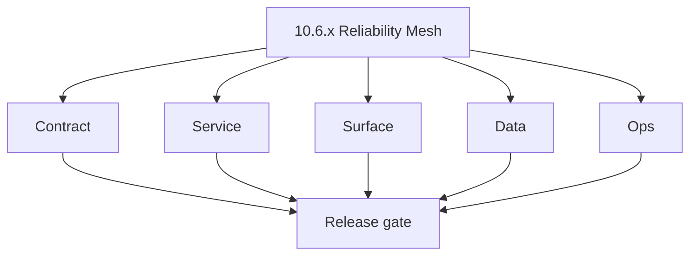
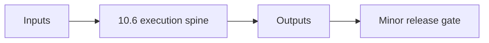

# Version 10.6 - Reliability Mesh

Focus: fault tolerance, DLQ behavior, pause/resume checkpoint safety.

## Patch checklist (`10.6.x`)
- `10.6.0` freeze retry/timeout/idempotency contract.
- `10.6.1` standardize worker error handling and retries.
- `10.6.2` persist checkpoint and attempt lineage fields.
- `10.6.3` expose progress, pause, and resume controls in UI.
- `10.6.4` publish resilience flow including DLQ branches.
- `10.6.5` ensure suppression preserved across retries.
- `10.6.6` validate idempotent resume from partial failure.
- `10.6.7` append reliability audit events.
- `10.6.8` tune queue concurrency and worker backpressure.
- `10.6.9` release drill: retry chaos test evidence.
- **Patch closure:** Every codenamed patch file includes **Micro-gate** + **Service task slices**. Era hub: [`versions.md`](../versions.md).
### Micro-gate reference (apply at every `10.N.P`)

| Track | Gate question (must answer Yes or document waiver) |
| --- | --- |
| **Contract** | Campaign/sequence/template schema — modules + `emailcampaign_endpoint_era_matrix.json` updated? |
| **Service** | Send worker, SMTP/queue, webhooks, tracking — smoke + parity documented? |
| **Surface** | Campaign builder, audience, template UX — delta? |
| **Frontend** | Campaign UI, hooks, extension/email surfaces — delta? |
| **Data** | Recipients, events, suppression — `emailcampaign_data_lineage` / DB docs updated? |
| **Ops** | Deliverability runbooks, compliance evidence, metrics — recorded? |

**Patch ladder:** Codenames per minor — see patch table below (`Void`→`Bloom` unless minor defines a custom ladder).

## Patches

| Patch | Codename | Doc |
| --- | --- | --- |
| `10.6.0` | Void | [`10.6.0` — Void](10.6.0 — Void.md) |
| `10.6.1` | Seed | [`10.6.1` — Seed](10.6.1 — Seed.md) |
| `10.6.2` | Sprout | [`10.6.2` — Sprout](10.6.2 — Sprout.md) |
| `10.6.3` | Roots | [`10.6.3` — Roots](10.6.3 — Roots.md) |
| `10.6.4` | Soil | [`10.6.4` — Soil](10.6.4 — Soil.md) |
| `10.6.5` | Rain | [`10.6.5` — Rain](10.6.5 — Rain.md) |
| `10.6.6` | Stem | [`10.6.6` — Stem](10.6.6 — Stem.md) |
| `10.6.7` | Branch | [`10.6.7` — Branch](10.6.7 — Branch.md) |
| `10.6.8` | Leaf | [`10.6.8` — Leaf](10.6.8 — Leaf.md) |
| `10.6.9` | Bloom | [`10.6.9` — Bloom](10.6.9 — Bloom.md) |

## Flowchart

### Runtime focus (unique to this minor)

## Patch ladder (10.6.0 - 10.6.9)

### Micro-gate reference (apply at every patch)

| Track | Gate question (must answer Yes or waiver) |
| --- | --- |
| **Contract** | Contract/API change captured with diff or explicit no-change note |
| **Service** | Service health and smoke for affected paths pass |
| **Surface** | UI/admin/extension impact documented or N/A |
| **Frontend** | Routes/components/hooks affected listed or N/A |
| **Data** | Migrations/index/lineage deltas linked or N/A |
| **Ops** | Rollback/secrets/CI/runbook delta linked or N/A |

**Patch intent bands:** `.0` charter, `.1-.2` scaffold, `.3-.5` hardening, `.6-.8` integration, `.9` freeze/handoff.

| Patch | Codename | Focus | Evidence gate |
| --- | --- | --- | --- |
| `10.6.0` | Void | patch focus | charter artifact linked |
| `10.6.1` | Seed | patch focus | closeout evidence attached |
| `10.6.2` | Sprout | patch focus | closeout evidence attached |
| `10.6.3` | Roots | patch focus | closeout evidence attached |
| `10.6.4` | Soil | patch focus | closeout evidence attached |
| `10.6.5` | Rain | patch focus | closeout evidence attached |
| `10.6.6` | Stem | patch focus | closeout evidence attached |
| `10.6.7` | Branch | patch focus | closeout evidence attached |
| `10.6.8` | Leaf | patch focus | closeout evidence attached |
| `10.6.9` | Bloom | patch focus | handoff documented |

## Release Gate and Evidence

### Master Task Checklist
- 📌 Planned: Track-level closure evidence linked

### Backend API and Endpoints
- 📌 Planned: Endpoint/contract parity verified

### Database and Data Lineage
- 📌 Planned: Migration and lineage references linked

### Frontend UX
- 📌 Planned: UX/route behavior evidence linked

### UI Elements
- 📌 Planned: Components/checklist closeout captured

### Flow and Graph
- 📌 Planned: Runtime graph reflects implementation

### Validation
- 📌 Planned: Smoke/CI/lint checks recorded

### Release Gate
- 📌 Planned: Minor ready for handoff to next minor
