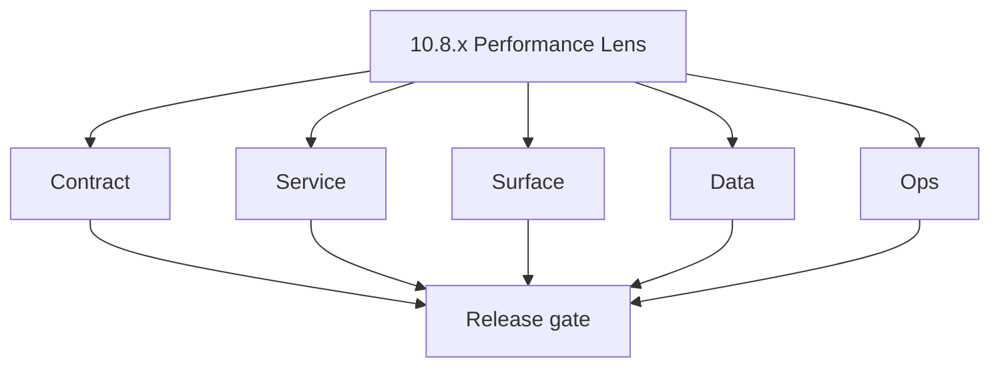
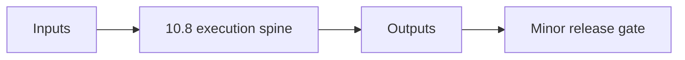

# Version 10.8 - Performance Lens

Focus: throughput, latency, and campaign unit-cost optimization.

## Patch checklist (`10.8.x`)
- `10.8.0` freeze performance KPI contract and targets.
- `10.8.1` optimize hot paths (send loop, template fetch, logging).
- `10.8.2` add performance lineage metrics storage.
- `10.8.3` surface campaign performance panels and trends.
- `10.8.4` publish perf flow graph and bottleneck map.
- `10.8.5` keep deliverability quality under optimization changes.
- `10.8.6` protect reliability SLO while tuning concurrency.
- `10.8.7` preserve compliance trace fields in optimized paths.
- `10.8.8` tune SMTP concurrency + Connectra query cost.
- `10.8.9` release with before/after benchmark evidence.
- **Patch closure:** Every codenamed patch file includes **Micro-gate** + **Service task slices**. Era hub: [`versions.md`](../versions.md).
### Micro-gate reference (apply at every `10.N.P`)

| Track | Gate question (must answer Yes or document waiver) |
| --- | --- |
| **Contract** | Campaign/sequence/template schema — modules + `emailcampaign_endpoint_era_matrix.json` updated? |
| **Service** | Send worker, SMTP/queue, webhooks, tracking — smoke + parity documented? |
| **Surface** | Campaign builder, audience, template UX — delta? |
| **Frontend** | Campaign UI, hooks, extension/email surfaces — delta? |
| **Data** | Recipients, events, suppression — `emailcampaign_data_lineage` / DB docs updated? |
| **Ops** | Deliverability runbooks, compliance evidence, metrics — recorded? |

**Patch ladder:** Codenames per minor — see patch table below (`Void`→`Bloom` unless minor defines a custom ladder).

## Patches

| Patch | Codename | Doc |
| --- | --- | --- |
| `10.8.0` | Void | [`10.8.0` — Void](10.8.0 — Void.md) |
| `10.8.1` | Seed | [`10.8.1` — Seed](10.8.1 — Seed.md) |
| `10.8.2` | Sprout | [`10.8.2` — Sprout](10.8.2 — Sprout.md) |
| `10.8.3` | Roots | [`10.8.3` — Roots](10.8.3 — Roots.md) |
| `10.8.4` | Soil | [`10.8.4` — Soil](10.8.4 — Soil.md) |
| `10.8.5` | Rain | [`10.8.5` — Rain](10.8.5 — Rain.md) |
| `10.8.6` | Stem | [`10.8.6` — Stem](10.8.6 — Stem.md) |
| `10.8.7` | Branch | [`10.8.7` — Branch](10.8.7 — Branch.md) |
| `10.8.8` | Leaf | [`10.8.8` — Leaf](10.8.8 — Leaf.md) |
| `10.8.9` | Bloom | [`10.8.9` — Bloom](10.8.9 — Bloom.md) |

## Flowchart

### Runtime focus (unique to this minor)

## Patch ladder (10.8.0 - 10.8.9)

### Micro-gate reference (apply at every patch)

| Track | Gate question (must answer Yes or waiver) |
| --- | --- |
| **Contract** | Contract/API change captured with diff or explicit no-change note |
| **Service** | Service health and smoke for affected paths pass |
| **Surface** | UI/admin/extension impact documented or N/A |
| **Frontend** | Routes/components/hooks affected listed or N/A |
| **Data** | Migrations/index/lineage deltas linked or N/A |
| **Ops** | Rollback/secrets/CI/runbook delta linked or N/A |

**Patch intent bands:** `.0` charter, `.1-.2` scaffold, `.3-.5` hardening, `.6-.8` integration, `.9` freeze/handoff.

| Patch | Codename | Focus | Evidence gate |
| --- | --- | --- | --- |
| `10.8.0` | Void | patch focus | charter artifact linked |
| `10.8.1` | Seed | patch focus | closeout evidence attached |
| `10.8.2` | Sprout | patch focus | closeout evidence attached |
| `10.8.3` | Roots | patch focus | closeout evidence attached |
| `10.8.4` | Soil | patch focus | closeout evidence attached |
| `10.8.5` | Rain | patch focus | closeout evidence attached |
| `10.8.6` | Stem | patch focus | closeout evidence attached |
| `10.8.7` | Branch | patch focus | closeout evidence attached |
| `10.8.8` | Leaf | patch focus | closeout evidence attached |
| `10.8.9` | Bloom | patch focus | handoff documented |

## Release Gate and Evidence

### Master Task Checklist
- 📌 Planned: Track-level closure evidence linked

### Backend API and Endpoints
- 📌 Planned: Endpoint/contract parity verified

### Database and Data Lineage
- 📌 Planned: Migration and lineage references linked

### Frontend UX
- 📌 Planned: UX/route behavior evidence linked

### UI Elements
- 📌 Planned: Components/checklist closeout captured

### Flow and Graph
- 📌 Planned: Runtime graph reflects implementation

### Validation
- 📌 Planned: Smoke/CI/lint checks recorded

### Release Gate
- 📌 Planned: Minor ready for handoff to next minor
## Tasks

### Contract

- ✅ Completed: 📌 Planned: **[emailcampaign]** — Diff and document schema for operations like ConnectraClient, LAMBDA_AI_API_URL, LAMBDA_CONNECTRA_API_URL; align with roadmap | area: `backend-api` | files: `docs/backend/apis/*.md`, `contact360.io/api/app/graphql/schema.py` | reason: Keep GraphQL/REST contracts aligned for era 10.0 patch 10.8.0

### Service

- ✅ Completed: 📌 Planned: **[emailcampaign]** — Service slice: Era 10 scope per docs/codebases/emailcampaign-codebase-analysis.md | area: `backend-api` | files: `contact360.io/api/app/graphql/modules/`, `contact360.io/api/app/clients/` | reason: Implement or verify runtime behavior for Era 10 scope per docs/codebases/emailcampaign-codebase-analysis.md
- ✅ Completed: 📌 Planned: **[jobs]** — Harden primary worker/gateway integration and failure envelopes | area: `backend-api` | files: `docs/codebases/jobs-codebase-analysis.md` | reason: P0 band: critical path and idempotency

### Surface

- ✅ Completed: 📌 Planned: **[appointment360]** — Verify UX for route `/email` and bindings (patch 10.8.0 band 0) | area: `frontend-page` | files: `contact360.io/app/...` | reason: Dashboard/extension surface for era 10 must match gateway contracts

### Data

- ✅ Completed: 📌 Planned: **[emailcampaign]** — Update PostgreSQL/ES/S3 lineage notes if this patch touches persistence or exports | area: `data-lineage` | files: `docs/backend/database/`, `migrations/` | reason: Migrations, indexes, and lineage evidence for this patch

### Ops

- ✅ Completed: 📌 Planned: **[platform]** — Record smoke evidence, rollback, and alerts (patch band 0: charter/P0) | area: `ops` | files: `docs/commands/`, `.github/workflows/` | reason: Smoke, rollback, and observability for patch 10.8.0

