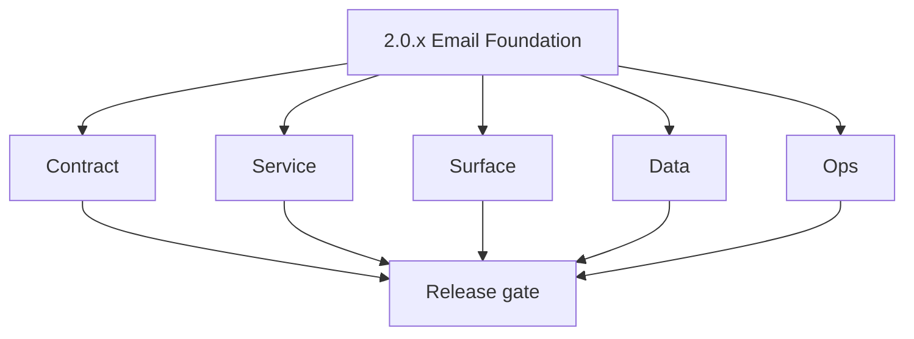
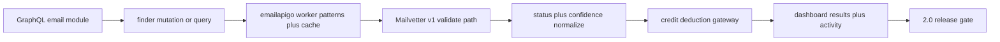

# Version 2.0 — Email Foundation

- **Status:** ✅ Completed
- **Codename:** Email Foundation
- **Era:** 2.x (Contact360 email system)
- **Roadmap:** Stages **2.1**, **2.2**, **2.3** — finder + verifier + results spine aligned to [`docs/versions.md`](../versions.md) **`2.0.0`** email-era cut
- **Summary:** Wire the **product backbone** end-to-end: GraphQL email module → Lambdas (`emailapigo` / `emailapis`) → pattern + fallback finder → Mailvetter verify path → normalized results + activity visibility.
- **Definition-of-done gate:** `2.0` cannot be marked complete until mailbox credential handling is migrated away from plaintext local storage and direct credential headers.
- **Patch closure:** Every codenamed patch file includes **Micro-gate** + **Service task slices**. Era hub: [`versions.md`](../versions.md).

## Scope

- **Target:** `2.0.x` patches — one coherent “email platform v1” before deep slices in `2.1+`.
- **In scope:** Single/bulk GraphQL contracts, starter Mailvetter v1 usage, dashboard Email Studio happy paths, credit deduction hooks from **`1.x`**.
- **Out of scope:** Full bulk hardening (stage **2.4** — primary focus `2.4` minor); mailbox token migration ( **`2.5`** ).
- **Owners:** Email Engineering + Platform API.

> [!CAUTION]
> **P0 Security Blocker (Credential Leak):** The `email` app currently persists **IMAP/SMTP mailbox credentials in `localStorage`** as plaintext. This is a critical data-at-rest vulnerability. `2.0` **cannot be marked complete** until credentials are migrated to a secure server-side token store (e.g., encrypted vault or OAuth2 refresh tokens). See [`docs/codebases/email-codebase-analysis.md`](../codebases/email-codebase-analysis.md).

> [!IMPORTANT]
> **Status Vocabulary Enforcement:** All email results must use the canonical status set: `valid`, `invalid`, `catchall`, `unknown`. Non-canonical statuses must be mapped/rejected at the GraphQL boundary.

## Flowchart

### Runtime focus (unique to this minor)

## Task tracks

### Contract

- ✅ Completed: ✅ Completed: 📌 Planned: Freeze **GraphQL email** field names and error codes for finder + verifier single paths — **Service task slices** in `2.0.P` patch files (scope from former `appointment360-email-system-task-pack.md`).
- ✅ Completed: ✅ Completed: 📌 Planned: Document **Lambda** invocation payload and provider selection order — **Service task slices** in `2.0.P` patch files (scope from former `emailapis-email-system-task-pack.md`).
- ✅ Completed: ✅ Completed: 📌 Planned: Lock **Mailvetter v1** `POST /v1/emails/validate` request/response for gateway mapping — **Service task slices** in `2.0.P` patch files (scope from former `mailvetter-email-system-task-pack.md`).
- ✅ Completed: ✅ Completed: 📌 Planned: **s3storage** — freeze multipart API contract (initiate/parts/register/complete/abort) per [`lambda/s3storage/docs/API.md`](../../lambda/s3storage/docs/API.md) and lock retry-safe completion semantics.
- ✅ Completed: ✅ Completed: 📌 Planned: **emailapis/emailapigo** — publish provider parity matrix: same input → normalized `valid`/`invalid`/`catchall`/`unknown` output for both Python (`TruelistClient`) and Go (`MailvetterClient`) adapters; document the Truelist → Mailvetter provider migration plan and cutover criteria.
- ✅ Completed: ✅ Completed: 📌 Planned: **emailapis** — add `MAILVETTER_API_KEY` and `MAILVETTER_BASE_URL` to Python `config.py` Settings and `template.yaml`; Go (`emailapigo`) already uses Mailvetter — Python must reach parity before Truelist is deprecated.

- ✅ Completed: 📌 Planned: **[appointment360]** — refine duplicate task (was: 📌 planned: **[architecture]** — product **graphql** remains …) | patch `2.0.0` band `0` | reason: specialize this file vs sibling patches; see docs/codebases/appointment360-codebase-analysis.md
### Service

- ✅ Completed: 📌 Planned: **[appointment360]** — refine duplicate task (was: 📌 planned: **[appointment360]** — refine duplicate task (was…) | patch `2.0.0` band `0` | reason: specialize this file vs sibling patches; see docs/codebases/appointment360-codebase-analysis.md
- ✅ Completed: 📌 Planned: **[appointment360]** — refine duplicate task (was: ✅ completed: 📌 planned: ensure verifier calls reach **mailve…) | patch `2.0.0` band `0` | reason: specialize this file vs sibling patches; see docs/codebases/appointment360-codebase-analysis.md
- ✅ Completed: 📌 Planned: **[appointment360]** — refine duplicate task (was: ✅ completed: 📌 planned: remove or gate **inline debug file w…) | patch `2.0.0` band `0` | reason: specialize this file vs sibling patches; see docs/codebases/appointment360-codebase-analysis.md
- ✅ Completed: ✅ Completed: ⬜ Incomplete: **s3storage** — enforce `X-Idempotency-Key` for initiate/complete/abort under client retries; store idempotency state alongside session JSON in S3.
- ✅ Completed: ✅ Completed: ⬜ Incomplete: **s3storage** — add end-to-end failure-path tests: partial upload, worker timeout, duplicate complete (must not double-charge storage or metadata).
- ✅ Completed: ✅ Completed: ⬜ Incomplete: **emailapis** — `email_verification_service.py` still instantiates `TruelistClient` as primary provider; Go `emailapigo` has fully migrated to Mailvetter — migrate Python to add `MailvetterClient` and align provider routing with Go adapter.
- ✅ Completed: ✅ Completed: ⬜ Incomplete: **emailapigo** — router.go has `// TODO: email verification and pattern endpoints mirroring Python paths` — implement GET `/email-patterns/` list and search endpoints parity with Python `emailapis`.
- ✅ Completed: ✅ Completed: 📌 Planned: **emailapis** — add `LOG_BASE_URL`/`LOG_API_KEY` propagation to Go `emailapigo` config and template so both Python and Go adapters ship events to `logs.api`.

- ✅ Completed: 📌 Planned: **[appointment360]** — refine duplicate task (was: 📌 planned: **[architecture]** — **go/gin satellites** in sco…) | patch `2.0.0` band `0` | reason: specialize this file vs sibling patches; see docs/codebases/appointment360-codebase-analysis.md
### Surface

- ✅ Completed: 📌 Planned: **[appointment360]** — refine duplicate task (was: ✅ completed: 📌 planned: **app:** email studio tabs wired to …) | patch `2.0.0` band `0` | reason: specialize this file vs sibling patches; see docs/codebases/appointment360-codebase-analysis.md
- ✅ Completed: 📌 Planned: **[appointment360]** — refine duplicate task (was: ✅ completed: 📌 planned: map ui labels to **frozen status voc…) | patch `2.0.0` band `0` | reason: specialize this file vs sibling patches; see docs/codebases/appointment360-codebase-analysis.md
- ✅ Completed: ✅ Completed: ✅ Completed: **contact360.io/email (Mailhub)** — email client UI shell exists with Inbox, Sent, Spam, Drafts routes and individual email detail view with `DOMPurify` HTML sanitization.
- ✅ Completed: ✅ Completed: ⬜ Incomplete: **contact360.io/email (Mailhub)** — `src/components/email-list.tsx` uses `any` types throughout: `emails: any[]`, `folder: any`, `data: any` in `DataTable` — define a proper `EmailDto` TypeScript interface (matching the backend API response) and replace all `any` types; the same applies to `data-table.tsx` which accepts `data: any`.
- ✅ Completed: ✅ Completed: ⬜ Incomplete: **contact360.io/email (Mailhub)** — `email-list.tsx` has `import { act } from "react"` on line 9 which is an unused import (a leftover from testing scaffolding); remove the import to prevent lint warnings and confusion.
- ✅ Completed: ✅ Completed: ⬜ Incomplete: **contact360.io/email (Mailhub)** — `src/app/page.tsx` (the "Mailhub" landing) has `console.log(BACKEND_URL)` on line 19 — this leaks the backend URL into browser DevTools in production; remove this debug log.
- ✅ Completed: ✅ Completed: ⬜ Incomplete: **contact360.io/email (Mailhub)** — no compose email UI exists; the sidebar shows Inbox/Sent/Spam/Drafts but there is no route or component for composing a new email or replying — add a `ComposeEmail` sheet/modal component and wire it to `POST ${BACKEND_URL}/api/emails/send`.
- ✅ Completed: ✅ Completed: 📌 Planned: **contact360.io/email (Mailhub)** — add email reply/forward action to the `EmailPage` (`/email/[mailId]`); the current detail view only shows the email body with no reply or forward button; add a reply form below the email body that pre-fills `To`, `Subject` (with `Re:` prefix), and sends via the backend.
- ✅ Completed: ✅ Completed: 📌 Planned: **contact360.io/email (Mailhub)** — implement email list pagination: `email-list.tsx` fetches all emails from `GET /api/emails/{folder}` without any `limit` or `offset` parameters; add server-side pagination (page size 25) and a "Load more" or cursor-based pagination control in the `DataTable`.

- ✅ Completed: 📌 Planned: **[appointment360]** — refine duplicate task (was: 📌 planned: **[architecture]** — **next.js** customer surface…) | patch `2.0.0` band `0` | reason: specialize this file vs sibling patches; see docs/codebases/appointment360-codebase-analysis.md
### Data

- ✅ Completed: 📌 Planned: **[appointment360]** — refine duplicate task (was: ✅ completed: 📌 planned: **`email_finder_cache`** / **`email_…) | patch `2.0.0` band `0` | reason: specialize this file vs sibling patches; see docs/codebases/appointment360-codebase-analysis.md
- ✅ Completed: 📌 Planned: **[appointment360]** — refine duplicate task (was: ✅ completed: 📌 planned: activity rows for verification event…) | patch `2.0.0` band `0` | reason: specialize this file vs sibling patches; see docs/codebases/appointment360-codebase-analysis.md
- ✅ Completed: ✅ Completed: 📌 Planned: **s3storage** — add metadata reconciliation command: compare S3 objects vs `metadata.json` entries, flag drift, schedule periodic runs.

- ✅ Completed: 📌 Planned: **[appointment360]** — refine duplicate task (was: 📌 planned: **[architecture]** — **postgresql-first** per `do…) | patch `2.0.0` band `0` | reason: specialize this file vs sibling patches; see docs/codebases/appointment360-codebase-analysis.md
- ✅ Completed: 📌 Planned: **[appointment360]** — refine duplicate task (was: 📌 planned: **[architecture]** — **redis exit**: campaign (as…) | patch `2.0.0` band `0` | reason: specialize this file vs sibling patches; see docs/codebases/appointment360-codebase-analysis.md
### Ops

- ✅ Completed: 📌 Planned: **[appointment360]** — refine duplicate task (was: ✅ completed: 📌 planned: smoke: dashboard finder → verify → r…) | patch `2.0.0` band `0` | reason: specialize this file vs sibling patches; see docs/codebases/appointment360-codebase-analysis.md
- ✅ Completed: 📌 Planned: **[appointment360]** — refine duplicate task (was: ✅ completed: 📌 planned: baseline logs: request id from app →…) | patch `2.0.0` band `0` | reason: specialize this file vs sibling patches; see docs/codebases/appointment360-codebase-analysis.md
- ✅ Completed: ✅ Completed: ✅ Completed: **contact360.io/jobs** — `email_finder_export_stream`, `email_verify_export_stream`, and `email_pattern_import_stream` processors are registered in the jobs scheduler and execute streaming enrichment from S3 CSV → `lambda/emailapis` → output CSV → S3.
- ✅ Completed: ✅ Completed: ⬜ Incomplete: **contact360.io/jobs** — `email_finder_export_stream` processor uses `EMAIL_API_BASE_URL` which defaults to empty string `""` in `Settings`; if not configured, the processor fails with a connection error without a clear startup validation message — add `config_validator.py` check that `EMAIL_API_BASE_URL` is non-empty when any email processor job type is registered.
- ✅ Completed: ✅ Completed: ⬜ Incomplete: **contact360.io/jobs** — `email_verify_export_stream` processor reuses `EmailExportDAGRequest` (the same schema as email finder export) but verification should add an `email_column` field to specify which CSV column contains the pre-existing email addresses to verify — the current schema shares the finder `csv_columns` structure which may not map correctly for pure verification jobs.
- ✅ Completed: ✅ Completed: 📌 Planned: **contact360.io/jobs** — add `email_campaign_send_stream` processor to the registry for future bulk email campaign delivery; this processor will consume a campaign job from the queue, fetch recipient list from S3, and dispatch via the email send API in configurable batch sizes.
- ✅ Completed: ✅ Completed: ✅ Completed: **contact360.io/app (Dashboard)** — Email Studio UI implemented: `app/(dashboard)/email/page.tsx` has Finder tab (single + bulk sub-tabs) and Verifier tab (single + bulk sub-tabs) with `useEmailFinderSingle`, `useEmailVerifierSingle`, `useEmailVerifierBulk` hooks wired to GraphQL.
- ✅ Completed: ✅ Completed: ✅ Completed: **contact360.io/app (Dashboard)** — Bulk email export job creation implemented: `email/page.tsx` calls `createEmailFinderExport` and `createEmailVerifyExport` from `jobsService.ts`; CSV column mapping modal (`EmailMappingModal`) allows users to map uploaded CSV headers to required fields.
- ✅ Completed: ✅ Completed: ✅ Completed: **contact360.io/app (Dashboard)** — `EmailAssistantPanel` component exists as a third tab ("assistant") in the Email page alongside finder and verifier.
- ✅ Completed: ✅ Completed: ⬜ Incomplete: **contact360.io/app (Dashboard)** — `email/page.tsx` `EmailAssistantPanel` is rendered as the "assistant" tab but its implementation is unclear — audit whether `EmailAssistantPanel` calls a real AI endpoint or contains placeholder/mock content; if mocked, wire it to the real `contact.ai` Lambda or GraphQL AI module.
- ✅ Completed: ✅ Completed: ⬜ Incomplete: **contact360.io/app (Dashboard)** — `jobsService.ts` `defaultEmailExportPayload` hardcodes `row_limit: 100` and `chunk_size: 10` as defaults with no UI controls to change these values; for large bulk email export jobs, users cannot adjust batch size or row limits from the UI — add optional advanced settings fields to the `ScheduleJobModal` or email bulk upload flow.

- ✅ Completed: 📌 Planned: **[appointment360]** — refine duplicate task (was: 📌 planned: **[architecture]** — **observability**: correlate…) | patch `2.0.0` band `0` | reason: specialize this file vs sibling patches; see docs/codebases/appointment360-codebase-analysis.md
## Task Breakdown

| Slice | Outcome |
| --- | --- |
| Gateway | Email module + credits + Mailvetter client |
| emailapigo | Pattern generation + cache |
| Mailvetter | Single validate SLO baseline |
| App | Email Studio MVP UX |

## Immediate next execution queue

- 📌 Planned: Golden path artifact: sequence diagram or trace export.
- 📌 Planned: Status mapping table: Mailvetter ↔ GraphQL ↔ UI.

## Cross-service ownership

| Service | Focus |
| --- | --- |
| `contact360.io/api` | Email GraphQL, auth, credits |
| `lambda/emailapigo` | Finder runtime |
| `lambda/emailapis` | Parity / fallback |
| `backend(dev)/mailvetter` | Verifier engine |
| `contact360.io/app` | Email Studio |

## Codebase file targets (what you’ll actually change in `2.0.x`)

Grounded in:
- `docs/codebases/appointment360-codebase-analysis.md`
- `docs/codebases/emailapis-codebase-analysis.md`
- `docs/codebases/mailvetter-codebase-analysis.md`
- `docs/codebases/app-codebase-analysis.md`

| Slice | Primary codebases | Start files | Why this is in `2.0` |
| --- | --- | --- | --- |
| Gateway contract + mapping | `contact360.io/api` | `app/graphql/modules/email/*`, `app/graphql/modules/jobs/*`, `app/clients/*` | Make the end-to-end email spine callable + stable |
| Finder runtime | `lambda/emailapigo` (+ fallback `lambda/emailapis`) | `main.go`, `internal/services/email_finder_service.go` | Pattern + cache path begins; deep finder is `2.1` |
| Verifier engine baseline | `backend(dev)/mailvetter` | `internal/handlers/validate.go`, `internal/validator/logic.go` | V1 validate “works through gateway” proof |
| UI wiring | `contact360.io/app` | hooks `useEmailFinderSingle`, `useEmailVerifierSingle` | Email Studio MVP states and mapping correctness |

## Frontend components and hooks (2.0 baseline)

- **Hooks**: `useEmailFinderSingle`, `useEmailVerifierSingle`, `useJobStatus` (polling wrapper)
- **Surface**: Email Studio Finder + Verifier tabs (see `docs/frontend/pages/email_page.json`)
- **Bindings**: `docs/frontend/emailapis-ui-bindings.md`, `docs/frontend/hooks-services-contexts.md`

## Backend API and endpoint refs (2.0 contract)

- GraphQL modules: `docs/backend/apis/15_EMAIL_MODULE.md`, `docs/backend/apis/16_JOBS_MODULE.md`
- Endpoint matrices: `docs/backend/endpoints/*graphql*.json` + service era matrices

## Database and data lineage scope (2.0)

- Email finder persistence: `email_finder_cache`, `email_patterns` (see `docs/backend/database/emailapis_data_lineage.md`)
- Mailvetter persistence (single + job model): `jobs`, `results` (see `docs/backend/database/mailvetter_data_lineage.md`)
- Activity/usage/credits tables as referenced by the gateway (see `docs/backend.md` and `docs/audit-compliance.md`)

## References

- [`docs/roadmap.md`](../roadmap.md) — VERSION 2.x stages 2.1–2.3
- [`email_system.md`](email_system.md)
- [`docs/codebases/emailapis-codebase-analysis.md`](../codebases/emailapis-codebase-analysis.md)
- [`docs/codebases/mailvetter-codebase-analysis.md`](../codebases/mailvetter-codebase-analysis.md)

## Backend API and Endpoint Scope

- **GraphQL:** `email` module — finder, verifier, pattern stubs as implemented; `usage` / credit deduction alignment.
- **REST:** Mailvetter `/v1/emails/validate`; Lambda endpoints behind gateway.

## Database and Data Lineage Scope

- **PostgreSQL:** user-scoped email activity; patterns/cache references per schema.
- **External:** Mailvetter job store (single path); no bulk S3 output requirement for `2.0` baseline.

## Frontend UX Surface Scope

- Email Studio: single finder, single verifier, basic results list, activity snippet.

## UI Elements Checklist

- 📌 Planned: Finder domain/name inputs + submit
- 📌 Planned: Verifier email input + submit
- 📌 Planned: Status badge + confidence display
- 📌 Planned: Credit or usage hint on action (if exposed)

## Flow / Graph Delta for This Minor

- **Delta:** Replaces mistaken **Connectra / VQL** boilerplate with the real **email spine**; establishes the runtime graph used by `2.1`–`2.3` slices.

## Audit and Compliance Notes

- Credit spend and email operations logged per [`docs/audit-compliance.md`](../audit-compliance.md); avoid PII in client-side logs.

## Patch ladder (`2.0.0` – `2.0.9`)

### Micro-gate reference (apply at every `2.N.P`)

| Track | Gate question (must answer Yes or document waiver) |
| --- | --- |
| **Contract** | GraphQL email/jobs/upload or Lambda/Mailvetter REST changed? Diff vs `docs/backend/apis/`; bulk job idempotency documented? |
| **Service** | Finder/verifier/bulk paths still smoke; provider routing + error envelopes OK or versioned? |
| **Surface** | Email Studio, bulk job UI, or `/email` mailbox changed? Loading/error/progress contracts? |
| **Frontend** | Which routes/hooks apply (see **Frontend UX Surface Scope** / checklist in minor)? |
| **Data** | `email_finder_cache`, patterns, jobs, Mailvetter, S3 artifacts — migrations + lineage? |
| **Ops** | Multipart/queue durability, alerts, rollback/runbook delta for email releases? |
| **Architecture** | Go/Gin satellites only via Python GraphQL gateway (`contact360.io/api`); Next.js `NEXT_PUBLIC_GRAPHQL_URL`; Postgres-first / Redis exit per `docs/docs/data-stores-postgres.md`. |

**Patch intent bands:** `.0` charter · `.1`–`.3` core path · `.4`–`.6` hardening · `.7`–`.8` integration · `.9` minor freeze / handoff.

Theme: **Spark** — codenames in per-patch `2.0.P — *.md` files.

| Patch | Codename | Contract | Service | Surface | Data | Ops |
| --- | --- | --- | --- | --- | --- | --- |
| `2.0.0` | Ignite | Freeze Email Studio GraphQL “happy path” fields and errors | Gateway → Lambda email calls smoke | Finder+Verifier tabs show success state | Cache/pattern read/write confirmed | Single trace shows request_id across hop |
| `2.0.1` | Kindle | Error envelope normalized (GraphQL → UI) | Retry-safe downstream call wrappers | Error toast + retry CTA UX | No PII leaks in error payloads | Add baseline failure counters |
| `2.0.2` | Flame | Finder payload documented (identity keys) | Route finder through `emailapigo` for heavy pattern work | Results list renders multiple candidates | `email_finder_cache` key normalization proven | Provider call latency budget logged |
| `2.0.3` | Flare | Mailvetter v1 mapping documented | Timeout/retry policy for Mailvetter enforced | Verifier shows “confirming…” transient state | Verification activity row/record emitted | **Remove inline debug file writes** in gateway modules |
| `2.0.4` | Glow | Status vocabulary mapping table frozen | Mailvetter status → GraphQL mapping stable | UI badges match canonical statuses | Persist normalized status in results | Status drift alarm stub |
| `2.0.5` | Burn | Credit deduction policy clarified | Deduct once per operation (no double-deduct) | UI shows credit impact copy | Credit event logged with correlation_id | Credit anomaly alert stub |
| `2.0.6` | Torch | Activity schema for email ops frozen | Emit activity/log events on key actions | Activity snippet visible in UI | Activity rows queryable | logs/api ingestion verified |
| `2.0.7` | Blaze | Polling contract for jobs/status consistent | `job(jobId)` polling stable | Loading/skeleton states locked | No duplicate job rows on refresh | Basic SLO docs updated |
| `2.0.8` | Ash | Provider fallback rules documented | Fallback order implemented & tested | UI shows provider attribution | Source/provider fields persisted | Provider drift checks |
| `2.0.9` | Ember | Freeze 2.0 contract for 2.1 | Regression tests for happy path | UI copy + states locked | Schema/lineage links updated | Release notes + rollback steps |

## Release Gate and Evidence

### Master Task Checklist

- 📌 Planned: `docs/versions.md` reflects `2.0.x` intent
- 📌 Planned: Roadmap 2.1–2.3 DoD smoke for shipped cut

### Backend API and Endpoints

- 📌 Planned: GraphQL email + Mailvetter smoke
- ✅ Completed: **contact360.io/api** — `app/graphql/modules/email/` implements `addEmailPattern` (single) and `addEmailPatternBulk` mutations via `LambdaEmailClient`; both require authentication and validate input before proxying to Lambda Email API.
- ✅ Completed: **contact360.io/api** — `app/clients/lambda_email_client.py` wraps `LAMBDA_EMAIL_API_URL` with `LAMBDA_EMAIL_API_KEY` header, configurable timeout; `add_email_pattern` and `add_email_pattern_bulk` methods implemented.
- ✅ Completed: **contact360.io/api** — Job scheduler mutations in `app/graphql/modules/jobs/mutations.py` include `createEmailFinderExport` (triggers tkdjob email-export) and `createEmailVerifyExport` (triggers tkdjob email-verify) — both create `SchedulerJob` DB records and call `TkdjobClient`.
- ⬜ Incomplete: **contact360.io/api** — Email module only handles **pattern add** (POST); there is no `findEmail` or `verifyEmail` single-lookup mutation proxied through the API — the `findEmails` / `verifySingleEmail` GraphQL operations that the frontend calls are missing from `app/graphql/modules/email/` and must be added to proxy to Lambda Email API's finder/verifier endpoints.
- 📌 Planned: **contact360.io/api** — `createEmailPatternImport` job mutation is defined in `app/graphql/modules/jobs/inputs.py` but the import mutation body needs to be wired through the tkdjob `email-pattern-import` endpoint — verify `tkdjob_client.py` has the correct route and add integration test.
- ✅ Completed: **backend(dev)/email campaign** — Full SMTP email delivery pipeline implemented: `worker/email_worker.go` renders HTML templates with personalization (`FirstName`, `LastName`, `Email`, `UnsubscribeURL`), checks suppression list before every send, formats RFC-compliant MIME messages, sends via `net/smtp.SendMail`, and updates per-recipient status (sent/failed) and campaign counters in PostgreSQL.
- ✅ Completed: **backend(dev)/email campaign** — Template management API fully operational: `template/handlers.go` + `template/service.go` implement `POST /templates` (HTML file upload → S3), `GET /templates` (list), `GET /templates/:id` (get), `DELETE /templates/:id` (S3 delete + cache eviction), `POST /templates/:id/preview` (render with sample data) — templates stored in S3 bucket `emailcampaign-templates`, in-memory cache for performance.
- ✅ Completed: **backend(dev)/email campaign** — Suppression list (opt-out compliance): `GET /unsub?token=...` validates JWT token, cross-checks stored `unsub_token` in `recipients` table to prevent stale/forged links, adds email to `suppression_list` table with reason `"unsubscribed"`, updates recipient status — full CAN-SPAM/GDPR unsubscribe flow.
- ✅ Completed: **backend(dev)/email campaign** — IMAP mailbox integration: `GET /list/mailbox` lists IMAP folders, `GET /list/inbox` fetches 10 latest emails, `GET /body/:uid` retrieves raw HTML email body — using `go-imap` + `go-message` libraries; credentials from env vars.
- ⬜ Incomplete: **backend(dev)/email campaign** — Recipients are loaded exclusively from local CSV files (`producer/csv_loader.go`) — the campaign API accepts a `filepath` parameter defaulting to `./data/data.csv`; there is no endpoint to upload a CSV, no integration with Contact360 Connectra contact database, and no way to target a saved search or contact segment — this blocks real B2B campaign use.
- ⬜ Incomplete: **backend(dev)/email campaign** — Template in-memory cache has **no TTL or expiry** (`template/service.go` stores `CachedTemplate{HTML: html, CachedAt: time.Now()}` but `CachedAt` is never checked) — updated templates in S3 are not reflected until the process restarts; add TTL-based expiry (e.g., 5 minutes) using `CachedAt`.
- ⬜ Incomplete: **backend(dev)/email campaign** — `db/db.go::Connect()` uses `sslmode=disable` hardcoded — this cannot be overridden for production deployments that require TLS to PostgreSQL; make `sslmode` configurable via `DB_SSLMODE` env var (default `disable` for dev, `require` for prod).
- 📌 Planned: **backend(dev)/email campaign** — Add `POST /recipients/upload` endpoint to accept a CSV file upload directly via the API (instead of requiring a local file path) — enables operators to upload contact lists without filesystem access, required for containerized deployment.
- 📌 Planned: **backend(dev)/email campaign** — Add Connectra contact integration: accept a `saved_search_id` or `filter` object in the campaign create request, call the Connectra contacts API to fetch matching contacts, and use them as recipients — this replaces the CSV-only approach and enables Contact360's core B2B targeting.

### Database and Data Lineage

- 📌 Planned: Cache/pattern lineage note linked

### Frontend UX

- 📌 Planned: Trace: finder → verifier → result

### UI Elements

- 📌 Planned: Checklist above

### Flow and Graph

- 📌 Planned: Runtime Mermaid reviewed

### Validation

- 📌 Planned: Zero-credit / error paths return explicit codes

### Release Gate

- 📌 Planned: Sign-off for **`2.1` Finder Engine** slice

## Patches

| Patch | Codename | Doc |
| --- | --- | --- |
| `2.0.0` | Void | [`2.0.0` — Void](2.0.0 — Void.md) |
| `2.0.1` | Seed | [`2.0.1` — Seed](2.0.1 — Seed.md) |
| `2.0.2` | Sprout | [`2.0.2` — Sprout](2.0.2 — Sprout.md) |
| `2.0.3` | Roots | [`2.0.3` — Roots](2.0.3 — Roots.md) |
| `2.0.4` | Soil | [`2.0.4` — Soil](2.0.4 — Soil.md) |
| `2.0.5` | Rain | [`2.0.5` — Rain](2.0.5 — Rain.md) |
| `2.0.6` | Stem | [`2.0.6` — Stem](2.0.6 — Stem.md) |
| `2.0.7` | Branch | [`2.0.7` — Branch](2.0.7 — Branch.md) |
| `2.0.8` | Leaf | [`2.0.8` — Leaf](2.0.8 — Leaf.md) |
| `2.0.9` | Bloom | [`2.0.9` — Bloom](2.0.9 — Bloom.md) |
