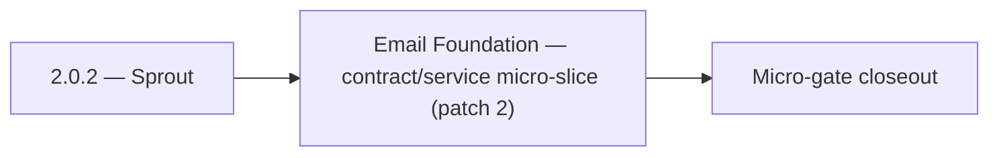

# 2.0.2 — Sprout

- **Era:** `2.x` Email system — hub [`versions.md`](../versions.md) · minors start at [`2.0 — Email Foundation`](2.0%20%E2%80%94%20Email%20Foundation.md)
- **Minor:** [2.0 — Email Foundation](./2.0 — Email Foundation.md)
- **Codename:** Sprout
- **Status:** planned

## Focus
Email Foundation — contract/service micro-slice (patch 2)

## Flowchart

## Micro-gate

| Track | Gate question | Answer / Evidence (fill at patch closeout) |
| --- | --- | --- |
| **Contract** | GraphQL email/jobs/upload or Lambda/Mailvetter REST changed? Diff vs `docs/backend/apis/`; bulk job idempotency? | Document at patch closeout. |
| **Service** | Finder/verifier/bulk stream smoke; provider routing + error envelopes unchanged or versioned? | Document smoke paths. |
| **Surface** | Email Studio, bulk job UI, or `/email` mailbox changed? Loading/error/progress contracts? | Document UX delta or N/A. |
| **Frontend** | Which routes/hooks must change for this patch? | Email Studio Finder/Verifier; `docs/frontend/emailapis-ui-bindings.md`. Document at closeout. |
| **Data** | `email_finder_cache`, patterns, job rows, Mailvetter store, S3 artifacts — migrations + lineage? | Document migrations/lineage or N/A. |
| **Ops** | Multipart/queue alerts, rollback/runbook delta for email-impacting releases? | Document ops delta or N/A. |

## Tasks
### Contract
- 📌 Planned: Lock **Mailvetter v1** `POST /v1/emails/validate` request/response for gateway mapping — **Service task slices** below (includes former `mailvetter-email-system-task-pack.md` scope).
- 📌 Planned: Align `AnalyzeEmailRiskInput` in GraphQL schema (`17_AI_CHATS_MODULE.md`) with REST schema.
- 📌 Planned: Freeze v1 endpoints: `POST /v1/emails/validate`, `POST /v1/emails/validate-bulk`, `GET /v1/jobs/:job_id`, `GET /v1/jobs/:job_id/results`.
- 📌 Planned: Freeze multipart lifecycle API contract: `initiate`, presigned **part URL**, `register` part, `complete`, `abort`.

### Service
- 📌 Planned: Remove or gate **inline debug file writes** in email handlers (Appointment360 analysis).
- 📌 Planned: Add fallback to Gemini if HF JSON task fails for email risk analysis.
- 📌 Planned: Add explicit `failed` job status path for partial/system failures.
- 📌 Planned: **Bulk failure recovery:** client retry strategy, server-side cleanup of abandoned multipart sessions.

## Service task slices
> Merged from era `2.x` email system task packs (P0→`.0`–`.2`, P1→`.3`–`.6`, Ops→`.7`–`.9`).

### Appointment360 (gateway)
- Define EmailQuery { findEmails, findEmailsBulk, verifySingleEmail, verifyEmailsBulk } types
- Define EmailMutation { addEmailPattern, addEmailPatternBulk }
- Define JobQuery { job(jobId), jobs(limit,offset,status,jobType) }
- Define JobMutation { createEmailFinderExport, createEmailVerifyExport, createEmailPatternImport, retryJob }
- Define shared SchedulerJob GraphQL type with status, timeline, dag, result_url
- Define EmailFinderInput, EmailVerifierInput, BulkEmailInput, EmailPatternInput types
- Implement LambdaEmailClient in app/clients/lambda_email_client.py
- Wire findEmails query → LambdaEmailClient.find_single(email_input)
- Wire findEmailsBulk query → LambdaEmailClient.find_bulk(...)
- Wire verifySingleEmail query → LambdaEmailClient.verify_single(...)
- Wire verifyEmailsBulk query → LambdaEmailClient.verify_bulk(...)
- Wire addEmailPattern mutation → LambdaEmailClient.add_pattern(...)
- Implement TkdjobClient in app/clients/tkdjob_client.py
- Wire createEmailFinderExport mutation → TkdjobClient.create_email_export(...)
- Wire createEmailVerifyExport mutation → TkdjobClient.create_email_verify(...)
- Wire createEmailPatternImport mutation → TkdjobClient.create_email_pattern_import(...)
- Wire job(jobId) query → TkdjobClient.get_job_status(job_id)
- Wire jobs() query → TkdjobClient.list_jobs(...)
- Remove inline debug file writes from email/queries.py and jobs/mutations.py
- Add credit deduction: deduct per email find/verify operation
- /email page, Finder tab → query findEmails / query findEmailsBulk binding
- /email page, Verifier tab → query verifySingleEmail / query verifyEmailsBulk binding
- CSV upload on Email Verifier/Finder → mutation createEmailFinderExport / createEmailVerifyExport
- Jobs list table on /email → query jobs(jobType:"email_export") binding
- Job status progress bar → polling query job(jobId) every 2s
- useEmailFinderSingle hook: call findEmails, show spinner while pending
- useEmailFinderBulk hook: upload CSV, create export job, poll status
- useEmailVerifierSingle hook: call verifySingleEmail
- useJobStatus hook: polling wrapper for query job(jobId)
- Record activity on email export creation: write to activities table
- Track credit consumption per email finder/verifier call
- Ensure tkdjob job_id is stored if job is deferred (for polling)
- Configure LAMBDA_EMAIL_API_URL and LAMBDA_EMAIL_API_KEY in .env.example
- Configure TKDJOB_API_URL and TKDJOB_API_KEY in .env.example

### emailapis / emailapigo
- Define and freeze era **`2.x`** email endpoint and payload compatibility notes (finder, verifier, pattern, bulk batch).
- Update endpoint/reference matrix: `docs/backend/endpoints/emailapis_endpoint_era_matrix.json`.
- Publish **provider parity matrix**: same input → normalized output for **Python vs Go** adapters (golden fixtures).
- Freeze **status vocabulary** table consumed by Appointment360 GraphQL mappers.
- Document **bulk partial-batch** semantics: which rows retry, which are terminal, how errors surface in `job_response`.
- Implement/validate runtime behavior for era **`2.x`** finder, verifier, pattern, and fallback paths.
- Verify auth, provider routing, **error envelope**, and health diagnostics behavior.
- Propagate **`X-Request-ID`** (or equivalent) from gateway into Lambda logs.
- Align **credit correlation**: accept gateway context headers or payload fields for billing traces (see `2.9` minor).
- Document **`email_finder_cache`** and **`email_patterns`** lineage impact for era **`2.x`**.
- Record provider, status, and traceability expectations for this era (cache key includes provider/version if needed).

### Jobs
- Freeze contracts for `email_finder_export_stream`, `email_verify_export_stream`, and `email_pattern_import_stream` (inputs, outputs, terminal states).
- Keep endpoint and **status semantics** aligned with UI progress expectations (percent, processed/total, failure counts).
- Document **checkpoint** fields: byte offset or row cursor, idempotent resume rules.
- Define **`job_node.data`** metadata for **`2.x` billing alignment**: `user_uuid`, `billing.correlation_id`, optional `credit_estimate`, `rows_total` — see `version_2.9`.
- **Retry policy:** which failures are worker-retriable vs terminal; no duplicate credit charge on successful retry (coordinate with gateway).
- Validate stream processor behavior for **large CSV** inputs (memory bounds, backpressure).
- Enforce **retry and checkpoint** semantics for email flows; kill/restart worker test passes.
- Concurrency targets per roadmap: finder stream **3**, verifier stream **5** (tune via config; document).
- Batch calls to `emailapis` / `emailapigo` / Mailvetter with **bounded concurrency** and backoff.
- Document input/output **CSV lineage** and error envelopes in `job_response` / job store.
- Record **checkpoint-byte** and **processed-row** meaning for email workflows.

## Evidence gate
Patch closeout includes contract diff, smoke output, data lineage delta, and ops note
