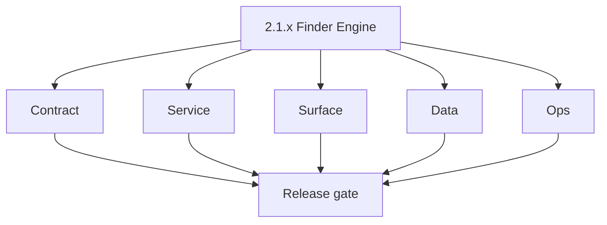

# Version 2.1 — Finder Engine

- **Status:** ✅ Completed
- **Codename:** Finder Engine  
- **Era:** 2.x (Contact360 email system)  
- **Roadmap:** Stage **2.1** — Email Finder Engine (patterns, Go worker, historical logs)  
- **Summary:** Production maturity for **email discovery**: `emailService.ts` / hooks → GraphQL finder → **`emailapigo`** pattern generation (10 formats) → cache lookup → provider fallback → scored candidates → dashboard.  
- **Patch closure:** Every codenamed patch file includes **Micro-gate** + **Service task slices**. Era hub: [`versions.md`](../versions.md).

## Scope

- **Target:** `2.1.x` patches — finder-only depth; verifier is **`2.2`**.  
- **In scope:** Pattern matrix, cache semantics, credit deduction **per finder call** (roadmap).  
- **Out of scope:** Mailvetter scoring model changes ( **`2.2`** ); bulk CSV stream ( **`2.4`** ).  
- **Owners:** Email Engineering.

## Flowchart

### Runtime focus (unique to this minor)

```mermaid
flowchart LR
    hook["useEmailFinderSingle or emailService"] --> gql["findEmail GraphQL"]
    gql --> gw["gateway auth plus credit check"]
    gw --> go["emailapigo Go worker"]
    go --> pat["up to 10 pattern formats"]
    pat --> cache["email_finder_cache lookup"]
    cache --> score["rank or score candidates"]
    score --> norm["normalize metadata for UI"]
    norm --> dash["dashboard finder results"]
    dash --> gate["2.1 release gate"]
```

## Task tracks

### Contract

- ✅ Completed: 📌 Planned: Freeze **finder** GraphQL input/output and enum for pattern sources — **Service task slices** in `2.1.P` patch files (scope from former `appointment360-email-system-task-pack.md`).
- ✅ Completed: 📌 Planned: Document **emailapigo** vs **emailapis** routing rules — **Service task slices** in `2.1.P` patch files (scope from former `emailapis-email-system-task-pack.md`).

### Service

- ✅ Completed: 📌 Planned: Implement or verify **10-pattern generation** and **historical log** behavior per roadmap.
- ✅ Completed: 📌 Planned: Harden **provider fallback** when primary provider fails (no silent empty result).

### Surface

- ✅ Completed: 📌 Planned: **App:** `EmailFinderSingle.tsx` + `useEmailFinderSingle.ts` aligned to contract.
- ✅ Completed: 📌 Planned: Loading, empty, and error states explicit.

### Data

- ✅ Completed: 📌 Planned: **`email_finder_cache`** mutation rules and TTL or invalidation policy documented.
- ✅ Completed: 📌 Planned: **`email_patterns`** lineage for user-added patterns.

### Ops

- ✅ Completed: 📌 Planned: Latency dashboard: p50/p95 finder (roadmap KPI).
- ✅ Completed: 📌 Planned: Alert on finder error rate spike.

## Task Breakdown

| Slice | Outcome |
| --- | --- |
| emailapigo | Pattern + cache core |
| Gateway | Credit + routing |
| App | Finder UX contract |

## Immediate next execution queue

- 📌 Planned: Contract test: same input → deterministic pattern set (modulo provider).  
- 📌 Planned: Cross-check `truelist` vs `mailvetter` naming in docs vs runtime.

## Cross-service ownership

| Service | Focus |
| --- | --- |
| `lambda/emailapigo` | Primary finder runtime |
| `lambda/emailapis` | Fallback / parity |
| `contact360.io/api` | GraphQL + credits |
| `contact360.io/app` | Finder UI |

## Codebase file targets (Finder Engine)

Grounded in `docs/codebases/emailapis-codebase-analysis.md` and `docs/codebases/appointment360-codebase-analysis.md`.

| Slice | Primary codebases | Start files | What must be true by 2.1 freeze |
| --- | --- | --- | --- |
| Pattern + candidate generation | `lambda/emailapigo` | `lambda/emailapigo/internal/services/email_finder_service.go` | Produces deterministic pattern set (within defined rules) |
| Cache read/write | `lambda/emailapis` + DB | Python service `app/services/email_finder_service.py` (cache path) | `email_finder_cache` identity keys are normalized and stable |
| Gateway routing rules | `contact360.io/api` | `app/clients/lambda_email_client.py`, email module resolvers | Routing `emailapigo` vs `emailapis` documented and testable |
| UI contract | `contact360.io/app` | `useEmailFinderSingle`, Finder tab components | UI ordering matches server ranking; empty/error states locked |

## Data focus: `email_finder_cache` write path (explicit)

This minor owns the semantics of cache writes and cache hits.

- **Identity keys**: `first_name`, `last_name`, `domain` are case-insensitive and normalized.
- **Write rule**: only write cache entries for validated input sets (no invalid domain pollution).
- **Evidence**: data lineage doc updated (`docs/backend/database/emailapis_data_lineage.md`) and at least one “cache hit” trace exists.

## References

- [`docs/roadmap.md`](../roadmap.md) — stage 2.1  
- [`docs/codebases/emailapis-codebase-analysis.md`](../codebases/emailapis-codebase-analysis.md)  
- [`email_system.md`](email_system.md)

## Backend API and Endpoint Scope

- **GraphQL:** finder mutations/queries only for this minor slice.  
- **Lambda:** emailapigo endpoints used by gateway for finder.

## Database and Data Lineage Scope

- **email_finder_cache**, **email_patterns** — read/write paths and ownership.

## Frontend UX Surface Scope

- Single finder flow; optional bulk finder entry only if already in product (defer bulk export to `2.4`).

## UI Elements Checklist

- 📌 Planned: Finder form fields (name, domain, etc.)  
- 📌 Planned: Results list with pattern source labels  
- 📌 Planned: Loading spinner / skeleton  
- 📌 Planned: Error toast with retry

## Flow / Graph Delta for This Minor

- **Delta:** Narrows **`2.0`** spine to **finder depth** — Go worker, patterns, cache — without owning verifier or bulk.

## Audit and Compliance Notes

- Log finder invocations with **user id** and **credit deduction** correlation id; avoid logging full PII blobs.

## Patch ladder (`2.1.0` – `2.1.9`)

### Micro-gate reference (apply at every `2.N.P`)

| Track | Gate question (must answer Yes or document waiver) |
| --- | --- |
| **Contract** | GraphQL email/jobs/upload or Lambda/Mailvetter REST changed? Diff vs `docs/backend/apis/`; bulk job idempotency documented? |
| **Service** | Finder/verifier/bulk paths still smoke; provider routing + error envelopes OK or versioned? |
| **Surface** | Email Studio, bulk job UI, or `/email` mailbox changed? Loading/error/progress contracts? |
| **Frontend** | Which routes/hooks apply (see **Frontend UX Surface Scope** / checklist in minor)? |
| **Data** | `email_finder_cache`, patterns, jobs, Mailvetter, S3 artifacts — migrations + lineage? |
| **Ops** | Multipart/queue durability, alerts, rollback/runbook delta for email releases? |

**Patch intent bands:** `.0` charter · `.1`–`.3` core path · `.4`–`.6` hardening · `.7`–`.8` integration · `.9` minor freeze / handoff.

Theme: **Pattern** — codenames in per-patch `2.1.P — *.md` files.

| Patch | Codename | Contract | Service | Surface | Data | Ops |
| --- | --- | --- | --- | --- | --- | --- |
| `2.1.0` | Match | Pattern formats list frozen | Pattern generation stable in `emailapigo` | UI shows pattern sources | Cache keys normalized | Latency baseline captured |
| `2.1.1` | Guess | Provider fallback contract documented | Second provider path returns compatible payload | UI shows fallback attribution | Cache write evidence for fallback | Error spike alert stub |
| `2.1.2` | Format | Normalization rules frozen | Candidate normalization identical across adapters | UI copy uses canonical address | Cache stores normalized form | Regression tests for normalization |
| `2.1.3` | Domain | Domain validation error codes frozen | Invalid domains rejected early | Inline domain errors | No cache pollution | Invalid-domain telemetry |
| `2.1.4` | Alias | Alias expansion policy frozen | Alias generation deterministic | Optional alias UX toggle | Store alias decision evidence | Alias false-positive monitor |
| `2.1.5` | Variant | Variant scoring rubric frozen | Scoring computed consistently | Score badge + tooltip | Persist score fields for export | Score drift checks |
| `2.1.6` | Combine | Merge rules frozen | Provider candidate merge deterministic | “Best” result semantics consistent | Provider disagreement stored | Disagreement metrics |
| `2.1.7` | Score | Score field names frozen | Server ordering stable | UI doesn’t re-sort incorrectly | Score persisted | Ranking regression tests |
| `2.1.8` | Rank | Ordering contract frozen | Stable sort keys | UI ordering matches server | Store rank + tie-break | UI snapshot/regression |
| `2.1.9` | Freeze | Finder contract frozen for verifier integration | Parity fixtures for Python/Go | UI states locked | Cache/pattern lineage links updated | Release notes + rollback |

## Release Gate and Evidence

### Master Task Checklist

- 📌 Planned: `docs/versions.md` / roadmap 2.1 alignment

### Backend API and Endpoints

- 📌 Planned: Finder GraphQL + Lambda smoke

### Database and Data Lineage

- 📌 Planned: Cache/pattern doc updated

### Frontend UX

- 📌 Planned: Screenshot or trace of finder success path

### UI Elements

- 📌 Planned: Checklist above

### Flow and Graph

- 📌 Planned: Runtime Mermaid reviewed

### Validation

- 📌 Planned: Credit deducted once per successful finder policy

### Release Gate

- 📌 Planned: Sign-off for **`2.2` Verifier Engine**

## Patches

| Patch | Codename | Doc |
| --- | --- | --- |
| `2.1.0` | Void | [`2.1.0` — Void](2.1.0 — Void.md) |
| `2.1.1` | Seed | [`2.1.1` — Seed](2.1.1 — Seed.md) |
| `2.1.2` | Sprout | [`2.1.2` — Sprout](2.1.2 — Sprout.md) |
| `2.1.3` | Roots | [`2.1.3` — Roots](2.1.3 — Roots.md) |
| `2.1.4` | Soil | [`2.1.4` — Soil](2.1.4 — Soil.md) |
| `2.1.5` | Rain | [`2.1.5` — Rain](2.1.5 — Rain.md) |
| `2.1.6` | Stem | [`2.1.6` — Stem](2.1.6 — Stem.md) |
| `2.1.7` | Branch | [`2.1.7` — Branch](2.1.7 — Branch.md) |
| `2.1.8` | Leaf | [`2.1.8` — Leaf](2.1.8 — Leaf.md) |
| `2.1.9` | Bloom | [`2.1.9` — Bloom](2.1.9 — Bloom.md) |
