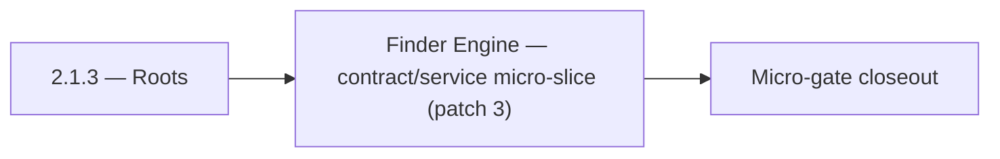

# 2.1.3 — Roots

- **Era:** `2.x` Email system — hub [`versions.md`](../versions.md) · minors start at [`2.0 — Email Foundation`](2.0%20%E2%80%94%20Email%20Foundation.md)
- **Minor:** [2.1 — Finder Engine](./2.1 — Finder Engine.md)
- **Codename:** Roots
- **Status:** planned

## Focus
Finder Engine — contract/service micro-slice (patch 3)

## Flowchart

## Micro-gate

| Track | Gate question | Answer / Evidence (fill at patch closeout) |
| --- | --- | --- |
| **Contract** | GraphQL email/jobs/upload or Lambda/Mailvetter REST changed? Diff vs `docs/backend/apis/`; bulk job idempotency? | Document at patch closeout. |
| **Service** | Finder/verifier/bulk stream smoke; provider routing + error envelopes unchanged or versioned? | Document smoke paths. |
| **Surface** | Email Studio, bulk job UI, or `/email` mailbox changed? Loading/error/progress contracts? | Document UX delta or N/A. |
| **Frontend** | Which routes/hooks must change for this patch? | Finder/pattern UI + emailapigo routing — see minor. Document at closeout. |
| **Data** | `email_finder_cache`, patterns, job rows, Mailvetter store, S3 artifacts — migrations + lineage? | Document migrations/lineage or N/A. |
| **Ops** | Multipart/queue alerts, rollback/runbook delta for email-impacting releases? | Document ops delta or N/A. |

## Tasks
### Contract
- Request: `{"email": "<string, valid email>"}`
- 📌 Planned: Document rate limit for email risk analysis endpoint (token bucket parameters).
- 📌 Planned: Freeze confidence score mapping and score breakdown schema.
- 📌 Planned: Document **output prefix** convention for email exports: link `job_id`, `user_uuid`, and optional `tenant` in key path.

### Service
- 📌 Planned: Write `HFService.json_task()` prompt for email risk scoring (role-based check, disposable domain check).
- 📌 Planned: Harden single verify path: syntax -> DNS -> SMTP -> scoring.
- 📌 Planned: Replace **in-memory** multipart session tracking with **durable shared storage** (Redis/Postgres/Dynamo — pick per implementation).
- 📌 Planned: In `mappers.py`: validate `email` field format if present; set `email_status=unverified` if email present but status absent

## Service task slices
> Merged from era `2.x` email system task packs (P0→`.0`–`.2`, P1→`.3`–`.6`, Ops→`.7`–`.9`).

### emailapis / emailapigo
- Document impacted pages/tabs/buttons/inputs/components for era **`2.x`** (Email Studio, bulk flows).
- Document relevant hooks/services/contexts and UX states (loading/error/progress/checkbox/radio).
- Document **`email_finder_cache`** and **`email_patterns`** lineage impact for era **`2.x`**.
- Record provider, status, and traceability expectations for this era (cache key includes provider/version if needed).
- Implement/validate runtime behavior for era **`2.x`** finder, verifier, pattern, and fallback paths.
- Verify auth, provider routing, **error envelope**, and health diagnostics behavior.
- Propagate **`X-Request-ID`** (or equivalent) from gateway into Lambda logs.
- Align **credit correlation**: accept gateway context headers or payload fields for billing traces (see `2.9` minor).

### Appointment360 (gateway)
- Document email module in docs/backend/apis/15_EMAIL_MODULE.md
- Document jobs module in docs/backend/apis/16_JOBS_MODULE.md
- Download result button → mutation s3.getDownloadUrl(key) after job complete
- Add email pattern modal → mutation addEmailPattern binding
- Create scheduler_jobs table (if managed in appointment360 DB): uuid, job_type, status, result_url, user_uuid, created_at
- Add Postman environment variables for Lambda Email + tkdjob
- Write integration test: findEmails round-trip with mocked LambdaEmailClient
- Write integration test: createEmailFinderExport → poll job(jobId) → status = done

## Evidence gate
Patch closeout includes contract diff, smoke output, data lineage delta, and ops note
