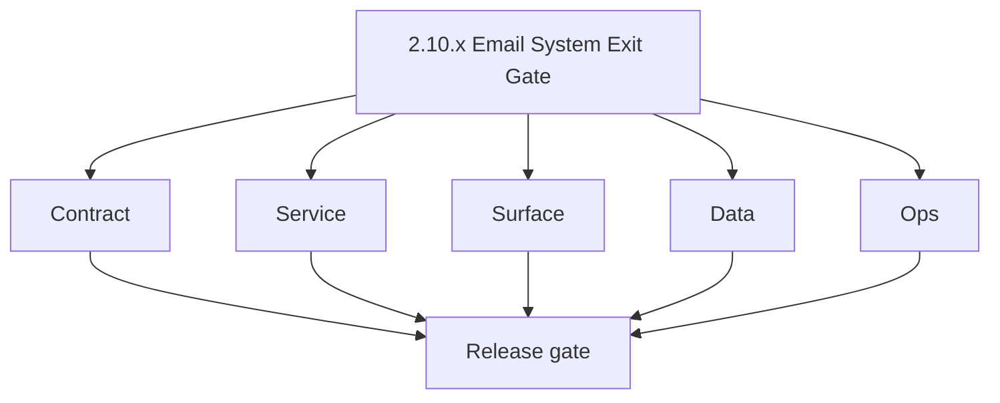
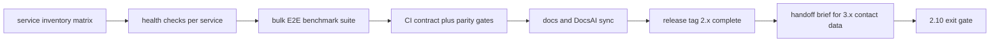

# Version 2.10 — Email System Exit Gate

- **Status:** planned  
- **Codename:** Email System Exit Gate  
- **Era:** 2.x (Contact360 email system)  
- **Roadmap:** Final **`2.x`** certification before **3.x** — Contact and company data system  
- **Summary:** **Freeze** the email platform: cross-service **health matrix**, **bulk E2E benchmark** baseline, **CI gates** for contract tests (emailapis parity, Mailvetter v1), documentation **sync** (`docs/docsai-sync.md`), explicit **handoff** narrative to `3.x`.  
- **Patch closure:** Every codenamed patch file includes **Micro-gate** + **Service task slices**. Era hub: [`versions.md`](../versions.md).

## Scope

- **Target:** `2.10.x` patches — evidence and gates, not feature expansion.  
- **In scope:** Runbooks, benchmarks, tagging releases.  
- **Out of scope:** New email features (defer to future minors or next era).  
- **Owners:** Email Engineering + Governance.

## Flowchart

### Runtime focus (unique to this minor)

## Task tracks

### Contract

- 📌 Planned: **OpenAPI / GraphQL** snapshots archived for email surfaces.  
- 📌 Planned: **Deprecation** list for legacy Mailvetter routes finalized.

### Service

- 📌 Planned: Load test **bulk** at target QPS; capture results.  
- 📌 Planned: Mailvetter **SMTP** error budget review.

### Surface

- 📌 Planned: **Accessibility** pass on Email Studio critical paths.

### Data

- 📌 Planned: S3 **lifecycle** for email artifacts confirmed in prod config.

### Ops

- 📌 Planned: **Runbook** index linked from [`email_system.md`](email_system.md).  
- 📌 Planned: On-call drill: P1 email outage.

## Task Breakdown

| Slice | Outcome |
| --- | --- |
| QA | Benchmark + CI |
| Docs | Freeze + sync |
| Leadership | Sign-off |

## Immediate next execution queue

- 📌 Planned: Single-page **handoff** doc for `3.x` owners.  
- 📌 Planned: Postmortem template for email incidents linked.

## Cross-service ownership

| Service | Focus |
| --- | --- |
| All email-related | Health row |
| Governance | DocsAI sync |

## References

- [`docs/version-policy.md`](../version-policy.md)  
- [`docs/docsai-sync.md`](../docsai-sync.md)  
- [`docs/versions.md`](../versions.md)  
- [`versions.md`](../versions.md) · per-patch Micro-gate in this folder

## Backend API and Endpoint Scope

- Full matrix: gateway, Lambdas, Mailvetter, jobs callbacks.

## Database and Data Lineage Scope

- Snapshot of schemas + migration head per service.

## Frontend UX Surface Scope

- Dashboard Email Studio + `/email` mailbox smoke checklist.

## UI Elements Checklist

- 📌 Planned: Critical path checklist signed (finder, verifier, bulk, mailbox connect)

## Flow / Graph Delta for This Minor

- **Delta:** **No new runtime graph** — certifies the graph built across `2.0`–`2.9`.

## Audit and Compliance Notes

- Exit criteria include **audit** sampling pass for email logs and bulk artifacts.

## Patch ladder (`2.10.0` – `2.10.9`)

### Micro-gate reference (apply at every `2.N.P`)

| Track | Gate question (must answer Yes or document waiver) |
| --- | --- |
| **Contract** | GraphQL email/jobs/upload or Lambda/Mailvetter REST changed? Diff vs `docs/backend/apis/`; bulk job idempotency documented? |
| **Service** | Finder/verifier/bulk paths still smoke; provider routing + error envelopes OK or versioned? |
| **Surface** | Email Studio, bulk job UI, or `/email` mailbox changed? Loading/error/progress contracts? |
| **Frontend** | Which routes/hooks apply (see **Frontend UX Surface Scope** / checklist in minor)? |
| **Data** | `email_finder_cache`, patterns, jobs, Mailvetter, S3 artifacts — migrations + lineage? |
| **Ops** | Multipart/queue durability, alerts, rollback/runbook delta for email releases? |

**Patch intent bands:** `.0` charter · `.1`–`.3` core path · `.4`–`.6` hardening · `.7`–`.8` integration · `.9` minor freeze / handoff.

Theme: **Arch** — codenames in per-patch `2.10.P — *.md` files.

| Patch | Codename | Focus |
| --- | --- | --- |
| `2.10.0` | Inventory | Service list |
| `2.10.1` | Probe | Health probes |
| `2.10.2` | Benchmark | Bulk numbers |
| `2.10.3` | Certify | Pass criteria |
| `2.10.4` | Harden | Remaining fixes |
| `2.10.5` | Document | Runbooks |
| `2.10.6` | Freeze | Contract freeze |
| `2.10.7` | Tag | Version tags |
| `2.10.8` | Promote | Comms |
| `2.10.9` | Exit | **3.x** handoff |

## Release Gate and Evidence

### Master Task Checklist

- 📌 Planned: Cross-cutting evidence in [`versions.md`](../versions.md) + per-patch **Micro-gate** closeouts

### Backend API and Endpoints

- 📌 Planned: CI green: parity + Mailvetter smoke

### Database and Data Lineage

- 📌 Planned: Schema snapshot artifact

### Frontend UX

- 📌 Planned: Smoke video or checklist

### UI Elements

- 📌 Planned: Checklist above

### Flow and Graph

- 📌 Planned: Full-era graph review with architects

### Validation

- 📌 Planned: Benchmark within SLO

### Release Gate

- 📌 Planned: **Explicit approval** to start **`3.x` Contact and company data system** program work

## Patches

| Patch | Codename | Doc |
| --- | --- | --- |
| `2.10.0` | Inventory | [`2.10.0` — Inventory](2.10.0 — Inventory.md) |
| `2.10.1` | Probe | [`2.10.1` — Probe](2.10.1 — Probe.md) |
| `2.10.2` | Benchmark | [`2.10.2` — Benchmark](2.10.2 — Benchmark.md) |
| `2.10.3` | Certify | [`2.10.3` — Certify](2.10.3 — Certify.md) |
| `2.10.4` | Harden | [`2.10.4` — Harden](2.10.4 — Harden.md) |
| `2.10.5` | Document | [`2.10.5` — Document](2.10.5 — Document.md) |
| `2.10.6` | Freeze | [`2.10.6` — Freeze](2.10.6 — Freeze.md) |
| `2.10.7` | Tag | [`2.10.7` — Tag](2.10.7 — Tag.md) |
| `2.10.8` | Promote | [`2.10.8` — Promote](2.10.8 — Promote.md) |
| `2.10.9` | Exit | [`2.10.9` — Exit](2.10.9 — Exit.md) |
