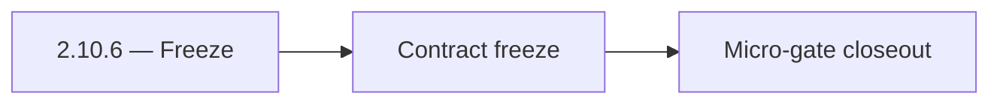

# 2.10.6 — Freeze

- **Era:** `2.x` Email system — hub [`versions.md`](../versions.md) · minors start at [`2.0 — Email Foundation`](2.0%20%E2%80%94%20Email%20Foundation.md)
- **Minor:** [2.10 — Email System Exit Gate](./2.10 — Email System Exit Gate.md)
- **Codename:** Freeze
- **Status:** planned

## Focus
Contract freeze

## Flowchart

## Micro-gate

| Track | Gate question | Answer / Evidence (fill at patch closeout) |
| --- | --- | --- |
| **Contract** | GraphQL email/jobs/upload or Lambda/Mailvetter REST changed? Diff vs `docs/backend/apis/`; bulk job idempotency? | Document at patch closeout. |
| **Service** | Finder/verifier/bulk stream smoke; provider routing + error envelopes unchanged or versioned? | Document smoke paths. |
| **Surface** | Email Studio, bulk job UI, or `/email` mailbox changed? Loading/error/progress contracts? | Document UX delta or N/A. |
| **Frontend** | Which routes/hooks must change for this patch? | Ops/health only unless exposing status externally. Document at closeout. |
| **Data** | `email_finder_cache`, patterns, job rows, Mailvetter store, S3 artifacts — migrations + lineage? | Document migrations/lineage or N/A. |
| **Ops** | Multipart/queue alerts, rollback/runbook delta for email-impacting releases? | Document ops delta or N/A. |

## Tasks
### Contract

- 📌 Planned: **OpenAPI / GraphQL** snapshots archived for email surfaces.  
- 📌 Planned: **Deprecation** list for legacy Mailvetter routes finalized.

### Service

- 📌 Planned: Load test **bulk** at target QPS; capture results.  
- 📌 Planned: Mailvetter **SMTP** error budget review.

### Surface

- 📌 Planned: **Accessibility** pass on Email Studio critical paths.

### Data

- 📌 Planned: S3 **lifecycle** for email artifacts confirmed in prod config.

### Ops

- 📌 Planned: **Runbook** index linked from [`email_system.md`](email_system.md).  
- 📌 Planned: On-call drill: P1 email outage.

## Service task slices
> Merged from era `2.x` email system task packs (P0→`.0`–`.2`, P1→`.3`–`.6`, Ops→`.7`–`.9`).

### Appointment360 (gateway)
- Document email module in docs/backend/apis/15_EMAIL_MODULE.md
- Document jobs module in docs/backend/apis/16_JOBS_MODULE.md
- Download result button → mutation s3.getDownloadUrl(key) after job complete
- Add email pattern modal → mutation addEmailPattern binding
- Create scheduler_jobs table (if managed in appointment360 DB): uuid, job_type, status, result_url, user_uuid, created_at
- Add Postman environment variables for Lambda Email + tkdjob
- Write integration test: findEmails round-trip with mocked LambdaEmailClient
- Write integration test: createEmailFinderExport → poll job(jobId) → status = done

### emailapis / emailapigo
- Document impacted pages/tabs/buttons/inputs/components for era **`2.x`** (Email Studio, bulk flows).
- Document relevant hooks/services/contexts and UX states (loading/error/progress/checkbox/radio).
- Document **`email_finder_cache`** and **`email_patterns`** lineage impact for era **`2.x`**.
- Record provider, status, and traceability expectations for this era (cache key includes provider/version if needed).
- Implement/validate runtime behavior for era **`2.x`** finder, verifier, pattern, and fallback paths.
- Verify auth, provider routing, **error envelope**, and health diagnostics behavior.
- Propagate **`X-Request-ID`** (or equivalent) from gateway into Lambda logs.
- Align **credit correlation**: accept gateway context headers or payload fields for billing traces (see `2.9` minor).

### Jobs
- Document email **bulk** pages using job status, timeline, and retry controls.
- Cover mapping checkboxes/radio controls and **progress bar** states (match Mailvetter/job percent contract).
- Document input/output **CSV lineage** and error envelopes in `job_response` / job store.
- Record **checkpoint-byte** and **processed-row** meaning for email workflows.
- Link **output S3 key** to `job_id` for support (see `logsapi` pack).
- Validate stream processor behavior for **large CSV** inputs (memory bounds, backpressure).
- Enforce **retry and checkpoint** semantics for email flows; kill/restart worker test passes.
- Concurrency targets per roadmap: finder stream **3**, verifier stream **5** (tune via config; document).
- Batch calls to `emailapis` / `emailapigo` / Mailvetter with **bounded concurrency** and backoff.

### logs.api
- Document impacted admin/support pages (if any) for era **`2.x`**.
- Document relevant hooks/services/contexts and UX states (loading/error/progress).
- Document **S3 CSV** storage and lineage impact for era **`2.x`** (canonical store pattern).
- Record **retention**, **trace IDs**, and **query-window** expectations.
- **Bulk scale:** partitioning, file rollover size, and max events/sec assumptions; cardinality limits on labels for metrics export.
- Implement/validate service behavior for era **`2.x`** event sources (jobs processors, gateway, Lambdas) and query expectations.
- Verify auth, error envelope, and health behavior for consuming services (**internal** consumers only unless explicitly exposed).

## Evidence gate
Patch closeout includes contract diff, smoke output, data lineage delta, and ops note
