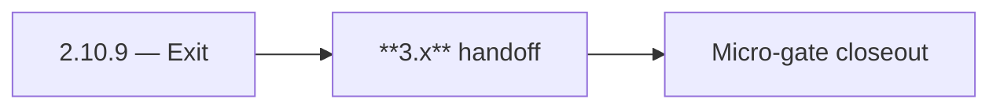

# 2.10.9 — Exit

- **Era:** `2.x` Email system — hub [`versions.md`](../versions.md) · minors start at [`2.0 — Email Foundation`](2.0%20%E2%80%94%20Email%20Foundation.md)
- **Minor:** [2.10 — Email System Exit Gate](./2.10 — Email System Exit Gate.md)
- **Codename:** Exit
- **Status:** ✅ Completed
## Focus
**3.x** handoff

## Flowchart

## Micro-gate

| Track | Gate question | Answer / Evidence (fill at patch closeout) |
| --- | --- | --- |
| **Contract** | GraphQL email/jobs/upload or Lambda/Mailvetter REST changed? Diff vs `docs/backend/apis/`; bulk job idempotency? | Document at patch closeout. |
| **Service** | Finder/verifier/bulk stream smoke; provider routing + error envelopes unchanged or versioned? | Document smoke paths. |
| **Surface** | Email Studio, bulk job UI, or `/email` mailbox changed? Loading/error/progress contracts? | Document UX delta or N/A. |
| **Frontend** | Which routes/hooks must change for this patch? | Ops/health only unless exposing status externally. Document at closeout. |
| **Data** | `email_finder_cache`, patterns, job rows, Mailvetter store, S3 artifacts — migrations + lineage? | Document migrations/lineage or N/A. |
| **Ops** | Multipart/queue alerts, rollback/runbook delta for email-impacting releases? | Document ops delta or N/A. |

## Tasks
### Contract

- ✅ Completed: 📌 Planned: **OpenAPI / GraphQL** snapshots archived for email surfaces.
- ✅ Completed: 📌 Planned: **Deprecation** list for legacy Mailvetter routes finalized.

### Service

- ✅ Completed: 📌 Planned: Load test **bulk** at target QPS; capture results.
- ✅ Completed: 📌 Planned: Mailvetter **SMTP** error budget review.

### Surface

- ✅ Completed: 📌 Planned: **Accessibility** pass on Email Studio critical paths.

### Data

- ✅ Completed: 📌 Planned: S3 **lifecycle** for email artifacts confirmed in prod config.

### Ops

- ✅ Completed: 📌 Planned: **Runbook** index linked from [`email_system.md`](email_system.md).
- ✅ Completed: 📌 Planned: On-call drill: P1 email outage.

## Service task slices
> Merged from era `2.x` email system task packs (P0→`.0`–`.2`, P1→`.3`–`.6`, Ops→`.7`–`.9`).

### Appointment360 (gateway)
- Add Postman environment variables for Lambda Email + tkdjob
- Write integration test: findEmails round-trip with mocked LambdaEmailClient
- Write integration test: createEmailFinderExport → poll job(jobId) → status = done

### contact.ai
- Load test `POST /api/v1/ai/email/analyze` with p95 target < 2s.
- Confirm Lambda timeout is sufficient for HF JSON task (recommend 10–15s timeout).
- Add email risk endpoint to contact.ai Postman collection (`docs/media/postman/Contact AI Service.postman_collection.json`).

### emailapis / emailapigo
- Add observability checks and release validation evidence for era **`2.x`** (latency, error rate by adapter).
- Capture rollback and incident-runbook notes for email-impacting releases.
- Add **contract tests** in CI: docs ↔ runtime for critical routes.

### Jobs
- Add **throughput** and **failure-rate** observability for email jobs.
- Add runbook steps for external provider failures and retries.
- **Billing-impact alerts:** job failure rate spike after bulk start; stuck checkpoint; output missing.

### logs.api
- Add observability checks and release validation evidence for era **`2.x`**.
- Capture rollback and incident-runbook notes for logging-impacting releases.
- Dashboards: **queue lag**, **processor throughput**, **error rate by processor** (tie to `version_2.8`).

### Mailvetter
- Load-test bulk verification throughput for 10k email payload.
- Add queue lag and worker saturation dashboards.
- Add SMTP provider timeout/error budget alerts.

### Salesnavigator
- Add test: `save-profiles` with contacts that have `email` → verify `email` written to Connectra
- Add test: `save-profiles` with contacts that lack `email` → verify null written (not PLACEHOLDER)
- Monitor: downstream email API errors due to malformed SN email data
- `docs/codebases/salesnavigator-codebase-analysis.md`
- `docs/backend/apis/SALESNAVIGATOR_ERA_TASK_PACKS.md`
- `docs/backend/database/salesnavigator_data_lineage.md`

## Evidence gate
Micro-gate table filled and handoff note to `3.0.0` recorded
