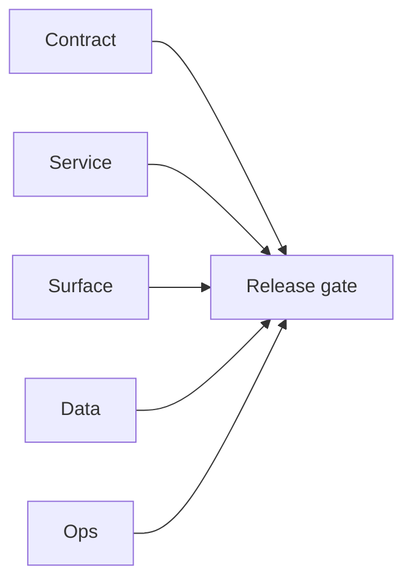

# 2.11.100 — EC2 email server runtime patch evidence

## Scope

Primary email-era patch evidence derived from `EC2/email.server/patches`.

## Included patch intents

- `003-parallel-bulk-verification.patch`: restored concurrent verifier pipeline.
- `004-endpoint-contract-fixes.patch`: pattern endpoint contract alignment.
- `006-error-handling.patch`: JSON decode and Redis write safety.

## Email system outcome

- Bulk verification behavior, endpoint contract handling, and runtime observability are improved.

## Flowchart

Five-track delivery (contract / service / surface / data / ops) for this doc:

**Master hub:** [`docs/docs/flowchart.md`](../docs/flowchart.md) — cross-system diagrams and era strip (`0.x` → `10.x`).
