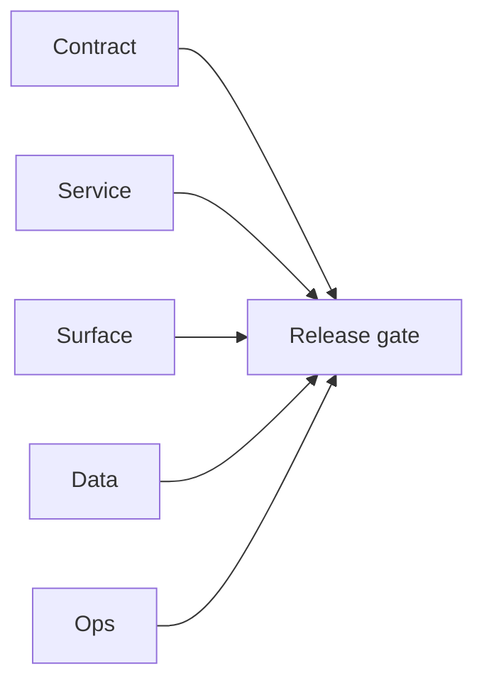

# 2.11.100 — EC2 email server runtime patch evidence

## Scope

Primary email-era patch evidence derived from `EC2/email.server/patches`.

## Included patch intents

- `003-parallel-bulk-verification.patch`: restored concurrent verifier pipeline.
- `004-endpoint-contract-fixes.patch`: pattern endpoint contract alignment.
- `006-error-handling.patch`: JSON decode and Redis write safety.

## Email system outcome

- Bulk verification behavior, endpoint contract handling, and runtime observability are improved.

## Flowchart

Five-track delivery (contract / service / surface / data / ops) for this doc:

**Master hub:** [`docs/docs/flowchart.md`](../docs/flowchart.md) — cross-system diagrams and era strip (`0.x` → `10.x`).

## Task tracks

### Contract

- ✅ Completed: Patches `003-parallel-bulk-verification`, `004-endpoint-contract-fixes`, `006-error-handling` mapped; REST/email contract parity per [`docs/backend/graphql.modules/15_EMAIL_MODULE.md`](../backend/graphql.modules/15_EMAIL_MODULE.md) and emailapis matrices.

### Service

- ✅ Completed: EC2 `email.server` runtime — concurrent verifier pipeline, endpoint fixes, JSON/Redis safety.

### Surface

- ✅ Completed: Bulk verification UX benefits indirectly (fewer stuck jobs); no separate UI change list in this evidence file.

### Data

- ✅ Completed: Checkpoint and job rows remain source of truth in `scheduler_jobs`; patches improve write safety and decode errors.

### Ops

- ✅ Completed: Deploy evidence under `EC2/email.server/patches`; monitor bulk success rate and error spikes post-rollout.
