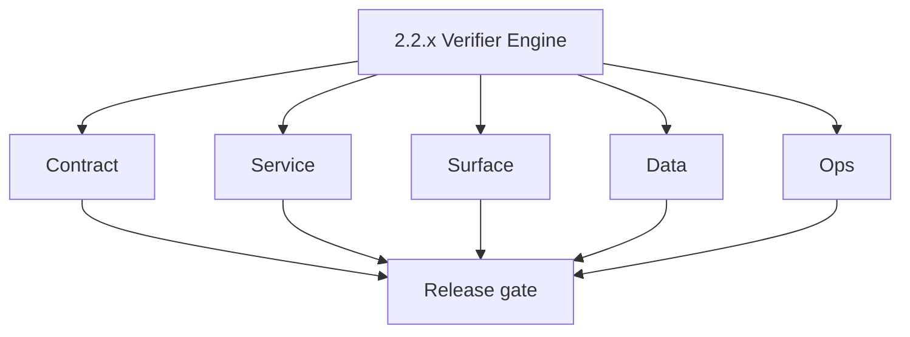

# Version 2.2 — Verifier Engine

- **Status:** ✅ Completed
- **Codename:** Verifier Engine
- **Era:** 2.x (Contact360 email system)
- **Roadmap:** Stage **2.2** — Email Verification Engine (Mailvetter, DNS/SMTP, SPF/DMARC, confidence)
- **Summary:** Make **deep verification** reliable: `verifyEmail` GraphQL → **Mailvetter** `POST /v1/emails/validate` → DNS/MX → SMTP probe → SPF/DMARC signals → **confidence score** → normalized status for app + logs.
- **Patch closure:** Every codenamed patch file includes **Micro-gate** + **Service task slices**. Era hub: [`versions.md`](../versions.md).

## Scope

- **Target:** `2.2.x` patches — verifier single path + contract lock with Mailvetter.
- **In scope:** Status vocabulary alignment (`valid`, `invalid`, `catch_all`, `risky`, `unknown` per pack).
- **Out of scope:** Bulk verify export stream ( **`2.4`** ); Redis rate limiter migration ( **`2.7`** ).
- **Owners:** Email Engineering + Mailvetter.

## Flowchart

### Runtime focus (unique to this minor)

```mermaid
flowchart LR
    gql["verifyEmail GraphQL"] --> api["gateway to Mailvetter client"]
    api --> mv["POST v1 emails validate"]
    mv --> dns["DNS MX plus records"]
    dns --> smtp["SMTP probe"]
    smtp --> sig["SPF DMARC signals"]
    sig --> score["confidence plus score_details"]
    score --> map["map to product status enums"]
    map --> app["dashboard verifier panel"]
    app --> gate["2.2 release gate"]
```

## Task tracks

### Contract

- ✅ Completed: 📌 Planned: Freeze **Mailvetter v1** validate response → GraphQL mapping table — **Service task slices** in `2.2.P` patch files (scope from former `mailvetter-email-system-task-pack.md`).
- 📌 Planned: **[appointment360]** — refine duplicate task (was: ✅ completed: 📌 planned: document **roadmap statuses** (valid…) | patch `2.2.0` band `0` | reason: specialize this file vs sibling patches; see docs/codebases/appointment360-codebase-analysis.md

- 📌 Planned: **[appointment360]** — refine duplicate task (was: 📌 planned: **[architecture]** — product **graphql** remains …) | patch `2.2.0` band `0` | reason: specialize this file vs sibling patches; see docs/codebases/appointment360-codebase-analysis.md
### Service

- 📌 Planned: **[appointment360]** — refine duplicate task (was: 📌 planned: **[appointment360]** — refine duplicate task (was…) | patch `2.2.0` band `0` | reason: specialize this file vs sibling patches; see docs/codebases/appointment360-codebase-analysis.md
- 📌 Planned: **[appointment360]** — refine duplicate task (was: ✅ completed: 📌 planned: timeouts and **partial failure** beh…) | patch `2.2.0` band `0` | reason: specialize this file vs sibling patches; see docs/codebases/appointment360-codebase-analysis.md

- 📌 Planned: **[appointment360]** — refine duplicate task (was: 📌 planned: **[architecture]** — **go/gin satellites** in sco…) | patch `2.2.0` band `0` | reason: specialize this file vs sibling patches; see docs/codebases/appointment360-codebase-analysis.md
### Surface

- 📌 Planned: **[appointment360]** — refine duplicate task (was: ✅ completed: 📌 planned: **app:** `useemailverifiersingle.ts`…) | patch `2.2.0` band `0` | reason: specialize this file vs sibling patches; see docs/codebases/appointment360-codebase-analysis.md
- 📌 Planned: **[appointment360]** — refine duplicate task (was: ✅ completed: 📌 planned: **email app** verifier tab mapping i…) | patch `2.2.0` band `0` | reason: specialize this file vs sibling patches; see docs/codebases/appointment360-codebase-analysis.md

- 📌 Planned: **[appointment360]** — refine duplicate task (was: 📌 planned: **[architecture]** — **next.js** customer surface…) | patch `2.2.0` band `0` | reason: specialize this file vs sibling patches; see docs/codebases/appointment360-codebase-analysis.md
### Data

- 📌 Planned: **[appointment360]** — refine duplicate task (was: ✅ completed: 📌 planned: persist verification outcome for **a…) | patch `2.2.0` band `0` | reason: specialize this file vs sibling patches; see docs/codebases/appointment360-codebase-analysis.md
- 📌 Planned: **[appointment360]** — refine duplicate task (was: ✅ completed: 📌 planned: normalize **results** columns for an…) | patch `2.2.0` band `0` | reason: specialize this file vs sibling patches; see docs/codebases/appointment360-codebase-analysis.md

- 📌 Planned: **[appointment360]** — refine duplicate task (was: 📌 planned: **[architecture]** — **postgresql-first** per `do…) | patch `2.2.0` band `0` | reason: specialize this file vs sibling patches; see docs/codebases/appointment360-codebase-analysis.md
- 📌 Planned: **[appointment360]** — refine duplicate task (was: 📌 planned: **[architecture]** — **redis exit**: campaign (as…) | patch `2.2.0` band `0` | reason: specialize this file vs sibling patches; see docs/codebases/appointment360-codebase-analysis.md
### Ops

- 📌 Planned: **[appointment360]** — refine duplicate task (was: ✅ completed: 📌 planned: smtp provider **error budget** alert…) | patch `2.2.0` band `0` | reason: specialize this file vs sibling patches; see docs/codebases/appointment360-codebase-analysis.md
- 📌 Planned: **[appointment360]** — refine duplicate task (was: ✅ completed: 📌 planned: baseline load: single-verify qps.) | patch `2.2.0` band `0` | reason: specialize this file vs sibling patches; see docs/codebases/appointment360-codebase-analysis.md

- 📌 Planned: **[appointment360]** — refine duplicate task (was: 📌 planned: **[architecture]** — **observability**: correlate…) | patch `2.2.0` band `0` | reason: specialize this file vs sibling patches; see docs/codebases/appointment360-codebase-analysis.md
## Task Breakdown

| Slice | Outcome |
| --- | --- |
| Mailvetter | Validate path SLO |
| Gateway | Map + credit if applicable |
| App | Verifier UX + diagnostics |

## Immediate next execution queue

- 📌 Planned: Deprecate or fence **legacy** Mailvetter routes if still exposed.
- 📌 Planned: Parity test: docs vs runtime for v1 validate.

## Cross-service ownership

| Service | Focus |
| --- | --- |
| `backend(dev)/mailvetter` | Core engine |
| `contact360.io/api` | GraphQL + client |
| `lambda/emailapis` | Optional relay — document |
| `contact360.io/app` | Verifier UI |

## Codebase file targets (Verifier Engine)

Grounded in `docs/codebases/mailvetter-codebase-analysis.md` and `docs/codebases/appointment360-codebase-analysis.md`.

| Slice | Primary codebases | Start files | What must be true by 2.2 freeze |
| --- | --- | --- | --- |
| Mailvetter v1 validate | `backend(dev)/mailvetter` | `internal/handlers/validate.go`, `internal/validator/logic.go` | Stable v1 payload + deterministic status mapping |
| Scoring explainability | `backend(dev)/mailvetter` | `internal/validator/scoring.go` | `score_details` consistently populated and safe to display |
| Gateway mapping | `contact360.io/api` | email module resolvers + Mailvetter client | GraphQL enums and errors map 1:1 |
| UI diagnostics | `contact360.io/app` | `useEmailVerifierSingle` + verifier components | “Why” panel shows safe explainability; timeout UX clear |

## Known gap (track explicitly)

- **O365 false-positive correction path** is flagged as potentially incomplete/inactive in the codebase analysis. Track this as either:
  - a `2.2.x` validation item (prove it works), or
  - a deferred hardening item with explicit owner + target minor.

## References

- [`docs/roadmap.md`](../roadmap.md) — stage 2.2
- [`docs/codebases/mailvetter-codebase-analysis.md`](../codebases/mailvetter-codebase-analysis.md)
- [`docs/backend.md`](../backend.md) — email module pointers

## Backend API and Endpoint Scope

- **GraphQL:** verifier operations.
- **REST:** Mailvetter `/v1/emails/validate` (+ health if used).

## Database and Data Lineage Scope

- Verification **history** rows; Mailvetter internal job store for async bulk (prep for `2.4`).

## Frontend UX Surface Scope

- Single verifier; link to results/history preview.

## UI Elements Checklist

- 📌 Planned: Verifier email input
- 📌 Planned: Status chip + confidence meter
- 📌 Planned: Expandable **why** / score_details
- 📌 Planned: Error / timeout message

## Flow / Graph Delta for This Minor

- **Delta:** Owns **signal chain** and **status semantics**; builds on `2.0` wiring without finder pattern work.

## Audit and Compliance Notes

- Verification events are sensitive — redact full SMTP transcripts from logs; align with [`docs/audit-compliance.md`](../audit-compliance.md).

## Patch ladder (`2.2.0` – `2.2.9`)

### Micro-gate reference (apply at every `2.N.P`)

| Track | Gate question (must answer Yes or document waiver) |
| --- | --- |
| **Contract** | GraphQL email/jobs/upload or Lambda/Mailvetter REST changed? Diff vs `docs/backend/apis/`; bulk job idempotency documented? |
| **Service** | Finder/verifier/bulk paths still smoke; provider routing + error envelopes OK or versioned? |
| **Surface** | Email Studio, bulk job UI, or `/email` mailbox changed? Loading/error/progress contracts? |
| **Frontend** | Which routes/hooks apply (see **Frontend UX Surface Scope** / checklist in minor)? |
| **Data** | `email_finder_cache`, patterns, jobs, Mailvetter, S3 artifacts — migrations + lineage? |
| **Ops** | Multipart/queue durability, alerts, rollback/runbook delta for email releases? |
| **Architecture** | Go/Gin satellites only via Python GraphQL gateway (`contact360.io/api`); Next.js `NEXT_PUBLIC_GRAPHQL_URL`; Postgres-first / Redis exit per `docs/docs/data-stores-postgres.md`. |

**Patch intent bands:** `.0` charter · `.1`–`.3` core path · `.4`–`.6` hardening · `.7`–`.8` integration · `.9` minor freeze / handoff.

Theme: **Signal** — codenames in per-patch `2.2.P — *.md` files.

| Patch | Codename | Contract | Service | Surface | Data | Ops |
| --- | --- | --- | --- | --- | --- | --- |
| `2.2.0` | Probe | v1 validate request/response frozen | SMTP probe stable under timeout budget | Spinner/processing state consistent | Store outcome for activity | Error budget baseline |
| `2.2.1` | Ping | DNS failure codes frozen | DNS/MX latency bounded | UI shows “DNS issue” meaningfully | Persist dns verdict fields | Alert on DNS spikes |
| `2.2.2` | Bounce | Bounce classification contract | Bounce heuristics tested | Bounce chip distinct | Bounce reason persisted | Bounce trend dashboard stub |
| `2.2.3` | Relay | Relay detection fields frozen | Relay checks stable | Relay detail in why panel | Relay signal stored | Monitor relay false positives |
| `2.2.4` | Resolve | MX resolution edge cases documented | Resolver robustness | UI error copy for edge cases | Resolution evidence stored | Latency distribution check |
| `2.2.5` | Score | Score schema frozen | Score weights stable | Confidence meter matches score | Persist score_details safely | Score drift monitor |
| `2.2.6` | Classify | Status taxonomy frozen | Status mapping deterministic | UI badges match canonical | Status columns normalized | Status distribution checks |
| `2.2.7` | Confirm | Confirm/double-check contract | Double-check path bounded | “confirming…” UX | Store confirm attempts | Rate-limit safety check |
| `2.2.8` | Reject | Invalid input contract | Early reject path | Inline validation errors | No result rows for reject | Reject-rate telemetry |
| `2.2.9` | Status | Freeze mapping for 2.3 | Regression tests | UI states locked | Lineage links updated | Release notes + rollback |

## Release Gate and Evidence

### Master Task Checklist

- 📌 Planned: Roadmap 2.2 DoD

### Backend API and Endpoints

- 📌 Planned: Mailvetter v1 validate smoke

### Database and Data Lineage

- 📌 Planned: History write path documented

### Frontend UX

- 📌 Planned: Verifier success + failure traces

### UI Elements

- 📌 Planned: Checklist above

### Flow and Graph

- 📌 Planned: Runtime Mermaid reviewed

### Validation

- 📌 Planned: Status map table signed off by PM + eng

### Release Gate

- 📌 Planned: Sign-off for **`2.3` Results Engine**

## Patches

| Patch | Codename | Doc |
| --- | --- | --- |
| `2.2.0` | Void | [`2.2.0` — Void](2.2.0 — Void.md) |
| `2.2.1` | Seed | [`2.2.1` — Seed](2.2.1 — Seed.md) |
| `2.2.2` | Sprout | [`2.2.2` — Sprout](2.2.2 — Sprout.md) |
| `2.2.3` | Roots | [`2.2.3` — Roots](2.2.3 — Roots.md) |
| `2.2.4` | Soil | [`2.2.4` — Soil](2.2.4 — Soil.md) |
| `2.2.5` | Rain | [`2.2.5` — Rain](2.2.5 — Rain.md) |
| `2.2.6` | Stem | [`2.2.6` — Stem](2.2.6 — Stem.md) |
| `2.2.7` | Branch | [`2.2.7` — Branch](2.2.7 — Branch.md) |
| `2.2.8` | Leaf | [`2.2.8` — Leaf](2.2.8 — Leaf.md) |
| `2.2.9` | Bloom | [`2.2.9` — Bloom](2.2.9 — Bloom.md) |
