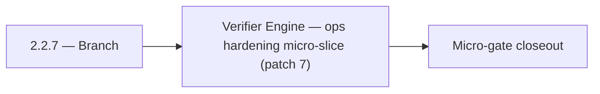

# 2.2.7 — Branch

- **Era:** `2.x` Email system — hub [`versions.md`](../versions.md) · minors start at [`2.0 — Email Foundation`](2.0%20%E2%80%94%20Email%20Foundation.md)
- **Minor:** [2.2 — Verifier Engine](./2.2 — Verifier Engine.md)
- **Codename:** Branch
- **Status:** planned

## Focus
Verifier Engine — ops hardening micro-slice (patch 7)

## Flowchart

## Micro-gate

| Track | Gate question | Answer / Evidence (fill at patch closeout) |
| --- | --- | --- |
| **Contract** | GraphQL email/jobs/upload or Lambda/Mailvetter REST changed? Diff vs `docs/backend/apis/`; bulk job idempotency? | Document at patch closeout. |
| **Service** | Finder/verifier/bulk stream smoke; provider routing + error envelopes unchanged or versioned? | Document smoke paths. |
| **Surface** | Email Studio, bulk job UI, or `/email` mailbox changed? Loading/error/progress contracts? | Document UX delta or N/A. |
| **Frontend** | Which routes/hooks must change for this patch? | Verifier surfaces + status mapping — see minor. Document at closeout. |
| **Data** | `email_finder_cache`, patterns, job rows, Mailvetter store, S3 artifacts — migrations + lineage? | Document migrations/lineage or N/A. |
| **Ops** | Multipart/queue alerts, rollback/runbook delta for email-impacting releases? | Document ops delta or N/A. |

## Tasks
### Ops
- 📌 Planned: SMTP provider **error budget** alert (Mailvetter pack).
- 📌 Planned: Load test `POST /api/v1/ai/email/analyze` with p95 target < 2s.
- 📌 Planned: Add email risk endpoint to contact.ai Postman collection (`docs/media/postman/Contact AI Service.postman_collection.json`).
- 📌 Planned: Add queue lag and worker saturation dashboards.

## Service task slices
> Merged from era `2.x` email system task packs (P0→`.0`–`.2`, P1→`.3`–`.6`, Ops→`.7`–`.9`).

### Mailvetter
- Load-test bulk verification throughput for 10k email payload.
- Add queue lag and worker saturation dashboards.
- Add SMTP provider timeout/error budget alerts.

### emailapis / emailapigo
- Add observability checks and release validation evidence for era **`2.x`** (latency, error rate by adapter).
- Capture rollback and incident-runbook notes for email-impacting releases.
- Add **contract tests** in CI: docs ↔ runtime for critical routes.

### Appointment360 (gateway)
- Add Postman environment variables for Lambda Email + tkdjob
- Write integration test: findEmails round-trip with mocked LambdaEmailClient
- Write integration test: createEmailFinderExport → poll job(jobId) → status = done

## Evidence gate
Patch closeout includes contract diff, smoke output, data lineage delta, and ops note
