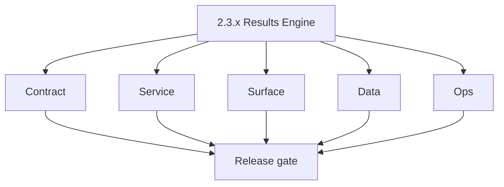
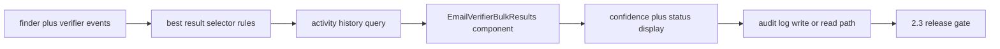

# Version 2.3 — Results Engine

- **Status:** ✅ Completed
- **Codename:** Results Engine
- **Era:** 2.x (Contact360 email system)
- **Roadmap:** Stage **2.3** — Results Engine (best email, auditable activity)
- **Summary:** **Presentation + audit** layer: pick **best result** from finder/verifier outputs, surface **confidence**, drive **`EmailVerifierBulkResults`** and related components, and ensure **activity history** is complete and queryable.
- **Patch closure:** Every codenamed patch file includes **Micro-gate** + **Service task slices**. Era hub: [`versions.md`](../versions.md).

## Scope

- **Target:** `2.3.x` patches — UX and logging quality for outcomes, not new providers.
- **In scope:** Result selection rules, activity log schema, dashboard consistency.
- **Out of scope:** Stream processor throughput ( **`2.4`** ); logs.api scale ( **`2.8`** ).
- **Owners:** Email Engineering + Dashboard.

## Flowchart

### Runtime focus (unique to this minor)

## Task tracks

### Contract

- ✅ Completed: 📌 Planned: **[appointment360]** — refine duplicate task (was: 📌 planned: **[appointment360]** — refine duplicate task (was…) | patch `2.3.0` band `0` | reason: specialize this file vs sibling patches; see docs/codebases/appointment360-codebase-analysis.md
- ✅ Completed: ✅ Completed: 📌 Planned: GraphQL **activity** query shape for email operations — **Service task slices** in `2.3.P` patch files (scope from former `appointment360-email-system-task-pack.md`).

- ✅ Completed: 📌 Planned: **[appointment360]** — refine duplicate task (was: 📌 planned: **[architecture]** — product **graphql** remains …) | patch `2.3.0` band `0` | reason: specialize this file vs sibling patches; see docs/codebases/appointment360-codebase-analysis.md
### Service

- ✅ Completed: 📌 Planned: **[appointment360]** — refine duplicate task (was: 📌 planned: **[appointment360]** — refine duplicate task (was…) | patch `2.3.0` band `0` | reason: specialize this file vs sibling patches; see docs/codebases/appointment360-codebase-analysis.md
- ✅ Completed: 📌 Planned: **[appointment360]** — refine duplicate task (was: ✅ completed: 📌 planned: pagination cursors for long historie…) | patch `2.3.0` band `0` | reason: specialize this file vs sibling patches; see docs/codebases/appointment360-codebase-analysis.md

- ✅ Completed: 📌 Planned: **[appointment360]** — refine duplicate task (was: 📌 planned: **[architecture]** — **go/gin satellites** in sco…) | patch `2.3.0` band `0` | reason: specialize this file vs sibling patches; see docs/codebases/appointment360-codebase-analysis.md
### Surface

- ✅ Completed: 📌 Planned: **[appointment360]** — refine duplicate task (was: ✅ completed: 📌 planned: **app:** `emailfindersingle.tsx`, `e…) | patch `2.3.0` band `0` | reason: specialize this file vs sibling patches; see docs/codebases/appointment360-codebase-analysis.md
- ✅ Completed: 📌 Planned: **[appointment360]** — refine duplicate task (was: ✅ completed: 📌 planned: **progress** components consume same…) | patch `2.3.0` band `0` | reason: specialize this file vs sibling patches; see docs/codebases/appointment360-codebase-analysis.md

- ✅ Completed: 📌 Planned: **[appointment360]** — refine duplicate task (was: 📌 planned: **[architecture]** — **next.js** customer surface…) | patch `2.3.0` band `0` | reason: specialize this file vs sibling patches; see docs/codebases/appointment360-codebase-analysis.md
### Data

- ✅ Completed: 📌 Planned: **[appointment360]** — refine duplicate task (was: ✅ completed: 📌 planned: **activity** table or view: indexes …) | patch `2.3.0` band `0` | reason: specialize this file vs sibling patches; see docs/codebases/appointment360-codebase-analysis.md
- ✅ Completed: 📌 Planned: **[appointment360]** — refine duplicate task (was: ✅ completed: 📌 planned: link rows to **request id** for supp…) | patch `2.3.0` band `0` | reason: specialize this file vs sibling patches; see docs/codebases/appointment360-codebase-analysis.md

- ✅ Completed: 📌 Planned: **[appointment360]** — refine duplicate task (was: 📌 planned: **[architecture]** — **postgresql-first** per `do…) | patch `2.3.0` band `0` | reason: specialize this file vs sibling patches; see docs/codebases/appointment360-codebase-analysis.md
- ✅ Completed: 📌 Planned: **[appointment360]** — refine duplicate task (was: 📌 planned: **[architecture]** — **redis exit**: campaign (as…) | patch `2.3.0` band `0` | reason: specialize this file vs sibling patches; see docs/codebases/appointment360-codebase-analysis.md
### Ops

- ✅ Completed: 📌 Planned: **[appointment360]** — refine duplicate task (was: ✅ completed: 📌 planned: support runbook: “how to trace one u…) | patch `2.3.0` band `0` | reason: specialize this file vs sibling patches; see docs/codebases/appointment360-codebase-analysis.md

- ✅ Completed: 📌 Planned: **[appointment360]** — refine duplicate task (was: 📌 planned: **[architecture]** — **observability**: correlate…) | patch `2.3.0` band `0` | reason: specialize this file vs sibling patches; see docs/codebases/appointment360-codebase-analysis.md
## Task Breakdown

| Slice | Outcome |
| --- | --- |
| Gateway | Activity API |
| App | Results UX parity |
| logs.api | Optional read path for admin (light) |

## Immediate next execution queue

- 📌 Planned: UX review: status colors vs accessibility.
- 📌 Planned: Snapshot tests for result row component.

## Cross-service ownership

| Service | Focus |
| --- | --- |
| `contact360.io/api` | Activity + aggregation |
| `contact360.io/app` | Results components |
| `logs.api` | Optional export for audits |

## Codebase file targets (Results Engine)

Grounded in `docs/codebases/app-codebase-analysis.md`, `docs/codebases/appointment360-codebase-analysis.md`, and `docs/codebases/logsapi-codebase-analysis.md`.

| Slice | Primary codebases | Start files | What must be true by 2.3 freeze |
| --- | --- | --- | --- |
| Best-result selection | Gateway + email runtime | gateway email resolvers/mappers | Selection is server-authoritative (UI does not invent ordering) |
| Activity query + storage | `contact360.io/api` | activity query module + repositories | Activity is queryable by user/time and tied to request_id |
| UI results components | `contact360.io/app` | `EmailFinderSingle.tsx`, `EmailVerifierBulkResults.tsx` | Table empty/loading/error states consistent |
| Audit trail export (optional) | `lambda/logs.api` | `app/services/log_service.py` | Query by `user_uuid`, `request_id`, time window works |

## Logs / activity event schema (2.3 baseline)

Even before `2.8` “Bulk Observability”, `2.3` should lock the minimal event fields required for support:

- `event_type`: `email.finder.response`, `email.verifier.response`, `email.activity.created`
- `request_id`, `trace_id`, `user_uuid`, `timestamp`
- No raw PII blobs in high-volume telemetry (see **Service task slices** on `2.8.P` patches + [`logsapi-codebase-analysis.md`](../codebases/logsapi-codebase-analysis.md))

## References

- [`docs/roadmap.md`](../roadmap.md) — stage 2.3
- [`docs/codebases/app-codebase-analysis.md`](../codebases/app-codebase-analysis.md)
- [`docs/frontend.md`](../frontend.md)

## Backend API and Endpoint Scope

- **GraphQL:** queries for email activity, result detail.
- **Internal:** may read from logs or PG depending on implementation.

## Database and Data Lineage Scope

- Activity storage; optional denormalized **last_result** for dashboard speed.

## Frontend UX Surface Scope

- Results lists, bulk results table, history panel.

## UI Elements Checklist

- 📌 Planned: Best-result highlight
- 📌 Planned: Confidence column
- 📌 Planned: Timestamp / actor
- 📌 Planned: Empty history state
- 📌 Planned: Load more or pagination

## Flow / Graph Delta for This Minor

- **Delta:** Adds **authoritative presentation + history** on top of `2.1`/`2.2` engines.

## Audit and Compliance Notes

- Activity records must support **tenant isolation** and retention policy; see [`docs/audit-compliance.md`](../audit-compliance.md).

## Patch ladder (`2.3.0` – `2.3.9`)

### Micro-gate reference (apply at every `2.N.P`)

| Track | Gate question (must answer Yes or document waiver) |
| --- | --- |
| **Contract** | GraphQL email/jobs/upload or Lambda/Mailvetter REST changed? Diff vs `docs/backend/apis/`; bulk job idempotency documented? |
| **Service** | Finder/verifier/bulk paths still smoke; provider routing + error envelopes OK or versioned? |
| **Surface** | Email Studio, bulk job UI, or `/email` mailbox changed? Loading/error/progress contracts? |
| **Frontend** | Which routes/hooks apply (see **Frontend UX Surface Scope** / checklist in minor)? |
| **Data** | `email_finder_cache`, patterns, jobs, Mailvetter, S3 artifacts — migrations + lineage? |
| **Ops** | Multipart/queue durability, alerts, rollback/runbook delta for email releases? |
| **Architecture** | Go/Gin satellites only via Python GraphQL gateway (`contact360.io/api`); Next.js `NEXT_PUBLIC_GRAPHQL_URL`; Postgres-first / Redis exit per `docs/docs/data-stores-postgres.md`. |

**Patch intent bands:** `.0` charter · `.1`–`.3` core path · `.4`–`.6` hardening · `.7`–`.8` integration · `.9` minor freeze / handoff.

Theme: **Canvas** — codenames in per-patch `2.3.P — *.md` files.

| Patch | Codename | Contract | Service | Surface | Data | Ops |
| --- | --- | --- | --- | --- | --- | --- |
| `2.3.0` | Draft | Best-result inputs frozen | Selection logic deterministic | Basic table renders | Store selected winner | Support query recipe draft |
| `2.3.1` | Render | Table columns frozen | Server ordering authoritative | Layout + empty states | Persist render fields | UI snapshot tests |
| `2.3.2` | Select | Edge-case rules documented | Handle ties and missing data | Edge-case UI copy | Persist tie-break reason | Monitor tie rate |
| `2.3.3` | Best | Tie-break policy frozen | Consistent tie-break | “Best” badge explain | Store algorithm version | Regression tests |
| `2.3.4` | Audit | Audit fields list frozen | Emit activity events | History view works | Index for user/time | Audit query runbook |
| `2.3.5` | Display | Badge/tooltips frozen | Mapping stable | Badges consistent | Status columns normalized | Accessibility review |
| `2.3.6` | Rate | Confidence formatting contract | Confidence computed consistently | Confidence meter UX | Store confidence band | Drift monitoring |
| `2.3.7` | Compare | Compare view schema frozen | Provide evidence fields | Compare drawer/modal | Candidate list stored | Payload size guard |
| `2.3.8` | Archive | Archive semantics frozen | History compaction safe | “Archived” UI state | Retention documented | Export checks |
| `2.3.9` | Seal | Freeze for 2.4 bulk | Regression suite green | UI copy locked | Lineage links updated | Release notes + rollback |

## Release Gate and Evidence

### Master Task Checklist

- 📌 Planned: Roadmap 2.3 KPI: result view completion

### Backend API and Endpoints

- 📌 Planned: Activity query smoke

### Database and Data Lineage

- 📌 Planned: Index + retention note

### Frontend UX

- 📌 Planned: Before/after screenshots

### UI Elements

- 📌 Planned: Checklist above

### Flow and Graph

- 📌 Planned: Runtime Mermaid reviewed

### Validation

- 📌 Planned: Spot-check 10 accounts: history complete

### Release Gate

- 📌 Planned: Sign-off for **`2.4` Bulk Processing**

## Patches

| Patch | Codename | Doc |
| --- | --- | --- |
| `2.3.0` | Void | [`2.3.0` — Void](2.3.0 — Void.md) |
| `2.3.1` | Seed | [`2.3.1` — Seed](2.3.1 — Seed.md) |
| `2.3.2` | Sprout | [`2.3.2` — Sprout](2.3.2 — Sprout.md) |
| `2.3.3` | Roots | [`2.3.3` — Roots](2.3.3 — Roots.md) |
| `2.3.4` | Soil | [`2.3.4` — Soil](2.3.4 — Soil.md) |
| `2.3.5` | Rain | [`2.3.5` — Rain](2.3.5 — Rain.md) |
| `2.3.6` | Stem | [`2.3.6` — Stem](2.3.6 — Stem.md) |
| `2.3.7` | Branch | [`2.3.7` — Branch](2.3.7 — Branch.md) |
| `2.3.8` | Leaf | [`2.3.8` — Leaf](2.3.8 — Leaf.md) |
| `2.3.9` | Bloom | [`2.3.9` — Bloom](2.3.9 — Bloom.md) |
