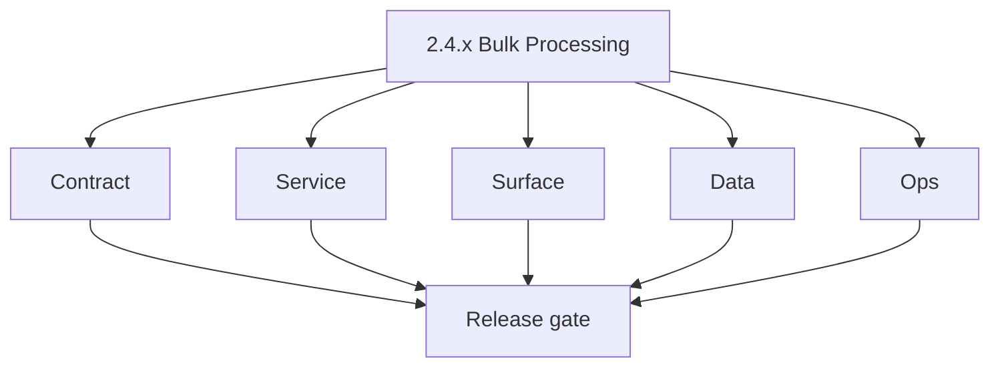

# Version 2.4 — Bulk Processing

- **Status:** ✅ Completed
- **Codename:** Bulk Processing
- **Era:** 2.x (Contact360 email system)
- **Roadmap:** Stage **2.4** — Bulk Processing — Validation (CSV, stream, checkpoint, multipart S3)
- **Summary:** **Async CSV pipeline**: upload → **multipart S3** → **jobs** DAG → `email_finder_export_stream` / `email_verify_export_stream` / pattern import → **checkpoint resume** → output object → **download** in app.
- **Patch closure:** Every codenamed patch file includes **Micro-gate** + **Service task slices**. Era hub: [`versions.md`](../versions.md).

## Scope

- **Target:** `2.4.x` patches — reliability over raw speed first.
- **In scope:** Concurrency targets (roadmap: finder stream **3**, verifier stream **5**), `useNewExport` UX, job status API.
- **Out of scope:** logs.api dashboards ( **`2.8`** ); Mailvetter distributed limiter ( **`2.7`** ).
- **Owners:** Data Pipeline + Platform + Email.

## Flowchart

### Runtime focus (unique to this minor)

```mermaid
flowchart LR
    up["CSV upload in app"] --> mp["s3storage multipart initiate plus parts"]
    mp --> complete["complete plus metadata worker"]
    complete --> job["jobs create DAG node"]
    job --> proc["stream processor finder or verify"]
    proc --> cp["checkpoint byte or row cursor"]
    cp --> out["multipart output to S3"]
    out --> dl["app download via job status"]
    dl --> gate["2.4 release gate"]
```

## Task tracks

### Contract

- ✅ Completed: ✅ Completed: 📌 Planned: Freeze **job create** mutation + **status** enum for email export jobs — **Service task slices** in `2.4.P` patch files (scope from former `jobs-email-system-task-pack.md`).
- ✅ Completed: ✅ Completed: 📌 Planned: Multipart **init/complete/abort** contract — **Service task slices** in `2.4.P` patch files (scope from former `s3storage-email-system-task-pack.md`).

- ✅ Completed: 📌 Planned: **[appointment360]** — refine duplicate task (was: 📌 planned: **[architecture]** — product **graphql** remains …) | patch `2.4.0` band `0` | reason: specialize this file vs sibling patches; see docs/codebases/appointment360-codebase-analysis.md
### Service

- ✅ Completed: 📌 Planned: **[appointment360]** — refine duplicate task (was: 📌 planned: **[appointment360]** — refine duplicate task (was…) | patch `2.4.0` band `0` | reason: specialize this file vs sibling patches; see docs/codebases/appointment360-codebase-analysis.md
- ✅ Completed: 📌 Planned: **[appointment360]** — refine duplicate task (was: ✅ completed: 📌 planned: batch calls to **emailapis** / **mai…) | patch `2.4.0` band `0` | reason: specialize this file vs sibling patches; see docs/codebases/appointment360-codebase-analysis.md

- ✅ Completed: 📌 Planned: **[appointment360]** — refine duplicate task (was: 📌 planned: **[architecture]** — **go/gin satellites** in sco…) | patch `2.4.0` band `0` | reason: specialize this file vs sibling patches; see docs/codebases/appointment360-codebase-analysis.md
### Surface

- ✅ Completed: 📌 Planned: **[appointment360]** — refine duplicate task (was: ✅ completed: 📌 planned: **app:** `usenewexport.ts` — progres…) | patch `2.4.0` band `0` | reason: specialize this file vs sibling patches; see docs/codebases/appointment360-codebase-analysis.md
- ✅ Completed: 📌 Planned: **[appointment360]** — refine duplicate task (was: ✅ completed: 📌 planned: clear copy for **partial failure** (…) | patch `2.4.0` band `0` | reason: specialize this file vs sibling patches; see docs/codebases/appointment360-codebase-analysis.md

- ✅ Completed: 📌 Planned: **[appointment360]** — refine duplicate task (was: 📌 planned: **[architecture]** — **next.js** customer surface…) | patch `2.4.0` band `0` | reason: specialize this file vs sibling patches; see docs/codebases/appointment360-codebase-analysis.md
### Data

- ✅ Completed: 📌 Planned: **[appointment360]** — refine duplicate task (was: ✅ completed: 📌 planned: **job_response** / checkpoint fields…) | patch `2.4.0` band `0` | reason: specialize this file vs sibling patches; see docs/codebases/appointment360-codebase-analysis.md
- ✅ Completed: 📌 Planned: **[appointment360]** — refine duplicate task (was: ✅ completed: 📌 planned: output s3 **prefix** and lifecycle.) | patch `2.4.0` band `0` | reason: specialize this file vs sibling patches; see docs/codebases/appointment360-codebase-analysis.md

- ✅ Completed: 📌 Planned: **[appointment360]** — refine duplicate task (was: 📌 planned: **[architecture]** — **postgresql-first** per `do…) | patch `2.4.0` band `0` | reason: specialize this file vs sibling patches; see docs/codebases/appointment360-codebase-analysis.md
- ✅ Completed: 📌 Planned: **[appointment360]** — refine duplicate task (was: 📌 planned: **[architecture]** — **redis exit**: campaign (as…) | patch `2.4.0` band `0` | reason: specialize this file vs sibling patches; see docs/codebases/appointment360-codebase-analysis.md
### Ops

- ✅ Completed: 📌 Planned: **[appointment360]** — refine duplicate task (was: ✅ completed: 📌 planned: runbook: stuck job → safe retry.) | patch `2.4.0` band `0` | reason: specialize this file vs sibling patches; see docs/codebases/appointment360-codebase-analysis.md
- ✅ Completed: 📌 Planned: **[appointment360]** — refine duplicate task (was: ✅ completed: 📌 planned: metrics: bulk job success rate, resu…) | patch `2.4.0` band `0` | reason: specialize this file vs sibling patches; see docs/codebases/appointment360-codebase-analysis.md

- ✅ Completed: 📌 Planned: **[appointment360]** — refine duplicate task (was: 📌 planned: **[architecture]** — **observability**: correlate…) | patch `2.4.0` band `0` | reason: specialize this file vs sibling patches; see docs/codebases/appointment360-codebase-analysis.md
## Task Breakdown

| Slice | Outcome |
| --- | --- |
| s3storage | Durable multipart |
| jobs | Stream + checkpoint |
| emailapis | Batch fan-out |
| App | Bulk UX |

## Immediate next execution queue

- 📌 Planned: E2E test: upload → process → download (success).
- 📌 Planned: E2E: kill worker mid-stream → resume.

## Cross-service ownership

| Service | Focus |
| --- | --- |
| `contact360.io/jobs` | Processors |
| `lambda/s3storage` | Multipart |
| `contact360.io/api` | Job mutations |
| `contact360.io/app` | Export UX |

## Codebase file targets (Bulk Processing)

Grounded in:
- `docs/codebases/s3storage-codebase-analysis.md`
- `docs/codebases/jobs-codebase-analysis.md`
- `docs/codebases/emailapis-codebase-analysis.md`

| Slice | Primary codebases | Start files | What must be true by 2.4 freeze |
| --- | --- | --- | --- |
| Multipart input upload | `lambda/s3storage` | `app/services/storage_backends.py`, `app/utils/worker.py` | No in-memory multipart session state in production |
| Stream processors | `EC2/email.server`, `EC2/sync.server` | Worker tasks for S3 CSV + import/export | Checkpoint/resume is idempotent |
| Gateway job create | `contact360.io/api` | jobs mutations + `email_server_client.py` / `ConnectraClient` | Create/poll/retry semantics stable |
| Batch downstream calls | `lambda/emailapis`/`emailapigo` + Mailvetter | service adapters | Bounded concurrency + partial failure mapping |

## Hard gate (explicit codebase risks)

1. **s3storage multipart sessions in-memory**: `_MULTIPART_SESSIONS` in `lambda/s3storage/app/services/storage_backends.py` must be replaced for `2.4.x` to be reliable.
2. **Hardcoded metadata worker function name**: `FunctionName="s3storage-metadata-worker"` must become env-driven.
3. **Metadata.json race**: `update_bucket_metadata.py` requires concurrency-safe updates.

## Master-plan execution — `2.4` five-track closure

| Track | Deliverable | Evidence / pointers |
| --- | --- | --- |
| **Contract** | Bulk email/job APIs: idempotency keys, limits, failure semantics | [`15_EMAIL_MODULE.md`](../backend/graphql.modules/15_EMAIL_MODULE.md), [`16_JOBS_MODULE.md`](../backend/graphql.modules/16_JOBS_MODULE.md); Postman collections under [`docs/backend/postman/`](../backend/postman/README.md) |
| **Service** | Retries, bounded concurrency, email.server + sync.server behavior | `contact360.io/jobs` UI + workers per [`jobs-codebase-analysis.md`](../codebases/jobs-codebase-analysis.md), [`emailapis-codebase-analysis.md`](../codebases/emailapis-codebase-analysis.md); gateway job client in `contact360.io/api` |
| **Surface** | Bulk progress, partial failure, re-run affordances | `JobsTable`, export/import flows, `FilesUploadModal` — see **Frontend UX Surface Scope** and `contact360.io/app` hooks (`useNewExport` patterns) |
| **Data** | `scheduler_jobs` checkpoint + dedup semantics | [`scheduler_jobs.sql`](../backend/database/scheduler_jobs.sql), [`crud/scheduler_jobs.sql`](../backend/database/crud/scheduler_jobs.sql) |
| **Ops** | Load validation + stuck-bulk runbook | [`runbooks/stuck_bulk_email_jobs.md`](../backend/database/runbooks/stuck_bulk_email_jobs.md) (operator steps); monitor job success / resume KPIs per patch ladder |

## References

- [`docs/roadmap.md`](../roadmap.md) — stage 2.4
- [`docs/codebases/jobs-codebase-analysis.md`](../codebases/jobs-codebase-analysis.md)
- [`email_system.md`](email_system.md) — section B async flow

## Backend API and Endpoint Scope

- **GraphQL:** job create, list, status, download URL.
- **Workers:** stream processors; Lambda batch endpoints.

## Database and Data Lineage Scope

- Job tables, **checkpoint** semantics, S3 input/output keys.

## Frontend UX Surface Scope

- Bulk finder/verify export, pattern import, job list.

## UI Elements Checklist

- 📌 Planned: File picker / drag-drop
- 📌 Planned: Upload progress
- 📌 Planned: Job row + status badge
- 📌 Planned: Download button when ready
- 📌 Planned: Error detail modal

## Flow / Graph Delta for This Minor

- **Delta:** Introduces **full async spine**; prior minors assumed mostly synchronous paths.

## Audit and Compliance Notes

- CSV may contain **PII** — S3 bucket policies, encryption, retention; restrict admin access.

## Patch ladder (`2.4.0` – `2.4.9`)

### Micro-gate reference (apply at every `2.N.P`)

| Track | Gate question (must answer Yes or document waiver) |
| --- | --- |
| **Contract** | GraphQL email/jobs/upload or Lambda/Mailvetter REST changed? Diff vs `docs/backend/graphql.modules/`; bulk job idempotency documented? |
| **Service** | Finder/verifier/bulk paths still smoke; provider routing + error envelopes OK or versioned? |
| **Surface** | Email Studio, bulk job UI, or `/email` mailbox changed? Loading/error/progress contracts? |
| **Frontend** | Which routes/hooks apply (see **Frontend UX Surface Scope** / checklist in minor)? |
| **Data** | `email_finder_cache`, patterns, jobs, Mailvetter, S3 artifacts — migrations + lineage? |
| **Ops** | Multipart/queue durability, alerts, rollback/runbook delta for email releases? |
| **Architecture** | Go/Gin satellites only via Python GraphQL gateway (`contact360.io/api`); Next.js `NEXT_PUBLIC_GRAPHQL_URL`; Postgres-first / Redis exit per `docs/docs/data-stores-postgres.md`. |

**Patch intent bands:** `.0` charter · `.1`–`.3` core path · `.4`–`.6` hardening · `.7`–`.8` integration · `.9` minor freeze / handoff.

Theme: **Stream** — codenames in per-patch `2.4.P — *.md` files.

| Patch | Codename | Contract | Service | Surface | Data | Ops |
| --- | --- | --- | --- | --- | --- | --- |
| `2.4.0` | Upload | Multipart initiate contract frozen | Initiate/part upload works | Upload UI + progress | Metadata seeded | Smoke test |
| `2.4.1` | Parse | CSV validation errors frozen | Parser robust | Mapping UI for headers | Schema stored | Invalid CSV telemetry |
| `2.4.2` | Queue | Job create payload frozen | Job enqueued reliably | Job row appears | `job_node.data` populated | Queue lag metric |
| `2.4.3` | Chunk | Chunk size semantics frozen | Batching stable | Progress reflects chunks | Row counters correct | Throughput baseline |
| `2.4.4` | Process | Partial failure envelope frozen | Processor core stable | Partial failure copy | Error rows stored | Failure spike alert |
| `2.4.5` | Checkpoint | Checkpoint fields frozen | Cursor correctness | Resume UI enabled | Checkpoint persisted | Kill/restart drill |
| `2.4.6` | Resume | Resume semantics frozen | Idempotent resume | Resume succeeds without duplicates | Output key stable | Resume success KPI |
| `2.4.7` | Output | Output artifact shape frozen | Output multipart stable | “Ready to download” state | Output key recorded | Missing-output alarm |
| `2.4.8` | Download | Download TTL/permissions frozen | Signed URLs correct | Download UX stable | Export reproducible | Download error monitor |
| `2.4.9` | Close | Freeze async spine for 2.5/2.6 | Regression suite green | UI copy locked | Lineage links updated | Release notes + rollback |

## Release Gate and Evidence

### Master Task Checklist

- 📌 Planned: Roadmap 2.4 DoD + KPI baseline

### Backend API and Endpoints

- 📌 Planned: Job + S3 smoke

### Database and Data Lineage

- 📌 Planned: Checkpoint + output key doc

### Frontend UX

- 📌 Planned: Recorded demo or trace

### UI Elements

- 📌 Planned: Checklist above

### Flow and Graph

- 📌 Planned: Runtime Mermaid reviewed

### Validation

- 📌 Planned: Resume success rate measured

### Release Gate

- 📌 Planned: Sign-off for **`2.5` Mailbox Core** or parallel **`2.6`** provider work per program

## Patches

| Patch | Codename | Doc |
| --- | --- | --- |
| `2.4.0` | Void | [`2.4.0` — Void](2.4.0 — Void.md) |
| `2.4.1` | Seed | [`2.4.1` — Seed](2.4.1 — Seed.md) |
| `2.4.2` | Sprout | [`2.4.2` — Sprout](2.4.2 — Sprout.md) |
| `2.4.3` | Roots | [`2.4.3` — Roots](2.4.3 — Roots.md) |
| `2.4.4` | Soil | [`2.4.4` — Soil](2.4.4 — Soil.md) |
| `2.4.5` | Rain | [`2.4.5` — Rain](2.4.5 — Rain.md) |
| `2.4.6` | Stem | [`2.4.6` — Stem](2.4.6 — Stem.md) |
| `2.4.7` | Branch | [`2.4.7` — Branch](2.4.7 — Branch.md) |
| `2.4.8` | Leaf | [`2.4.8` — Leaf](2.4.8 — Leaf.md) |
| `2.4.9` | Bloom | [`2.4.9` — Bloom](2.4.9 — Bloom.md) |
