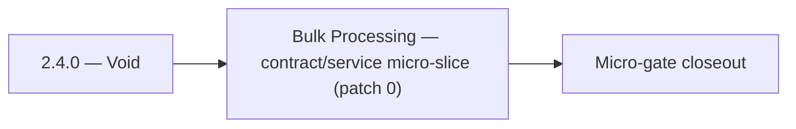

# 2.4.0 — Void

- **Era:** `2.x` Email system — hub [`versions.md`](../versions.md) · minors start at [`2.0 — Email Foundation`](2.0%20%E2%80%94%20Email%20Foundation.md)
- **Minor:** [2.4 — Bulk Processing](./2.4 — Bulk Processing.md)
- **Codename:** Void
- **Status:** ✅ Completed
## Focus
Bulk Processing — contract/service micro-slice (patch 0)

## Flowchart

## Micro-gate

| Track | Gate question | Answer / Evidence (fill at patch closeout) |
| --- | --- | --- |
| **Contract** | GraphQL email/jobs/upload or Lambda/Mailvetter REST changed? Diff vs `docs/backend/apis/`; bulk job idempotency? | Document at patch closeout. |
| **Service** | Finder/verifier/bulk stream smoke; provider routing + error envelopes unchanged or versioned? | Document smoke paths. |
| **Surface** | Email Studio, bulk job UI, or `/email` mailbox changed? Loading/error/progress contracts? | Document UX delta or N/A. |
| **Frontend** | Which routes/hooks must change for this patch? | Bulk upload, jobs progress, download — `files`/`jobs` UI bindings. Document at closeout. |
| **Data** | `email_finder_cache`, patterns, job rows, Mailvetter store, S3 artifacts — migrations + lineage? | Document migrations/lineage or N/A. |
| **Ops** | Multipart/queue alerts, rollback/runbook delta for email-impacting releases? | Document ops delta or N/A. |

## Tasks
### Contract
- ✅ Completed: 📌 Planned: Freeze **job create** mutation + **status** enum for email export jobs — **Service task slices** below (includes former `jobs-email-system-task-pack.md` scope).
- 📌 Planned: **[appointment360]** — refine duplicate task (was: ✅ completed: response: `{"risk_score": <0-100>, "analysis": …) | patch `2.4.0` band `0` | reason: specialize this file vs sibling patches; see docs/codebases/appointment360-codebase-analysis.md
- 📌 Planned: **[appointment360]** — refine duplicate task (was: ✅ completed: 📌 planned: add/verify a mapping shim at the gat…) | patch `2.4.0` band `0` | reason: specialize this file vs sibling patches; see docs/codebases/appointment360-codebase-analysis.md
- 📌 Planned: **[appointment360]** — refine duplicate task (was: ✅ completed: 📌 planned: freeze webhook callback payload cont…) | patch `2.4.0` band `0` | reason: specialize this file vs sibling patches; see docs/codebases/appointment360-codebase-analysis.md

### Service
- 📌 Planned: **[appointment360]** — refine duplicate task (was: 📌 planned: **[appointment360]** — refine duplicate task (was…) | patch `2.4.0` band `0` | reason: specialize this file vs sibling patches; see docs/codebases/appointment360-codebase-analysis.md
- 📌 Planned: **[appointment360]** — refine duplicate task (was: ✅ completed: 📌 planned: validate hf api response against `em…) | patch `2.4.0` band `0` | reason: specialize this file vs sibling patches; see docs/codebases/appointment360-codebase-analysis.md
- 📌 Planned: **[appointment360]** — refine duplicate task (was: ✅ completed: 📌 planned: harden bulk job path: dedupe, plan c…) | patch `2.4.0` band `0` | reason: specialize this file vs sibling patches; see docs/codebases/appointment360-codebase-analysis.md
- 📌 Planned: **[appointment360]** — refine duplicate task (was: ✅ completed: 📌 planned: harden **missing-part** and **duplic…) | patch `2.4.0` band `0` | reason: specialize this file vs sibling patches; see docs/codebases/appointment360-codebase-analysis.md

### Surface

- ✅ Completed: 📌 Planned: **[emailapis]** — Verify UX for route `/email` and bindings (patch 2.4.0 band 0) | area: `frontend-page` | files: `contact360.io/app/...` | reason: Dashboard/extension surface for era 2 must match gateway contracts

### Data

- 📌 Planned: **[appointment360]** — refine duplicate task (was: ✅ completed: 📌 planned: **[appointment360]** — update postgr…) | patch `2.4.0` band `0` | reason: specialize this file vs sibling patches; see docs/codebases/appointment360-codebase-analysis.md

### Ops

- ✅ Completed: 📌 Planned: **[platform]** — Record smoke evidence, rollback, and alerts (patch band 0: charter/P0) | area: `ops` | files: `docs/commands/`, `.github/workflows/` | reason: Smoke, rollback, and observability for patch 2.4.0

## Service task slices
> Merged from era `2.x` email system task packs (P0→`.0`–`.2`, P1→`.3`–`.6`, Ops→`.7`–`.9`).

### Jobs
- Freeze contracts for `email_finder_export_stream`, `email_verify_export_stream`, and `email_pattern_import_stream` (inputs, outputs, terminal states).
- Keep endpoint and **status semantics** aligned with UI progress expectations (percent, processed/total, failure counts).
- Document **checkpoint** fields: byte offset or row cursor, idempotent resume rules.
- Define **`job_node.data`** metadata for **`2.x` billing alignment**: `user_uuid`, `billing.correlation_id`, optional `credit_estimate`, `rows_total` — see `version_2.9`.
- **Retry policy:** which failures are worker-retriable vs terminal; no duplicate credit charge on successful retry (coordinate with gateway).
- Validate stream processor behavior for **large CSV** inputs (memory bounds, backpressure).
- Enforce **retry and checkpoint** semantics for email flows; kill/restart worker test passes.
- Concurrency targets per roadmap: finder stream **3**, verifier stream **5** (tune via config; document).
- Batch calls to `emailapis` / `emailapigo` / Mailvetter with **bounded concurrency** and backoff.
- Document input/output **CSV lineage** and error envelopes in `job_response` / job store.
- Record **checkpoint-byte** and **processed-row** meaning for email workflows.

### emailapis / emailapigo
- Define and freeze era **`2.x`** email endpoint and payload compatibility notes (finder, verifier, pattern, bulk batch).
- Update endpoint/reference matrix: `docs/backend/endpoints/emailapis_endpoint_era_matrix.json`.
- Publish **provider parity matrix**: same input → normalized output for **Python vs Go** adapters (golden fixtures).
- Freeze **status vocabulary** table consumed by Appointment360 GraphQL mappers.
- Document **bulk partial-batch** semantics: which rows retry, which are terminal, how errors surface in `job_response`.
- Implement/validate runtime behavior for era **`2.x`** finder, verifier, pattern, and fallback paths.
- Verify auth, provider routing, **error envelope**, and health diagnostics behavior.
- Propagate **`X-Request-ID`** (or equivalent) from gateway into Lambda logs.
- Align **credit correlation**: accept gateway context headers or payload fields for billing traces (see `2.9` minor).
- Document **`email_finder_cache`** and **`email_patterns`** lineage impact for era **`2.x`**.
- Record provider, status, and traceability expectations for this era (cache key includes provider/version if needed).

## Evidence gate
Primary charter artifact created and linked in the parent minor doc
