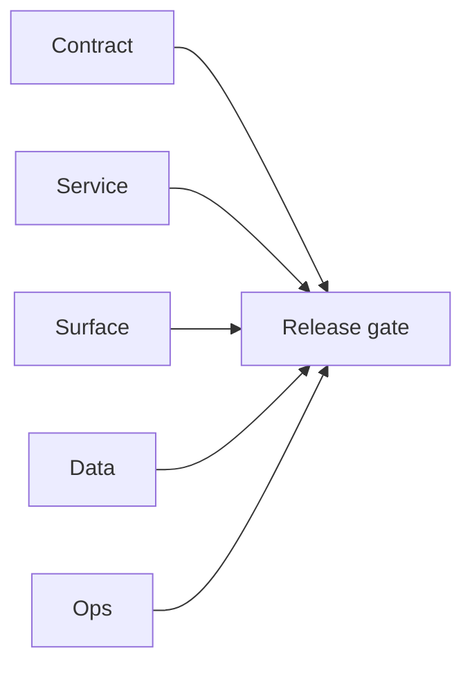

# 2.4.100 - Docker email stack blocker evidence

## Focus

Docker deployment blockers for `EC2/email.server` and `EC2/email campaign` during endpoint smoke verification.

## Micro-gate

- `EC2/email.server` (compose):
  - `GET http://localhost:3000/health` => `HTTP 000` in `0.007019s` (empty reply).
  - `GET http://localhost:3000/finder` => `HTTP 000` in `0.006584s` (empty reply).
  - Existing mismatch persists between compose host mapping and container runtime listener expectations.
- `EC2/email campaign` (docker run):
  - image build succeeds.
  - container exits before bind with `missing required environment variable: S3_TEMPLATE_BUCKET`.
  - `GET http://localhost:18094/health` => `HTTP 000` in `2.229080s`.

## Tasks

### Contract

- [ ] Lock canonical HTTP bind port contract for `email.server` and compose mapping parity.
- [ ] Publish complete required env matrix for `email campaign` including `S3_TEMPLATE_BUCKET`.

### Service

- [ ] Add startup self-check that logs resolved listen address and required env status before serving.

### Surface

- [ ] Avoid overlap with frontend dev ports (`3000+`) in local docker profiles.

### Data

- [ ] Align email stack local DB/Redis/S3 dependency assumptions with docker profile defaults.

### Ops

- [ ] Ship `docker compose --profile smoke` for email stack that includes valid env placeholders and non-conflicting ports.

## Evidence gate

- `tmp/evidence/docker-go/emailapi-health-3000.txt`
- `tmp/evidence/docker-go/emailapi-finder-3000.txt`
- `tmp/evidence/docker-go/campaign-health.txt`
- `tmp/evidence/docker-go/campaign-logs.txt`

## Flowchart

Five-track delivery (contract / service / surface / data / ops) for this doc:

**Master hub:** [`docs/docs/flowchart.md`](../docs/flowchart.md) — cross-system diagrams and era strip (`0.x` → `10.x`).
