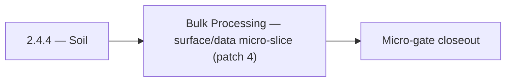

# 2.4.4 — Soil

- **Era:** `2.x` Email system — hub [`versions.md`](../versions.md) · minors start at [`2.0 — Email Foundation`](2.0%20%E2%80%94%20Email%20Foundation.md)
- **Minor:** [2.4 — Bulk Processing](./2.4 — Bulk Processing.md)
- **Codename:** Soil
- **Status:** ✅ Completed
## Focus
Bulk Processing — surface/data micro-slice (patch 4)

## Flowchart

## Micro-gate

| Track | Gate question | Answer / Evidence (fill at patch closeout) |
| --- | --- | --- |
| **Contract** | GraphQL email/jobs/upload or Lambda/Mailvetter REST changed? Diff vs `docs/backend/apis/`; bulk job idempotency? | Document at patch closeout. |
| **Service** | Finder/verifier/bulk stream smoke; provider routing + error envelopes unchanged or versioned? | Document smoke paths. |
| **Surface** | Email Studio, bulk job UI, or `/email` mailbox changed? Loading/error/progress contracts? | Document UX delta or N/A. |
| **Frontend** | Which routes/hooks must change for this patch? | Bulk upload, jobs progress, download — `files`/`jobs` UI bindings. Document at closeout. |
| **Data** | `email_finder_cache`, patterns, job rows, Mailvetter store, S3 artifacts — migrations + lineage? | Document migrations/lineage or N/A. |
| **Ops** | Multipart/queue alerts, rollback/runbook delta for email-impacting releases? | Document ops delta or N/A. |

## Tasks
### Surface
- ✅ Completed: 📌 Planned: **App:** `useNewExport.ts` — progress, failure, retry, download.
- ✅ Completed: 📌 Planned: Define loading state (spinner on badge while fetching) and error state (tooltip on error).
- ✅ Completed: `docs/frontend/components.md` (for `EmailRiskBadge` inventory)
- ✅ Completed: 📌 Planned: Show “why” diagnostics from `score_details` in verifier UI panel.

### Data
- ✅ Completed: 📌 Planned: **job_response** / checkpoint fields documented.
- ✅ Completed: 📌 Planned: Document in `contact_ai_data_lineage.md`: email PII is passed to HF API; review HF data retention policy.
- ✅ Completed: 📌 Planned: Add job events timeline table (queued, started, completed, failed, retried).
- ✅ Completed: 📌 Planned: Define: contacts inserted with `email=null` should be eligible for email finder pipeline

### Contract

- ✅ Completed: 📌 Planned: **[appointment360]** — Diff and document schema for operations like ConnectraClient, LAMBDA_AI_API_URL, LAMBDA_CONNECTRA_API_URL; align with roadmap | area: `backend-api` | files: `docs/backend/apis/*.md`, `contact360.io/api/app/graphql/schema.py` | reason: Keep GraphQL/REST contracts aligned for era 2.4 patch 2.4.4

### Service

- ✅ Completed: 📌 Planned: **[appointment360]** — Service slice: - [x] ✅ Completed: email finder/verifier and job orchestration modules are integrated. | area: `backend-api` | files: `contact360.io/api/app/graphql/modules/`, `contact360.io/api/app/clients/` | reason: Implement or verify runtime behavior for - [x] ✅ Completed: email finder/verifier and job orchestration modules are integ

### Ops

- ✅ Completed: 📌 Planned: **[platform]** — Record smoke evidence, rollback, and alerts (patch band 4: surface/data) | area: `ops` | files: `docs/commands/`, `.github/workflows/` | reason: Smoke, rollback, and observability for patch 2.4.4

## Service task slices
> Merged from era `2.x` email system task packs (P0→`.0`–`.2`, P1→`.3`–`.6`, Ops→`.7`–`.9`).

### Jobs
- Document email **bulk** pages using job status, timeline, and retry controls.
- Cover mapping checkboxes/radio controls and **progress bar** states (match Mailvetter/job percent contract).
- Document input/output **CSV lineage** and error envelopes in `job_response` / job store.
- Record **checkpoint-byte** and **processed-row** meaning for email workflows.
- Link **output S3 key** to `job_id` for support (see `logsapi` pack).
- Validate stream processor behavior for **large CSV** inputs (memory bounds, backpressure).
- Enforce **retry and checkpoint** semantics for email flows; kill/restart worker test passes.
- Concurrency targets per roadmap: finder stream **3**, verifier stream **5** (tune via config; document).
- Batch calls to `emailapis` / `emailapigo` / Mailvetter with **bounded concurrency** and backoff.

### emailapis / emailapigo
- Document impacted pages/tabs/buttons/inputs/components for era **`2.x`** (Email Studio, bulk flows).
- Document relevant hooks/services/contexts and UX states (loading/error/progress/checkbox/radio).
- Document **`email_finder_cache`** and **`email_patterns`** lineage impact for era **`2.x`**.
- Record provider, status, and traceability expectations for this era (cache key includes provider/version if needed).
- Implement/validate runtime behavior for era **`2.x`** finder, verifier, pattern, and fallback paths.
- Verify auth, provider routing, **error envelope**, and health diagnostics behavior.
- Propagate **`X-Request-ID`** (or equivalent) from gateway into Lambda logs.
- Align **credit correlation**: accept gateway context headers or payload fields for billing traces (see `2.9` minor).

## Evidence gate
Patch closeout includes contract diff, smoke output, data lineage delta, and ops note
