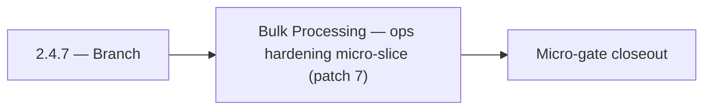

# 2.4.7 — Branch

- **Era:** `2.x` Email system — hub [`versions.md`](../versions.md) · minors start at [`2.0 — Email Foundation`](2.0%20%E2%80%94%20Email%20Foundation.md)
- **Minor:** [2.4 — Bulk Processing](./2.4 — Bulk Processing.md)
- **Codename:** Branch
- **Status:** ✅ Completed
## Focus
Bulk Processing — ops hardening micro-slice (patch 7)

## Flowchart

## Micro-gate

| Track | Gate question | Answer / Evidence (fill at patch closeout) |
| --- | --- | --- |
| **Contract** | GraphQL email/jobs/upload or Lambda/Mailvetter REST changed? Diff vs `docs/backend/apis/`; bulk job idempotency? | Document at patch closeout. |
| **Service** | Finder/verifier/bulk stream smoke; provider routing + error envelopes unchanged or versioned? | Document smoke paths. |
| **Surface** | Email Studio, bulk job UI, or `/email` mailbox changed? Loading/error/progress contracts? | Document UX delta or N/A. |
| **Frontend** | Which routes/hooks must change for this patch? | Bulk upload, jobs progress, download — `files`/`jobs` UI bindings. Document at closeout. |
| **Data** | `email_finder_cache`, patterns, job rows, Mailvetter store, S3 artifacts — migrations + lineage? | Document migrations/lineage or N/A. |
| **Ops** | Multipart/queue alerts, rollback/runbook delta for email-impacting releases? | Document ops delta or N/A. |

## Tasks
### Ops
- 📌 Planned: **[appointment360]** — refine duplicate task (was: ✅ completed: 📌 planned: runbook: stuck job → safe retry.) | patch `2.4.7` band `7` | reason: specialize this file vs sibling patches; see docs/codebases/appointment360-codebase-analysis.md
- 📌 Planned: **[appointment360]** — refine duplicate task (was: ✅ completed: 📌 planned: load test `post /api/v1/ai/email/ana…) | patch `2.4.7` band `7` | reason: specialize this file vs sibling patches; see docs/codebases/appointment360-codebase-analysis.md
- 📌 Planned: **[appointment360]** — refine duplicate task (was: ✅ completed: 📌 planned: add email risk endpoint to contact.a…) | patch `2.4.7` band `7` | reason: specialize this file vs sibling patches; see docs/codebases/appointment360-codebase-analysis.md
- 📌 Planned: **[appointment360]** — refine duplicate task (was: ✅ completed: 📌 planned: add queue lag and worker saturation …) | patch `2.4.7` band `7` | reason: specialize this file vs sibling patches; see docs/codebases/appointment360-codebase-analysis.md

### Contract

- ✅ Completed: 📌 Planned: **[appointment360]** — Diff and document schema for operations like ConnectraClient, LAMBDA_AI_API_URL, LAMBDA_CONNECTRA_API_URL; align with roadmap | area: `backend-api` | files: `docs/backend/apis/*.md`, `contact360.io/api/app/graphql/schema.py` | reason: Keep GraphQL/REST contracts aligned for era 2.7 patch 2.4.7

### Service

- 📌 Planned: **[appointment360]** — refine duplicate task (was: ✅ completed: 📌 planned: **[appointment360]** — service slice…) | patch `2.4.7` band `7` | reason: specialize this file vs sibling patches; see docs/codebases/appointment360-codebase-analysis.md

### Surface

- ✅ Completed: 📌 Planned: **[emailapis]** — Verify UX for route `/email` and bindings (patch 2.4.7 band 7) | area: `frontend-page` | files: `contact360.io/app/...` | reason: Dashboard/extension surface for era 2 must match gateway contracts

### Data

- 📌 Planned: **[appointment360]** — refine duplicate task (was: ✅ completed: 📌 planned: **[appointment360]** — update postgr…) | patch `2.4.7` band `7` | reason: specialize this file vs sibling patches; see docs/codebases/appointment360-codebase-analysis.md

## Service task slices
> Merged from era `2.x` email system task packs (P0→`.0`–`.2`, P1→`.3`–`.6`, Ops→`.7`–`.9`).

### Jobs
- Add **throughput** and **failure-rate** observability for email jobs.
- Add runbook steps for external provider failures and retries.
- **Billing-impact alerts:** job failure rate spike after bulk start; stuck checkpoint; output missing.

### emailapis / emailapigo
- Add observability checks and release validation evidence for era **`2.x`** (latency, error rate by adapter).
- Capture rollback and incident-runbook notes for email-impacting releases.
- Add **contract tests** in CI: docs ↔ runtime for critical routes.

### Mailvetter
- Load-test bulk verification throughput for 10k email payload.
- Add queue lag and worker saturation dashboards.
- Add SMTP provider timeout/error budget alerts.

## Evidence gate
Patch closeout includes contract diff, smoke output, data lineage delta, and ops note
