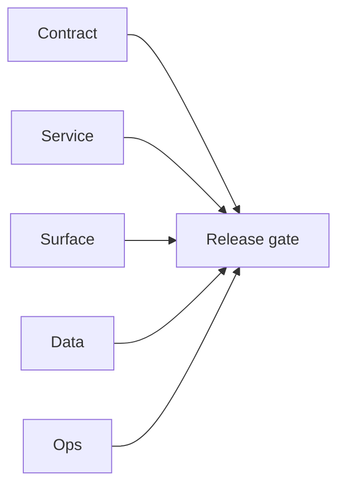

## Focus

Local smoke run for `EC2/email.server` and `EC2/email campaign` blockers affecting `2.4` bulk processing readiness.

## Micro-gate

- `EC2/email.server` compose stack starts, but mapped host port is `3000` while service logs indicate runtime listener on `8080`.
- `curl http://localhost:3000/*` returns empty reply (`code=000`) due port mismatch behavior.
- `EC2/email campaign` run (`go run ./cmd`) fails with `missing required environment variable: ADMIN_API_KEY`.

## Tasks

### Contract

- [ ] Align `docker-compose.yml` port mapping with runtime listener for `email.server`.
- [ ] Confirm canonical finder/verifier route base and document it consistently in endpoint matrices.

### Service

- [ ] Provide required env vars (`ADMIN_API_KEY` and dependent values) for `email campaign` local boot.
- [ ] Add startup validation that prints resolved host/port and exits with actionable diagnostics.

### Surface

- [ ] Restore stable UI reachability for local Email Studio flows by moving email server off frontend port `3000`.

### Data

- [ ] Ensure email stack DB dependency (`localhost:5432`) is configured and reachable for local profiles.

### Ops

- [ ] Add compose profile with non-conflicting frontend ports (avoid `3000` collision with Next.js surfaces).

## Evidence gate

- `tmp/evidence/email/health.json`
- `tmp/evidence/email/finder_stub.json`
- `tmp/evidence/email/verifier_stub.json`
- `terminals/203106.txt` startup error (`ADMIN_API_KEY` missing)

## Flowchart

Five-track delivery (contract / service / surface / data / ops) for this doc:

**Master hub:** [`docs/docs/flowchart.md`](../docs/flowchart.md) — cross-system diagrams and era strip (`0.x` → `10.x`).
