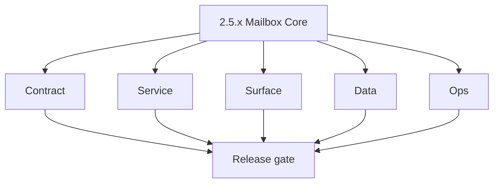
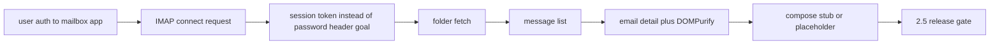

# Version 2.5 — Mailbox Core

- **Status:** planned  
- **Codename:** Mailbox Core  
- **Era:** 2.x (Contact360 email system)  
- **Roadmap:** **`contact360.io/email`** era **2.x** — core mailbox (folders, detail, IMAP connect) per [`docs/codebases/email-codebase-analysis.md`](../codebases/email-codebase-analysis.md)  
- **Summary:** Productize the **mailbox app**: IMAP connect → folder list → thread/detail → sanitized HTML render; **migrate** from `localStorage` + `X-Password` header pattern toward **backend-issued session token**.  
- **Patch closure:** Every codenamed patch file includes **Micro-gate** + **Service task slices**. Era hub: [`versions.md`](../versions.md).

## Scope

- **Target:** `2.5.x` patches — mailbox UX + security baseline.  
- **In scope:** Folder navigation, email detail, DOMPurify usage, retry on fetch errors.  
- **Out of scope:** Full compose/send production (may remain stub); campaign handoff (**`10.x`**).  
- **Owners:** Frontend + Platform API (session design).

## Flowchart

### Runtime focus (unique to this minor)

## Task tracks

### Contract

- 📌 Planned: Define **mailbox session** API (issue/refresh/revoke) — no long-lived password in browser.  
- 📌 Planned: Document **IMAP** capability assumptions (TLS, OAuth later).

### Service

- 📌 Planned: Backend proxy or token exchange **before** removing `X-Password` (phased).  
- 📌 Planned: Rate limit mailbox API per user.

### Surface

- 📌 Planned: Wire **search** input to filter state (email app task list).  
- 📌 Planned: **Flagged** tab behavior or remove if not supported.

### Data

- 📌 Planned: No **password** in `localStorage` by end of minor (target).  
- 📌 Planned: Account metadata stored server-side with encryption.

### Ops

- 📌 Planned: Error boundaries + toast normalization.  
- 📌 Planned: Basic client retry/backoff for IMAP fetch.

## Task Breakdown

| Slice | Outcome |
| --- | --- |
| email app | Mailbox UX |
| API | Session abstraction |
| Security | Remove high-risk header pattern |

## Immediate next execution queue

- 📌 Planned: Threat model doc for mailbox credentials.  
- 📌 Planned: Pen-test note on token TTL.

## Cross-service ownership

| Service | Focus |
| --- | --- |
| `contact360.io/email` | Next.js mailbox UI |
| Gateway or dedicated API | Mailbox session |
| IMAP | Provider edge |

## Codebase file targets (Mailbox Core)

Grounded in [`docs/codebases/email-codebase-analysis.md`](../codebases/email-codebase-analysis.md).

| Slice | Primary codebases | Start files | What must be true by 2.5 freeze |
| --- | --- | --- | --- |
| Mailbox list + filters | `contact360.io/email` | `components/email-list.tsx`, `components/data-table.tsx` | Folder list renders with reliable loading/error states |
| Account/session context | `contact360.io/email` | `context/imap-context.tsx` | **No IMAP password persistence** in localStorage |
| Auth + user bootstrap | `contact360.io/email` | `components/login-form.tsx`, `components/nav-user.tsx` | Login/logout flows don’t leak credentials |
| Backend session design | Gateway or mailbox API | (contract first) | Backend-issued mailbox session token replaces `X-Password` |

## Security P0 (must be treated as a gate)

The codebase analysis flags a high-risk pattern:

- IMAP credentials are passed via headers (`X-Email`, `X-Password`)
- Active account blob is persisted in browser `localStorage`

`2.5.x` must explicitly drive a migration to **backend-issued mailbox sessions**:

- 📌 Planned: Add mailbox session token issuance endpoint (or gateway bridge) and define TTL + refresh/revoke.
- 📌 Planned: Replace `X-Password` usage in frontend with `Authorization: Bearer <mailbox_session_token>` (or equivalent).
- 📌 Planned: Remove all password persistence from `localStorage` (store only opaque token + safe account id).
- 📌 Planned: Add audit logging: session issued/revoked, access patterns (no mailbox content).

## References

- [`docs/codebases/email-codebase-analysis.md`](../codebases/email-codebase-analysis.md)  
- [`docs/frontend.md`](../frontend.md)  
- [`email_system.md`](email_system.md) — product layer list

## Backend API and Endpoint Scope

- **REST/GraphQL:** mailbox session, folder, message, detail (as implemented).  
- **Headers:** deprecation plan for `X-Email` / `X-Password`.

## Database and Data Lineage Scope

- Mailbox account linkage to **user id**; audit of credential storage.

## Frontend UX Surface Scope

- Inbox, folders, detail, optional compose modal.

## UI Elements Checklist

- 📌 Planned: Folder sidebar  
- 📌 Planned: Message table  
- 📌 Planned: Detail pane  
- 📌 Planned: Connect account flow  
- 📌 Planned: Error / reconnect

## Flow / Graph Delta for This Minor

- **Delta:** Brings **`contact360.io/email`** into the same **2.x** documentation spine as dashboard Email Studio.

## Audit and Compliance Notes

- Mailbox content may include **PII**; align retention and access logging with [`docs/audit-compliance.md`](../audit-compliance.md).

## Patch ladder (`2.5.0` – `2.5.9`)

### Micro-gate reference (apply at every `2.N.P`)

| Track | Gate question (must answer Yes or document waiver) |
| --- | --- |
| **Contract** | GraphQL email/jobs/upload or Lambda/Mailvetter REST changed? Diff vs `docs/backend/apis/`; bulk job idempotency documented? |
| **Service** | Finder/verifier/bulk paths still smoke; provider routing + error envelopes OK or versioned? |
| **Surface** | Email Studio, bulk job UI, or `/email` mailbox changed? Loading/error/progress contracts? |
| **Frontend** | Which routes/hooks apply (see **Frontend UX Surface Scope** / checklist in minor)? |
| **Data** | `email_finder_cache`, patterns, jobs, Mailvetter, S3 artifacts — migrations + lineage? |
| **Ops** | Multipart/queue durability, alerts, rollback/runbook delta for email releases? |

**Patch intent bands:** `.0` charter · `.1`–`.3` core path · `.4`–`.6` hardening · `.7`–`.8` integration · `.9` minor freeze / handoff.

Theme: **Inbox** — codenames in per-patch `2.5.P — *.md` files.

| Patch | Codename | Contract | Service | Surface | Data | Ops |
| --- | --- | --- | --- | --- | --- | --- |
| `2.5.0` | Connect | Connect payload fields frozen | IMAP connect flow stable | Connect account UX | Account stored server-side | Error boundary + retry |
| `2.5.1` | Folder | Folder list schema frozen | Folder fetch resilient | Sidebar renders | Cache folder metadata | Folder fetch latency |
| `2.5.2` | Fetch | List fetch response schema frozen | Message list fetch stable | Table renders + pagination | No secrets stored client-side | Retry/backoff |
| `2.5.3` | Thread | Thread grouping contract | Thread logic correct | Thread UI stable | Thread metadata stored | Rendering perf check |
| `2.5.4` | Detail | Detail payload schema frozen | DOMPurify sanitization safe | Detail page stable | No raw HTML stored in logs | XSS regression checks |
| `2.5.5` | Token | Session token contract frozen | Token issuance/refresh works | Token-based auth wired | Remove password from localStorage | Token TTL monitoring |
| `2.5.6` | Flag | Flag feature contract or removal | Flagged behavior consistent | Flagged tab works or removed | Flag metadata stored | UX regression |
| `2.5.7` | Compose | Compose stub contract frozen | Compose placeholder safe | Compose UI present | No send side effects | Guardrails |
| `2.5.8` | Send | Send alpha contract | Send path guarded | UI indicates alpha | Audit events emitted | Rate-limit policy |
| `2.5.9` | Sync | Freeze mailbox security baseline | Regression suite green | UI copy locked | Credential audit evidence | Release notes + rollback |

## Release Gate and Evidence

### Master Task Checklist

- 📌 Planned: Email app era 2.x criteria documented in versions if shipped

### Backend API and Endpoints

- 📌 Planned: Session API smoke

### Database and Data Lineage

- 📌 Planned: Credential storage review

### Frontend UX

- 📌 Planned: Connect → read mail trace

### UI Elements

- 📌 Planned: Checklist above

### Flow and Graph

- 📌 Planned: Runtime Mermaid reviewed

### Validation

- 📌 Planned: No password in localStorage on staging

### Release Gate

- 📌 Planned: Sign-off for **`2.6` Provider Harmonization**

## Patches

| Patch | Codename | Doc |
| --- | --- | --- |
| `2.5.0` | Void | [`2.5.0` — Void](2.5.0 — Void.md) |
| `2.5.1` | Seed | [`2.5.1` — Seed](2.5.1 — Seed.md) |
| `2.5.2` | Sprout | [`2.5.2` — Sprout](2.5.2 — Sprout.md) |
| `2.5.3` | Roots | [`2.5.3` — Roots](2.5.3 — Roots.md) |
| `2.5.4` | Soil | [`2.5.4` — Soil](2.5.4 — Soil.md) |
| `2.5.5` | Rain | [`2.5.5` — Rain](2.5.5 — Rain.md) |
| `2.5.6` | Stem | [`2.5.6` — Stem](2.5.6 — Stem.md) |
| `2.5.7` | Branch | [`2.5.7` — Branch](2.5.7 — Branch.md) |
| `2.5.8` | Leaf | [`2.5.8` — Leaf](2.5.8 — Leaf.md) |
| `2.5.9` | Bloom | [`2.5.9` — Bloom](2.5.9 — Bloom.md) |
