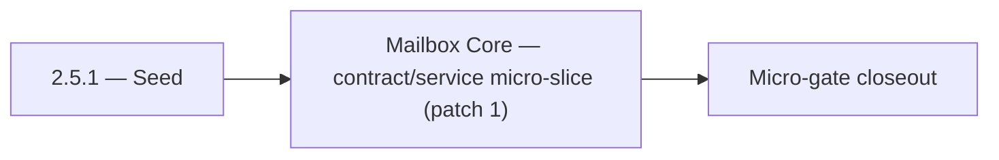

# 2.5.1 — Seed

- **Era:** `2.x` Email system — hub [`versions.md`](../versions.md) · minors start at [`2.0 — Email Foundation`](2.0%20%E2%80%94%20Email%20Foundation.md)
- **Minor:** [2.5 — Mailbox Core](./2.5 — Mailbox Core.md)
- **Codename:** Seed
- **Status:** ✅ Completed
## Focus
Mailbox Core — contract/service micro-slice (patch 1)

## Flowchart

## Micro-gate

| Track | Gate question | Answer / Evidence (fill at patch closeout) |
| --- | --- | --- |
| **Contract** | GraphQL email/jobs/upload or Lambda/Mailvetter REST changed? Diff vs `docs/backend/apis/`; bulk job idempotency? | Document at patch closeout. |
| **Service** | Finder/verifier/bulk stream smoke; provider routing + error envelopes unchanged or versioned? | Document smoke paths. |
| **Surface** | Email Studio, bulk job UI, or `/email` mailbox changed? Loading/error/progress contracts? | Document UX delta or N/A. |
| **Frontend** | Which routes/hooks must change for this patch? | `contact360.io/email` inbox/detail — credential security gate. Document at closeout. |
| **Data** | `email_finder_cache`, patterns, job rows, Mailvetter store, S3 artifacts — migrations + lineage? | Document migrations/lineage or N/A. |
| **Ops** | Multipart/queue alerts, rollback/runbook delta for email-impacting releases? | Document ops delta or N/A. |

## Tasks
### Contract
- ✅ Completed: 📌 Planned: Document **IMAP** capability assumptions (TLS, OAuth later).
- ✅ Completed: 📌 Planned: Align `AnalyzeEmailRiskInput` in GraphQL schema (`17_AI_CHATS_MODULE.md`) with REST schema.
- ✅ Completed: 📌 Planned: Freeze v1 endpoints: `POST /v1/emails/validate`, `POST /v1/emails/validate-bulk`, `GET /v1/jobs/:job_id`, `GET /v1/jobs/:job_id/results`.
- ✅ Completed: 📌 Planned: Freeze multipart lifecycle API contract: `initiate`, presigned **part URL**, `register` part, `complete`, `abort`.

### Service
- ✅ Completed: 📌 Planned: Rate limit mailbox API per user.
- ✅ Completed: 📌 Planned: Add fallback to Gemini if HF JSON task fails for email risk analysis.
- ✅ Completed: 📌 Planned: Add explicit `failed` job status path for partial/system failures.
- ✅ Completed: 📌 Planned: **Bulk failure recovery:** client retry strategy, server-side cleanup of abandoned multipart sessions.

### Surface

- ✅ Completed: 📌 Planned: **[emailapis]** — Verify UX for route `/email` and bindings (patch 2.5.1 band 1) | area: `frontend-page` | files: `contact360.io/app/...` | reason: Dashboard/extension surface for era 2 must match gateway contracts

### Data

- ✅ Completed: 📌 Planned: **[appointment360]** — Update PostgreSQL/ES/S3 lineage notes if this patch touches persistence or exports | area: `data-lineage` | files: `docs/backend/database/`, `migrations/` | reason: Migrations, indexes, and lineage evidence for this patch

### Ops

- ✅ Completed: 📌 Planned: **[platform]** — Record smoke evidence, rollback, and alerts (patch band 1: charter/P0) | area: `ops` | files: `docs/commands/`, `.github/workflows/` | reason: Smoke, rollback, and observability for patch 2.5.1

## Service task slices
> Merged from era `2.x` email system task packs (P0→`.0`–`.2`, P1→`.3`–`.6`, Ops→`.7`–`.9`).

### Appointment360 (gateway)
- Define EmailQuery { findEmails, findEmailsBulk, verifySingleEmail, verifyEmailsBulk } types
- Define EmailMutation { addEmailPattern, addEmailPatternBulk }
- Define JobQuery { job(jobId), jobs(limit,offset,status,jobType) }
- Define JobMutation { createEmailFinderExport, createEmailVerifyExport, createEmailPatternImport, retryJob }
- Define shared SchedulerJob GraphQL type with status, timeline, dag, result_url
- Define EmailFinderInput, EmailVerifierInput, BulkEmailInput, EmailPatternInput types
- Implement LambdaEmailClient in app/clients/lambda_email_client.py
- Wire findEmails query → LambdaEmailClient.find_single(email_input)
- Wire findEmailsBulk query → LambdaEmailClient.find_bulk(...)
- Wire verifySingleEmail query → LambdaEmailClient.verify_single(...)
- Wire verifyEmailsBulk query → LambdaEmailClient.verify_bulk(...)
- Wire addEmailPattern mutation → LambdaEmailClient.add_pattern(...)
- Implement TkdjobClient in app/clients/tkdjob_client.py
- Wire createEmailFinderExport mutation → TkdjobClient.create_email_export(...)
- Wire createEmailVerifyExport mutation → TkdjobClient.create_email_verify(...)
- Wire createEmailPatternImport mutation → TkdjobClient.create_email_pattern_import(...)
- Wire job(jobId) query → TkdjobClient.get_job_status(job_id)
- Wire jobs() query → TkdjobClient.list_jobs(...)
- Remove inline debug file writes from email/queries.py and jobs/mutations.py
- Add credit deduction: deduct per email find/verify operation
- /email page, Finder tab → query findEmails / query findEmailsBulk binding
- /email page, Verifier tab → query verifySingleEmail / query verifyEmailsBulk binding
- CSV upload on Email Verifier/Finder → mutation createEmailFinderExport / createEmailVerifyExport
- Jobs list table on /email → query jobs(jobType:"email_export") binding
- Job status progress bar → polling query job(jobId) every 2s
- useEmailFinderSingle hook: call findEmails, show spinner while pending
- useEmailFinderBulk hook: upload CSV, create export job, poll status
- useEmailVerifierSingle hook: call verifySingleEmail
- useJobStatus hook: polling wrapper for query job(jobId)
- Record activity on email export creation: write to activities table
- Track credit consumption per email finder/verifier call
- Ensure tkdjob job_id is stored if job is deferred (for polling)
- Configure LAMBDA_EMAIL_API_URL and LAMBDA_EMAIL_API_KEY in .env.example
- Configure TKDJOB_API_URL and TKDJOB_API_KEY in .env.example

## Evidence gate
Patch closeout includes contract diff, smoke output, data lineage delta, and ops note
