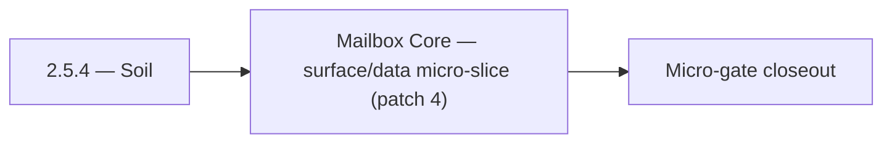

# 2.5.4 — Soil

- **Era:** `2.x` Email system — hub [`versions.md`](../versions.md) · minors start at [`2.0 — Email Foundation`](2.0%20%E2%80%94%20Email%20Foundation.md)
- **Minor:** [2.5 — Mailbox Core](./2.5 — Mailbox Core.md)
- **Codename:** Soil
- **Status:** planned

## Focus
Mailbox Core — surface/data micro-slice (patch 4)

## Flowchart

## Micro-gate

| Track | Gate question | Answer / Evidence (fill at patch closeout) |
| --- | --- | --- |
| **Contract** | GraphQL email/jobs/upload or Lambda/Mailvetter REST changed? Diff vs `docs/backend/apis/`; bulk job idempotency? | Document at patch closeout. |
| **Service** | Finder/verifier/bulk stream smoke; provider routing + error envelopes unchanged or versioned? | Document smoke paths. |
| **Surface** | Email Studio, bulk job UI, or `/email` mailbox changed? Loading/error/progress contracts? | Document UX delta or N/A. |
| **Frontend** | Which routes/hooks must change for this patch? | `contact360.io/email` inbox/detail — credential security gate. Document at closeout. |
| **Data** | `email_finder_cache`, patterns, job rows, Mailvetter store, S3 artifacts — migrations + lineage? | Document migrations/lineage or N/A. |
| **Ops** | Multipart/queue alerts, rollback/runbook delta for email-impacting releases? | Document ops delta or N/A. |

## Tasks
### Surface
- 📌 Planned: Wire **search** input to filter state (email app task list).
- 📌 Planned: Define loading state (spinner on badge while fetching) and error state (tooltip on error).
- `docs/frontend/components.md` (for `EmailRiskBadge` inventory)
- 📌 Planned: Show “why” diagnostics from `score_details` in verifier UI panel.

### Data
- 📌 Planned: No **password** in `localStorage` by end of minor (target).
- 📌 Planned: Document in `contact_ai_data_lineage.md`: email PII is passed to HF API; review HF data retention policy.
- 📌 Planned: Add job events timeline table (queued, started, completed, failed, retried).
- 📌 Planned: Define: contacts inserted with `email=null` should be eligible for email finder pipeline

## Service task slices
> Merged from era `2.x` email system task packs (P0→`.0`–`.2`, P1→`.3`–`.6`, Ops→`.7`–`.9`).

### Appointment360 (gateway)
- Document email module in docs/backend/apis/15_EMAIL_MODULE.md
- Document jobs module in docs/backend/apis/16_JOBS_MODULE.md
- Download result button → mutation s3.getDownloadUrl(key) after job complete
- Add email pattern modal → mutation addEmailPattern binding
- Create scheduler_jobs table (if managed in appointment360 DB): uuid, job_type, status, result_url, user_uuid, created_at
- Add Postman environment variables for Lambda Email + tkdjob
- Write integration test: findEmails round-trip with mocked LambdaEmailClient
- Write integration test: createEmailFinderExport → poll job(jobId) → status = done

## Evidence gate
Patch closeout includes contract diff, smoke output, data lineage delta, and ops note
