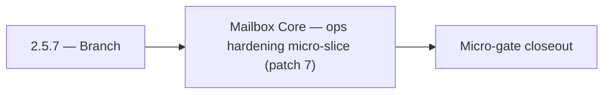

# 2.5.7 — Branch

- **Era:** `2.x` Email system — hub [`versions.md`](../versions.md) · minors start at [`2.0 — Email Foundation`](2.0%20%E2%80%94%20Email%20Foundation.md)
- **Minor:** [2.5 — Mailbox Core](./2.5 — Mailbox Core.md)
- **Codename:** Branch
- **Status:** ✅ Completed
## Focus
Mailbox Core — ops hardening micro-slice (patch 7)

## Flowchart

## Micro-gate

| Track | Gate question | Answer / Evidence (fill at patch closeout) |
| --- | --- | --- |
| **Contract** | GraphQL email/jobs/upload or Lambda/Mailvetter REST changed? Diff vs `docs/backend/apis/`; bulk job idempotency? | Document at patch closeout. |
| **Service** | Finder/verifier/bulk stream smoke; provider routing + error envelopes unchanged or versioned? | Document smoke paths. |
| **Surface** | Email Studio, bulk job UI, or `/email` mailbox changed? Loading/error/progress contracts? | Document UX delta or N/A. |
| **Frontend** | Which routes/hooks must change for this patch? | `contact360.io/email` inbox/detail — credential security gate. Document at closeout. |
| **Data** | `email_finder_cache`, patterns, job rows, Mailvetter store, S3 artifacts — migrations + lineage? | Document migrations/lineage or N/A. |
| **Ops** | Multipart/queue alerts, rollback/runbook delta for email-impacting releases? | Document ops delta or N/A. |

## Tasks
### Ops
- ✅ Completed: 📌 Planned: Error boundaries + toast normalization.
- ✅ Completed: 📌 Planned: Load test `POST /api/v1/ai/email/analyze` with p95 target < 2s.
- ✅ Completed: 📌 Planned: Add email risk endpoint to contact.ai Postman collection (`docs/media/postman/Contact AI Service.postman_collection.json`).
- ✅ Completed: 📌 Planned: Add queue lag and worker saturation dashboards.

### Contract

- ✅ Completed: 📌 Planned: **[appointment360]** — Diff and document schema for operations like ConnectraClient, LAMBDA_AI_API_URL, LAMBDA_CONNECTRA_API_URL; align with roadmap | area: `backend-api` | files: `docs/backend/apis/*.md`, `contact360.io/api/app/graphql/schema.py` | reason: Keep GraphQL/REST contracts aligned for era 2.7 patch 2.5.7

### Service

- ✅ Completed: 📌 Planned: **[appointment360]** — Service slice: - [x] ✅ Completed: email finder/verifier and job orchestration modules are integrated. | area: `backend-api` | files: `contact360.io/api/app/graphql/modules/`, `contact360.io/api/app/clients/` | reason: Implement or verify runtime behavior for - [x] ✅ Completed: email finder/verifier and job orchestration modules are integ

### Surface

- ✅ Completed: 📌 Planned: **[emailapis]** — Verify UX for route `/email` and bindings (patch 2.5.7 band 7) | area: `frontend-page` | files: `contact360.io/app/...` | reason: Dashboard/extension surface for era 2 must match gateway contracts

### Data

- ✅ Completed: 📌 Planned: **[appointment360]** — Update PostgreSQL/ES/S3 lineage notes if this patch touches persistence or exports | area: `data-lineage` | files: `docs/backend/database/`, `migrations/` | reason: Migrations, indexes, and lineage evidence for this patch

## Service task slices
> Merged from era `2.x` email system task packs (P0→`.0`–`.2`, P1→`.3`–`.6`, Ops→`.7`–`.9`).

### Appointment360 (gateway)
- Add Postman environment variables for Lambda Email + tkdjob
- Write integration test: findEmails round-trip with mocked LambdaEmailClient
- Write integration test: createEmailFinderExport → poll job(jobId) → status = done

## Evidence gate
Patch closeout includes contract diff, smoke output, data lineage delta, and ops note
