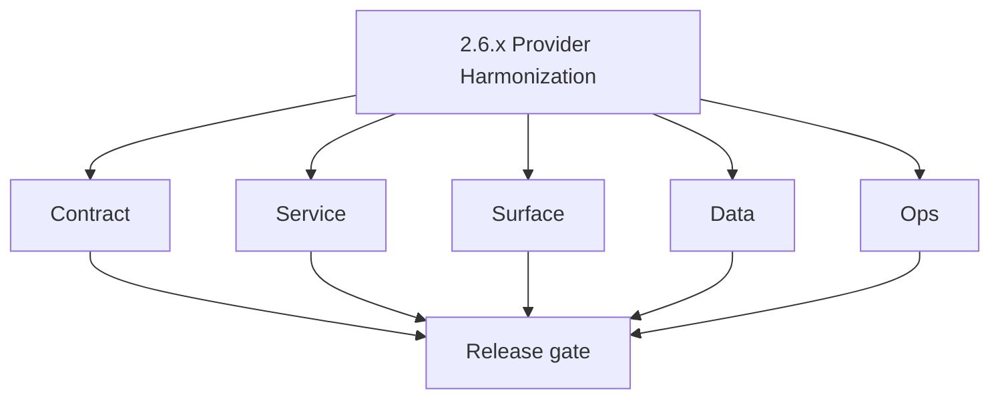
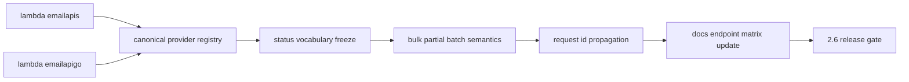

# Version 2.6 — Provider Harmonization

- **Status:** ✅ Completed
- **Codename:** Provider Harmonization
- **Era:** 2.x (Contact360 email system)
- **Roadmap:** Cross-cutting — **emailapis** era **2.x** task pack (provider naming, status semantics, bulk correctness)
- **Summary:** Eliminate **drift** between Python and Go Lambdas and docs: unify **`truelist` vs `mailvetter`** naming, freeze **status vocabulary**, harden **bulk partial-batch** error mapping and retries.
- **Patch closure:** Every codenamed patch file includes **Micro-gate** + **Service task slices**. Era hub: [`versions.md`](../versions.md).

## Scope

- **Target:** `2.6.x` patches — contract and test depth, minimal UI change unless mapping fixes required.
- **In scope:** Parity tests, endpoint matrix update, trace id propagation.
- **Out of scope:** Mailvetter infra hardening ( **`2.7`** ).
- **Owners:** Email platform.

## Flowchart

### Runtime focus (unique to this minor)

## Task tracks

### Contract

- ✅ Completed: 📌 Planned: Update **`emailapis_endpoint_era_matrix.json`** — **Service task slices** in `2.6.P` patch files (scope from former `emailapis-email-system-task-pack.md`).
- 📌 Planned: **[appointment360]** — refine duplicate task (was: ✅ completed: 📌 planned: publish **status enum** table shared…) | patch `2.6.0` band `0` | reason: specialize this file vs sibling patches; see docs/codebases/appointment360-codebase-analysis.md

- 📌 Planned: **[appointment360]** — refine duplicate task (was: 📌 planned: **[architecture]** — product **graphql** remains …) | patch `2.6.0` band `0` | reason: specialize this file vs sibling patches; see docs/codebases/appointment360-codebase-analysis.md
### Service

- 📌 Planned: **[appointment360]** — refine duplicate task (was: 📌 planned: **[appointment360]** — refine duplicate task (was…) | patch `2.6.0` band `0` | reason: specialize this file vs sibling patches; see docs/codebases/appointment360-codebase-analysis.md
- 📌 Planned: **[appointment360]** — refine duplicate task (was: ✅ completed: 📌 planned: **fallback** order documented in cod…) | patch `2.6.0` band `0` | reason: specialize this file vs sibling patches; see docs/codebases/appointment360-codebase-analysis.md

- 📌 Planned: **[appointment360]** — refine duplicate task (was: 📌 planned: **[architecture]** — **go/gin satellites** in sco…) | patch `2.6.0` band `0` | reason: specialize this file vs sibling patches; see docs/codebases/appointment360-codebase-analysis.md
### Surface

- 📌 Planned: **[appointment360]** — refine duplicate task (was: ✅ completed: 📌 planned: app mapping fixes only if enum chang…) | patch `2.6.0` band `0` | reason: specialize this file vs sibling patches; see docs/codebases/appointment360-codebase-analysis.md

- 📌 Planned: **[appointment360]** — refine duplicate task (was: 📌 planned: **[architecture]** — **next.js** customer surface…) | patch `2.6.0` band `0` | reason: specialize this file vs sibling patches; see docs/codebases/appointment360-codebase-analysis.md
### Data

- 📌 Planned: **[appointment360]** — refine duplicate task (was: ✅ completed: 📌 planned: cache keys include **provider versio…) | patch `2.6.0` band `0` | reason: specialize this file vs sibling patches; see docs/codebases/appointment360-codebase-analysis.md

- 📌 Planned: **[appointment360]** — refine duplicate task (was: 📌 planned: **[architecture]** — **postgresql-first** per `do…) | patch `2.6.0` band `0` | reason: specialize this file vs sibling patches; see docs/codebases/appointment360-codebase-analysis.md
- 📌 Planned: **[appointment360]** — refine duplicate task (was: 📌 planned: **[architecture]** — **redis exit**: campaign (as…) | patch `2.6.0` band `0` | reason: specialize this file vs sibling patches; see docs/codebases/appointment360-codebase-analysis.md
### Ops

- 📌 Planned: **[appointment360]** — refine duplicate task (was: ✅ completed: 📌 planned: dashboard: error rate by provider ad…) | patch `2.6.0` band `0` | reason: specialize this file vs sibling patches; see docs/codebases/appointment360-codebase-analysis.md

- 📌 Planned: **[appointment360]** — refine duplicate task (was: 📌 planned: **[architecture]** — **observability**: correlate…) | patch `2.6.0` band `0` | reason: specialize this file vs sibling patches; see docs/codebases/appointment360-codebase-analysis.md
## Task Breakdown

| Slice | Outcome |
| --- | --- |
| emailapis | Python path |
| emailapigo | Go path |
| Docs | Matrix + vocabulary |

## Immediate next execution queue

- 📌 Planned: List all references to deprecated provider names in repo.
- 📌 Planned: Contract test CI job.

## Cross-service ownership

| Service | Focus |
| --- | --- |
| `lambda/emailapis` | Adapters |
| `lambda/emailapigo` | Adapters |
| `contact360.io/api` | Mapping layer |
| `contact360.io/app` | Display enums |

## Codebase file targets (Provider Harmonization)

Grounded in `docs/codebases/emailapis-codebase-analysis.md`.

| Slice | Primary codebases | Start files | What must be true by 2.6 lock |
| --- | --- | --- | --- |
| Canonical provider registry | `lambda/emailapis` + `lambda/emailapigo` | provider selection logic in finder/verifier services | No provider name exists “only in one runtime” |
| Status vocabulary | Gateway + UI | gateway mappers + UI badge enums | UI labels are driven by frozen enum table |
| Partial-batch semantics | Jobs + Lambdas | bulk endpoints + jobs processors | Row-level errors are stable and retry-safe |
| Trace propagation | API + Lambdas | `LambdaEmailClient` + lambda middleware | request_id visible across api + lambda |

## Python/Go parity test plan (golden fixtures)

Goal: same payload → same normalized output, across Python and Go adapters.

**Fixture shape (minimum):**

- Inputs:
  - Finder: `{first_name,last_name,domain}`
  - Verifier: `{email}`
- Outputs:
  - `status` (canonical)
  - `confidence` / score band
  - `provider` (canonical name)
  - `error` envelope for failure cases

**Golden cases to include (minimum):**

1. Cache hit vs miss (finder)
2. Catch-all domain classification (verifier)
3. Disposable domain classification (verifier)
4. Provider timeout fallback behavior (finder/verifier)
5. Partial batch (bulk) with mixed terminal + retriable row errors

**Where to keep fixtures:**

- One shared “docs fixtures” directory (recommended) that both runtimes can load in CI, or mirrored copies with checksum checks.

## References

- [`docs/codebases/emailapis-codebase-analysis.md`](../codebases/emailapis-codebase-analysis.md) — risks 1–5
- **Service task slices** in `2.6.P` patch files (scope from former `emailapis-email-system-task-pack.md`)

## Backend API and Endpoint Scope

- All **email** Lambda routes used in prod; internal only.

## Database and Data Lineage Scope

- **email_finder_cache** key scheme if provider field changes.

## Frontend UX Surface Scope

- Enum-driven labels only — no new flows.

## UI Elements Checklist

- 📌 Planned: Status labels match frozen enum
- 📌 Planned: Tooltip text updated if status meaning changes

## Flow / Graph Delta for This Minor

- **Delta:** **Contracts** become single source of truth across runtimes; reduces class of production incidents.

## Audit and Compliance Notes

- Trace ids on finder/verifier for **support** without logging raw email bodies.

## Patch ladder (`2.6.0` – `2.6.9`)

### Micro-gate reference (apply at every `2.N.P`)

| Track | Gate question (must answer Yes or document waiver) |
| --- | --- |
| **Contract** | GraphQL email/jobs/upload or Lambda/Mailvetter REST changed? Diff vs `docs/backend/apis/`; bulk job idempotency documented? |
| **Service** | Finder/verifier/bulk paths still smoke; provider routing + error envelopes OK or versioned? |
| **Surface** | Email Studio, bulk job UI, or `/email` mailbox changed? Loading/error/progress contracts? |
| **Frontend** | Which routes/hooks apply (see **Frontend UX Surface Scope** / checklist in minor)? |
| **Data** | `email_finder_cache`, patterns, jobs, Mailvetter, S3 artifacts — migrations + lineage? |
| **Ops** | Multipart/queue durability, alerts, rollback/runbook delta for email releases? |
| **Architecture** | Go/Gin satellites only via Python GraphQL gateway (`contact360.io/api`); Next.js `NEXT_PUBLIC_GRAPHQL_URL`; Postgres-first / Redis exit per `docs/docs/data-stores-postgres.md`. |

**Patch intent bands:** `.0` charter · `.1`–`.3` core path · `.4`–`.6` hardening · `.7`–`.8` integration · `.9` minor freeze / handoff.

Theme: **Bridge** — codenames in per-patch `2.6.P — *.md` files.

| Patch | Codename | Contract | Service | Surface | Data | Ops |
| --- | --- | --- | --- | --- | --- | --- |
| `2.6.0` | Align | Provider list frozen | Provider selection consistent | UI shows canonical providers | Provider field normalized | Baseline adapter metrics |
| `2.6.1` | Map | Legacy→canonical mapping frozen | Alias mapping implemented | UI back-compat labels | Handle old values | Drift detection |
| `2.6.2` | Normalize | Output normalization rules frozen | Normalization identical across runtimes | UI copy aligns | Store normalized outputs | Regression tests |
| `2.6.3` | Unify | Single registry contract | Registry used everywhere | UI reads same enums | Mapping tables documented | CI gate required |
| `2.6.4` | Freeze | Enum freeze | Runtime enforces enums | Badges/tooltips updated | Export columns updated | Release notes |
| `2.6.5` | Test | Parity suite required | Golden fixtures green | No UI changes expected | Fixture datasets versioned | CI fails on drift |
| `2.6.6` | Validate | Staging validation checklist | Live staging runs match fixtures | Screenshot evidence (if needed) | Drift report stored | Alert thresholds |
| `2.6.7` | Publish | Docs published | Runtime tagged | UI docs updated | Data lineage updated | Support runbook |
| `2.6.8` | Version | Version bump policy | Version metadata emitted | Debug drawer optional | Store mapping version | Rollback safety |
| `2.6.9` | Lock | Lock for 2.7 | Regression suite green | UI stable | Schema links refreshed | Final sign-off |

## Release Gate and Evidence

### Master Task Checklist

- 📌 Planned: Matrix file committed

### Backend API and Endpoints

- 📌 Planned: Parity CI green

### Database and Data Lineage

- 📌 Planned: Cache key note if changed

### Frontend UX

- 📌 Planned: N/A or mapping screenshot

### UI Elements

- 📌 Planned: Checklist above

### Flow and Graph

- 📌 Planned: Runtime Mermaid reviewed

### Validation

- 📌 Planned: Bulk partial failure mapping signed off

### Release Gate

- 📌 Planned: Sign-off for **`2.7` Mailvetter Hardening**

## Patches

| Patch | Codename | Doc |
| --- | --- | --- |
| `2.6.0` | Void | [`2.6.0` — Void](2.6.0 — Void.md) |
| `2.6.1` | Seed | [`2.6.1` — Seed](2.6.1 — Seed.md) |
| `2.6.2` | Sprout | [`2.6.2` — Sprout](2.6.2 — Sprout.md) |
| `2.6.3` | Roots | [`2.6.3` — Roots](2.6.3 — Roots.md) |
| `2.6.4` | Soil | [`2.6.4` — Soil](2.6.4 — Soil.md) |
| `2.6.5` | Rain | [`2.6.5` — Rain](2.6.5 — Rain.md) |
| `2.6.6` | Stem | [`2.6.6` — Stem](2.6.6 — Stem.md) |
| `2.6.7` | Branch | [`2.6.7` — Branch](2.6.7 — Branch.md) |
| `2.6.8` | Leaf | [`2.6.8` — Leaf](2.6.8 — Leaf.md) |
| `2.6.9` | Bloom | [`2.6.9` — Bloom](2.6.9 — Bloom.md) |
