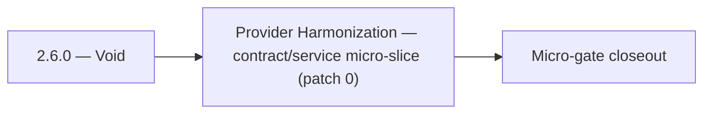

# 2.6.0 — Void

- **Era:** `2.x` Email system — hub [`versions.md`](../versions.md) · minors start at [`2.0 — Email Foundation`](2.0%20%E2%80%94%20Email%20Foundation.md)
- **Minor:** [2.6 — Provider Harmonization](./2.6 — Provider Harmonization.md)
- **Codename:** Void
- **Status:** ✅ Completed
## Focus
Provider Harmonization — contract/service micro-slice (patch 0)

## Flowchart

## Micro-gate

| Track | Gate question | Answer / Evidence (fill at patch closeout) |
| --- | --- | --- |
| **Contract** | GraphQL email/jobs/upload or Lambda/Mailvetter REST changed? Diff vs `docs/backend/apis/`; bulk job idempotency? | Document at patch closeout. |
| **Service** | Finder/verifier/bulk stream smoke; provider routing + error envelopes unchanged or versioned? | Document smoke paths. |
| **Surface** | Email Studio, bulk job UI, or `/email` mailbox changed? Loading/error/progress contracts? | Document UX delta or N/A. |
| **Frontend** | Which routes/hooks must change for this patch? | Provider/status badges — no vocabulary drift. Document at closeout. |
| **Data** | `email_finder_cache`, patterns, job rows, Mailvetter store, S3 artifacts — migrations + lineage? | Document migrations/lineage or N/A. |
| **Ops** | Multipart/queue alerts, rollback/runbook delta for email-impacting releases? | Document ops delta or N/A. |

## Tasks
### Contract
- ✅ Completed: 📌 Planned: Update **`emailapis_endpoint_era_matrix.json`** — **Service task slices** below (includes former `emailapis-email-system-task-pack.md` scope).
- ✅ Completed: Response: `{"risk_score": <0-100>, "analysis": "<string>", "is_role_based": <bool>, "is_disposable": <bool>}`
- ✅ Completed: 📌 Planned: Add/verify a mapping shim at the gateway boundary so `AnalyzeEmailRiskInput.model` invokes the intended HF model.
- ✅ Completed: 📌 Planned: Freeze webhook callback payload contract.

### Service
- ✅ Completed: 📌 Planned: **Parity tests** same payload → same normalized output (Python vs Go).
- ✅ Completed: 📌 Planned: Validate HF API response against `EmailRiskAnalysisResponse` schema; handle malformed JSON from LLM.
- ✅ Completed: 📌 Planned: Harden bulk job path: dedupe, plan checks, queueing, worker updates.
- ✅ Completed: 📌 Planned: Harden **missing-part** and **duplicate-registration** failure handling.

### Surface

- ✅ Completed: 📌 Planned: **[emailapis]** — Verify UX for route `/email` and bindings (patch 2.6.0 band 0) | area: `frontend-page` | files: `contact360.io/app/...` | reason: Dashboard/extension surface for era 2 must match gateway contracts

### Data

- ✅ Completed: 📌 Planned: **[appointment360]** — Update PostgreSQL/ES/S3 lineage notes if this patch touches persistence or exports | area: `data-lineage` | files: `docs/backend/database/`, `migrations/` | reason: Migrations, indexes, and lineage evidence for this patch

### Ops

- ✅ Completed: 📌 Planned: **[platform]** — Record smoke evidence, rollback, and alerts (patch band 0: charter/P0) | area: `ops` | files: `docs/commands/`, `.github/workflows/` | reason: Smoke, rollback, and observability for patch 2.6.0

## Service task slices
> Merged from era `2.x` email system task packs (P0→`.0`–`.2`, P1→`.3`–`.6`, Ops→`.7`–`.9`).

### emailapis / emailapigo
- Define and freeze era **`2.x`** email endpoint and payload compatibility notes (finder, verifier, pattern, bulk batch).
- Update endpoint/reference matrix: `docs/backend/endpoints/emailapis_endpoint_era_matrix.json`.
- Publish **provider parity matrix**: same input → normalized output for **Python vs Go** adapters (golden fixtures).
- Freeze **status vocabulary** table consumed by Appointment360 GraphQL mappers.
- Document **bulk partial-batch** semantics: which rows retry, which are terminal, how errors surface in `job_response`.
- Implement/validate runtime behavior for era **`2.x`** finder, verifier, pattern, and fallback paths.
- Verify auth, provider routing, **error envelope**, and health diagnostics behavior.
- Propagate **`X-Request-ID`** (or equivalent) from gateway into Lambda logs.
- Align **credit correlation**: accept gateway context headers or payload fields for billing traces (see `2.9` minor).
- Document **`email_finder_cache`** and **`email_patterns`** lineage impact for era **`2.x`**.
- Record provider, status, and traceability expectations for this era (cache key includes provider/version if needed).

## Evidence gate
Primary charter artifact created and linked in the parent minor doc
