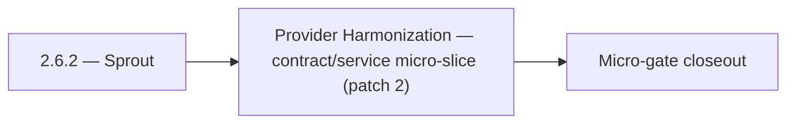

# 2.6.2 — Sprout

- **Era:** `2.x` Email system — hub [`versions.md`](../versions.md) · minors start at [`2.0 — Email Foundation`](2.0%20%E2%80%94%20Email%20Foundation.md)
- **Minor:** [2.6 — Provider Harmonization](./2.6 — Provider Harmonization.md)
- **Codename:** Sprout
- **Status:** planned

## Focus
Provider Harmonization — contract/service micro-slice (patch 2)

## Flowchart

## Micro-gate

| Track | Gate question | Answer / Evidence (fill at patch closeout) |
| --- | --- | --- |
| **Contract** | GraphQL email/jobs/upload or Lambda/Mailvetter REST changed? Diff vs `docs/backend/apis/`; bulk job idempotency? | Document at patch closeout. |
| **Service** | Finder/verifier/bulk stream smoke; provider routing + error envelopes unchanged or versioned? | Document smoke paths. |
| **Surface** | Email Studio, bulk job UI, or `/email` mailbox changed? Loading/error/progress contracts? | Document UX delta or N/A. |
| **Frontend** | Which routes/hooks must change for this patch? | Provider/status badges — no vocabulary drift. Document at closeout. |
| **Data** | `email_finder_cache`, patterns, job rows, Mailvetter store, S3 artifacts — migrations + lineage? | Document migrations/lineage or N/A. |
| **Ops** | Multipart/queue alerts, rollback/runbook delta for email-impacting releases? | Document ops delta or N/A. |

## Tasks
### Contract
- 📌 Planned: Lock `POST /api/v1/ai/email/analyze` request/response schema:
- 📌 Planned: Confirm `LambdaAIClient.analyze_email_risk()` path is `/api/v1/ai/email/analyze` (not legacy `/gemini/email`).
- 📌 Planned: Freeze status vocabulary: `valid`, `invalid`, `catch_all`, `risky`, `unknown`.
- 📌 Planned: Define **retry/idempotency** expectations for `complete` and `abort` (duplicate complete safe?).

### Service
- 📌 Planned: Implement `POST /api/v1/ai/email/analyze` in `app/api/v1/endpoints/ai.py`.
- 📌 Planned: Confirm email addresses are not logged or persisted in any table (privacy compliance).
- 📌 Planned: Add retry and dead-letter handling for poisoned tasks.
- 📌 Planned: Ensure **metadata worker** runs reliably after `complete` — `metadata.json` merge for email artifacts.

## Service task slices
> Merged from era `2.x` email system task packs (P0→`.0`–`.2`, P1→`.3`–`.6`, Ops→`.7`–`.9`).

### emailapis / emailapigo
- Define and freeze era **`2.x`** email endpoint and payload compatibility notes (finder, verifier, pattern, bulk batch).
- Update endpoint/reference matrix: `docs/backend/endpoints/emailapis_endpoint_era_matrix.json`.
- Publish **provider parity matrix**: same input → normalized output for **Python vs Go** adapters (golden fixtures).
- Freeze **status vocabulary** table consumed by Appointment360 GraphQL mappers.
- Document **bulk partial-batch** semantics: which rows retry, which are terminal, how errors surface in `job_response`.
- Implement/validate runtime behavior for era **`2.x`** finder, verifier, pattern, and fallback paths.
- Verify auth, provider routing, **error envelope**, and health diagnostics behavior.
- Propagate **`X-Request-ID`** (or equivalent) from gateway into Lambda logs.
- Align **credit correlation**: accept gateway context headers or payload fields for billing traces (see `2.9` minor).
- Document **`email_finder_cache`** and **`email_patterns`** lineage impact for era **`2.x`**.
- Record provider, status, and traceability expectations for this era (cache key includes provider/version if needed).

## Evidence gate
Patch closeout includes contract diff, smoke output, data lineage delta, and ops note
