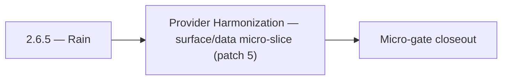

# 2.6.5 — Rain

- **Era:** `2.x` Email system — hub [`versions.md`](../versions.md) · minors start at [`2.0 — Email Foundation`](2.0%20%E2%80%94%20Email%20Foundation.md)
- **Minor:** [2.6 — Provider Harmonization](./2.6 — Provider Harmonization.md)
- **Codename:** Rain
- **Status:** planned

## Focus
Provider Harmonization — surface/data micro-slice (patch 5)

## Flowchart

## Micro-gate

| Track | Gate question | Answer / Evidence (fill at patch closeout) |
| --- | --- | --- |
| **Contract** | GraphQL email/jobs/upload or Lambda/Mailvetter REST changed? Diff vs `docs/backend/apis/`; bulk job idempotency? | Document at patch closeout. |
| **Service** | Finder/verifier/bulk stream smoke; provider routing + error envelopes unchanged or versioned? | Document smoke paths. |
| **Surface** | Email Studio, bulk job UI, or `/email` mailbox changed? Loading/error/progress contracts? | Document UX delta or N/A. |
| **Frontend** | Which routes/hooks must change for this patch? | Provider/status badges — no vocabulary drift. Document at closeout. |
| **Data** | `email_finder_cache`, patterns, job rows, Mailvetter store, S3 artifacts — migrations + lineage? | Document migrations/lineage or N/A. |
| **Ops** | Multipart/queue alerts, rollback/runbook delta for email-impacting releases? | Document ops delta or N/A. |

## Tasks
### Surface
- 📌 Planned: Design `EmailRiskBadge` component spec: shows risk score as colored badge (green/yellow/red) on contact email field.
- `docs/frontend/contact-ai-ui-bindings.md`
- 📌 Planned: Ensure progress bars consume `processed/total/percentage` consistently.
- 📌 Planned: Dashboard contacts row: "Needs email enrichment" badge on SN-sourced contacts without email

### Data
- 📌 Planned: Confirm no `ai_chats` rows created by utility calls (stateless path).
- 📌 Planned: Normalize key verification columns in `results` for queryable analytics.
- 📌 Planned: Confirm `email_status` field is preserved when present (e.g., `verified`, `risky`, `invalid`)

## Service task slices
> Merged from era `2.x` email system task packs (P0→`.0`–`.2`, P1→`.3`–`.6`, Ops→`.7`–`.9`).

### emailapis / emailapigo
- Document impacted pages/tabs/buttons/inputs/components for era **`2.x`** (Email Studio, bulk flows).
- Document relevant hooks/services/contexts and UX states (loading/error/progress/checkbox/radio).
- Document **`email_finder_cache`** and **`email_patterns`** lineage impact for era **`2.x`**.
- Record provider, status, and traceability expectations for this era (cache key includes provider/version if needed).
- Implement/validate runtime behavior for era **`2.x`** finder, verifier, pattern, and fallback paths.
- Verify auth, provider routing, **error envelope**, and health diagnostics behavior.
- Propagate **`X-Request-ID`** (or equivalent) from gateway into Lambda logs.
- Align **credit correlation**: accept gateway context headers or payload fields for billing traces (see `2.9` minor).

## Evidence gate
Patch closeout includes contract diff, smoke output, data lineage delta, and ops note
