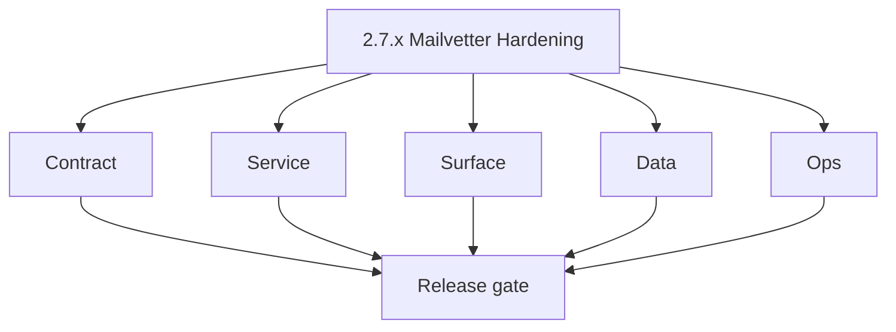
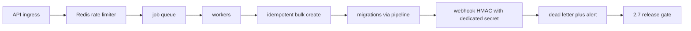

# Version 2.7 — Mailvetter Hardening

- **Status:** planned  
- **Codename:** Mailvetter Hardening  
- **Era:** 2.x (Contact360 email system)  
- **Roadmap:** Cross-cutting — **Mailvetter** primary delivery concerns (see [`docs/codebases/mailvetter-codebase-analysis.md`](../codebases/mailvetter-codebase-analysis.md) immediate execution queue)  
- **Summary:** Production **hardening**: **Redis-backed** distributed rate limiter, **explicit migration pipeline** (not runtime startup), **idempotency keys** for bulk job create, **webhook secret** separate from API secret, legacy route deprecation.  
- **Patch closure:** Every codenamed patch file includes **Micro-gate** + **Service task slices**. Era hub: [`versions.md`](../versions.md).

## Scope

- **Target:** `2.7.x` patches — ops safety and contract clarity.  
- **In scope:** Worker scaling assumptions, DLQ, failed job status.  
- **Out of scope:** New scoring models (product change).  
- **Owners:** Email platform + Mailvetter.

## Flowchart

### Runtime focus (unique to this minor)

## Task tracks

### Contract

- 📌 Planned: Deprecate **legacy** `/upload` `/status` if still public; document sunset — **Service task slices** in `2.7.P` patch files (scope from former `mailvetter-email-system-task-pack.md`).  
- 📌 Planned: **Idempotency-Key** header on bulk create.

### Service

- 📌 Planned: Replace **in-memory** limiter with **Redis**.  
- 📌 Planned: **failed** job status for poison / system errors.

### Surface

- 📌 Planned: Legacy static UI removal or guard behind feature flag.

### Data

- 📌 Planned: **Job events** timeline table (queued → completed/failed).  
- 📌 Planned: Migrations run in **deploy pipeline** only.

### Ops

- 📌 Planned: Runbook: Redis down → degrade behavior.  
- 📌 Planned: Alerts: queue lag, worker saturation.

## Task Breakdown

| Slice | Outcome |
| --- | --- |
| Mailvetter | Core hardening |
| Infra | Redis + secrets |
| Docs | OpenAPI parity tests |

## Immediate next execution queue

- 📌 Planned: Load test after Redis limiter.  
- 📌 Planned: Secret rotation drill for webhook.

## Cross-service ownership

| Service | Focus |
| --- | --- |
| `backend(dev)/mailvetter` | All items |
| DevOps | Redis, migrations |

## Codebase file targets (Mailvetter Hardening)

Grounded in `docs/codebases/mailvetter-codebase-analysis.md`.

| Slice | Primary codebases | Start files | What must be true by 2.7 gate |
| --- | --- | --- | --- |
| Redis-backed rate limiting | `backend(dev)/mailvetter` + Redis | `backend(dev)/mailvetter/internal/api/router.go` (middleware wiring) | Limiter is distributed-safe across replicas |
| Migration discipline | `backend(dev)/mailvetter` + deploy pipeline | `backend(dev)/mailvetter/internal/store/db.go` | Migrations are not executed on app startup |
| Idempotency for bulk create | `backend(dev)/mailvetter` | bulk validate handler + job service | Retries don’t duplicate jobs or charges |
| Webhook secret isolation | `backend(dev)/mailvetter` | `internal/webhook/dispatcher.go` | `WEBHOOK_SECRET_KEY` independent from API secret |
| Legacy surface deprecation | `backend(dev)/mailvetter` | legacy routes + `static/index.html` | v1 is canonical; legacy guarded/deprecated |

## References

- [`docs/codebases/mailvetter-codebase-analysis.md`](../codebases/mailvetter-codebase-analysis.md)  
- **Service task slices** in `2.7.P` patch files (scope from former `mailvetter-email-system-task-pack.md`)

## Backend API and Endpoint Scope

- **v1:** validate, validate-bulk, jobs, results, webhook.

## Database and Data Lineage Scope

- Jobs, results, events tables; migration ordering.

## Frontend UX Surface Scope

- Dashboard verifier progress bars unchanged semantically.

## UI Elements Checklist

- 📌 Planned: Progress uses processed/total/percentage  
- 📌 Planned: Failed job user-visible state

## Flow / Graph Delta for This Minor

- **Delta:** Same user-visible features, **safer** multi-replica and deploy behavior.

## Audit and Compliance Notes

- Separate secrets reduce blast radius; document in [`docs/audit-compliance.md`](../audit-compliance.md) key rotation section.

## Patch ladder (`2.7.0` – `2.7.9`)

### Micro-gate reference (apply at every `2.N.P`)

| Track | Gate question (must answer Yes or document waiver) |
| --- | --- |
| **Contract** | GraphQL email/jobs/upload or Lambda/Mailvetter REST changed? Diff vs `docs/backend/apis/`; bulk job idempotency documented? |
| **Service** | Finder/verifier/bulk paths still smoke; provider routing + error envelopes OK or versioned? |
| **Surface** | Email Studio, bulk job UI, or `/email` mailbox changed? Loading/error/progress contracts? |
| **Frontend** | Which routes/hooks apply (see **Frontend UX Surface Scope** / checklist in minor)? |
| **Data** | `email_finder_cache`, patterns, jobs, Mailvetter, S3 artifacts — migrations + lineage? |
| **Ops** | Multipart/queue durability, alerts, rollback/runbook delta for email releases? |

**Patch intent bands:** `.0` charter · `.1`–`.3` core path · `.4`–`.6` hardening · `.7`–`.8` integration · `.9` minor freeze / handoff.

Theme: **Anvil** — codenames in per-patch `2.7.P — *.md` files.

| Patch | Codename | Contract | Service | Surface | Data | Ops |
| --- | --- | --- | --- | --- | --- | --- |
| `2.7.0` | Harden | Hardening contract published | Baseline hardening branch | No UX change expected | Job/status vocab reviewed | Runbook drafted |
| `2.7.1` | Distribute | Limiter behavior documented | Redis limiter implemented | 429 handling UX consistent | Rate-limit events logged | Multi-replica test |
| `2.7.2` | Limit | Quotas contract frozen | Quotas enforced | UI shows quota errors | Quota decision evidence | Alert on quota bypass |
| `2.7.3` | Migrate | Migration pipeline contract | Startup migrations removed | No UX change | Migration evidence stored | Deploy gate |
| `2.7.4` | Isolate | Secret isolation contract | Webhook secret separated | Admin docs updated | Secret rotation safe | Rotation drill |
| `2.7.5` | Monitor | Metrics schema frozen | Metrics emitted | No UX change | Metrics rollups | Dashboard |
| `2.7.6` | Alert | Thresholds frozen | Alert rules implemented | Clear failed states | Failure payload stored | Alerts firing |
| `2.7.7` | Retry | Retry semantics frozen | Retry logic stable | Retry UI correct | try_count correct | Retry storm guard |
| `2.7.8` | DLQ | DLQ contract frozen | DLQ handling added | Admin-only visibility | DLQ retention | DLQ alarms |
| `2.7.9` | Gate | Gate checklist locked | Regression suite green | UI stable | Lineage links updated | Final sign-off |

## Release Gate and Evidence

### Master Task Checklist

- 📌 Planned: Execution queue items 1–7 addressed or waived

### Backend API and Endpoints

- 📌 Planned: v1 route parity tests

### Database and Data Lineage

- 📌 Planned: Migration run evidence

### Frontend UX

- 📌 Planned: Legacy UI status

### UI Elements

- 📌 Planned: Checklist above

### Flow and Graph

- 📌 Planned: Runtime Mermaid reviewed

### Validation

- 📌 Planned: Two-replica rate limit test

### Release Gate

- 📌 Planned: Sign-off for **`2.8` Bulk Observability**

## Patches

| Patch | Codename | Doc |
| --- | --- | --- |
| `2.7.0` | Void | [`2.7.0` — Void](2.7.0 — Void.md) |
| `2.7.1` | Seed | [`2.7.1` — Seed](2.7.1 — Seed.md) |
| `2.7.2` | Sprout | [`2.7.2` — Sprout](2.7.2 — Sprout.md) |
| `2.7.3` | Roots | [`2.7.3` — Roots](2.7.3 — Roots.md) |
| `2.7.4` | Soil | [`2.7.4` — Soil](2.7.4 — Soil.md) |
| `2.7.5` | Rain | [`2.7.5` — Rain](2.7.5 — Rain.md) |
| `2.7.6` | Stem | [`2.7.6` — Stem](2.7.6 — Stem.md) |
| `2.7.7` | Branch | [`2.7.7` — Branch](2.7.7 — Branch.md) |
| `2.7.8` | Leaf | [`2.7.8` — Leaf](2.7.8 — Leaf.md) |
| `2.7.9` | Bloom | [`2.7.9` — Bloom](2.7.9 — Bloom.md) |
