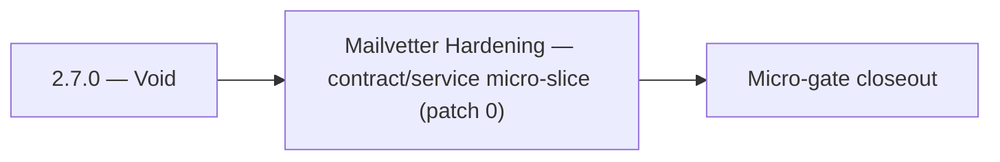

# 2.7.0 — Void

- **Era:** `2.x` Email system — hub [`versions.md`](../versions.md) · minors start at [`2.0 — Email Foundation`](2.0%20%E2%80%94%20Email%20Foundation.md)
- **Minor:** [2.7 — Mailvetter Hardening](./2.7 — Mailvetter Hardening.md)
- **Codename:** Void
- **Status:** planned

## Focus
Mailvetter Hardening — contract/service micro-slice (patch 0)

## Flowchart

## Micro-gate

| Track | Gate question | Answer / Evidence (fill at patch closeout) |
| --- | --- | --- |
| **Contract** | GraphQL email/jobs/upload or Lambda/Mailvetter REST changed? Diff vs `docs/backend/apis/`; bulk job idempotency? | Document at patch closeout. |
| **Service** | Finder/verifier/bulk stream smoke; provider routing + error envelopes unchanged or versioned? | Document smoke paths. |
| **Surface** | Email Studio, bulk job UI, or `/email` mailbox changed? Loading/error/progress contracts? | Document UX delta or N/A. |
| **Frontend** | Which routes/hooks must change for this patch? | Verifier progress + failed states vs jobs UI. Document at closeout. |
| **Data** | `email_finder_cache`, patterns, job rows, Mailvetter store, S3 artifacts — migrations + lineage? | Document migrations/lineage or N/A. |
| **Ops** | Multipart/queue alerts, rollback/runbook delta for email-impacting releases? | Document ops delta or N/A. |

## Tasks
### Contract
- 📌 Planned: Deprecate **legacy** `/upload` `/status` if still public; document sunset — **Service task slices** below (includes former `mailvetter-email-system-task-pack.md` scope).
- Response: `{"risk_score": <0-100>, "analysis": "<string>", "is_role_based": <bool>, "is_disposable": <bool>}`
- 📌 Planned: Add/verify a mapping shim at the gateway boundary so `AnalyzeEmailRiskInput.model` invokes the intended HF model.
- 📌 Planned: Freeze webhook callback payload contract.

### Service
- 📌 Planned: Replace **in-memory** limiter with **Redis**.
- 📌 Planned: Validate HF API response against `EmailRiskAnalysisResponse` schema; handle malformed JSON from LLM.
- 📌 Planned: Harden bulk job path: dedupe, plan checks, queueing, worker updates.
- 📌 Planned: Harden **missing-part** and **duplicate-registration** failure handling.

## Service task slices
> Merged from era task packs and analysis docs for this domain.

- Confirm contract and runtime slices are mapped to the parent minor objective.
- Attach service-level smoke evidence and known waivers in patch closeout.

## Evidence gate
Primary charter artifact created and linked in the parent minor doc
