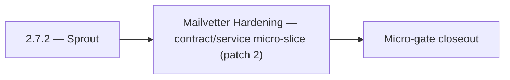

# 2.7.2 — Sprout

- **Era:** `2.x` Email system — hub [`versions.md`](../versions.md) · minors start at [`2.0 — Email Foundation`](2.0%20%E2%80%94%20Email%20Foundation.md)
- **Minor:** [2.7 — Mailvetter Hardening](./2.7 — Mailvetter Hardening.md)
- **Codename:** Sprout
- **Status:** ✅ Completed
## Focus
Mailvetter Hardening — contract/service micro-slice (patch 2)

## Flowchart

## Micro-gate

| Track | Gate question | Answer / Evidence (fill at patch closeout) |
| --- | --- | --- |
| **Contract** | GraphQL email/jobs/upload or Lambda/Mailvetter REST changed? Diff vs `docs/backend/apis/`; bulk job idempotency? | Document at patch closeout. |
| **Service** | Finder/verifier/bulk stream smoke; provider routing + error envelopes unchanged or versioned? | Document smoke paths. |
| **Surface** | Email Studio, bulk job UI, or `/email` mailbox changed? Loading/error/progress contracts? | Document UX delta or N/A. |
| **Frontend** | Which routes/hooks must change for this patch? | Verifier progress + failed states vs jobs UI. Document at closeout. |
| **Data** | `email_finder_cache`, patterns, job rows, Mailvetter store, S3 artifacts — migrations + lineage? | Document migrations/lineage or N/A. |
| **Ops** | Multipart/queue alerts, rollback/runbook delta for email-impacting releases? | Document ops delta or N/A. |

## Tasks
### Contract
- ✅ Completed: 📌 Planned: Lock `POST /api/v1/ai/email/analyze` request/response schema:
- ✅ Completed: 📌 Planned: Confirm `LambdaAIClient.analyze_email_risk()` path is `/api/v1/ai/email/analyze` (not legacy `/gemini/email`).
- ✅ Completed: 📌 Planned: Freeze status vocabulary: `valid`, `invalid`, `catch_all`, `risky`, `unknown`.
- ✅ Completed: 📌 Planned: Define **retry/idempotency** expectations for `complete` and `abort` (duplicate complete safe?).

### Service
- ✅ Completed: 📌 Planned: Implement `POST /api/v1/ai/email/analyze` in `app/api/v1/endpoints/ai.py`.
- ✅ Completed: 📌 Planned: Confirm email addresses are not logged or persisted in any table (privacy compliance).
- ✅ Completed: 📌 Planned: Add retry and dead-letter handling for poisoned tasks.
- ✅ Completed: 📌 Planned: Ensure **metadata worker** runs reliably after `complete` — `metadata.json` merge for email artifacts.

### Surface

- ✅ Completed: 📌 Planned: **[emailapis]** — Verify UX for route `/email` and bindings (patch 2.7.2 band 2) | area: `frontend-page` | files: `contact360.io/app/...` | reason: Dashboard/extension surface for era 2 must match gateway contracts

### Data

- ✅ Completed: 📌 Planned: **[appointment360]** — Update PostgreSQL/ES/S3 lineage notes if this patch touches persistence or exports | area: `data-lineage` | files: `docs/backend/database/`, `migrations/` | reason: Migrations, indexes, and lineage evidence for this patch

### Ops

- ✅ Completed: 📌 Planned: **[platform]** — Record smoke evidence, rollback, and alerts (patch band 2: charter/P0) | area: `ops` | files: `docs/commands/`, `.github/workflows/` | reason: Smoke, rollback, and observability for patch 2.7.2

## Service task slices
> Merged from era task packs and analysis docs for this domain.

- Confirm contract and runtime slices are mapped to the parent minor objective.
- Attach service-level smoke evidence and known waivers in patch closeout.

## Evidence gate
Patch closeout includes contract diff, smoke output, data lineage delta, and ops note
