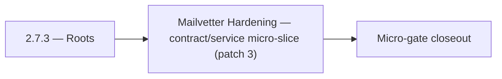

# 2.7.3 — Roots

- **Era:** `2.x` Email system — hub [`versions.md`](../versions.md) · minors start at [`2.0 — Email Foundation`](2.0%20%E2%80%94%20Email%20Foundation.md)
- **Minor:** [2.7 — Mailvetter Hardening](./2.7 — Mailvetter Hardening.md)
- **Codename:** Roots
- **Status:** planned

## Focus
Mailvetter Hardening — contract/service micro-slice (patch 3)

## Flowchart

## Micro-gate

| Track | Gate question | Answer / Evidence (fill at patch closeout) |
| --- | --- | --- |
| **Contract** | GraphQL email/jobs/upload or Lambda/Mailvetter REST changed? Diff vs `docs/backend/apis/`; bulk job idempotency? | Document at patch closeout. |
| **Service** | Finder/verifier/bulk stream smoke; provider routing + error envelopes unchanged or versioned? | Document smoke paths. |
| **Surface** | Email Studio, bulk job UI, or `/email` mailbox changed? Loading/error/progress contracts? | Document UX delta or N/A. |
| **Frontend** | Which routes/hooks must change for this patch? | Verifier progress + failed states vs jobs UI. Document at closeout. |
| **Data** | `email_finder_cache`, patterns, job rows, Mailvetter store, S3 artifacts — migrations + lineage? | Document migrations/lineage or N/A. |
| **Ops** | Multipart/queue alerts, rollback/runbook delta for email-impacting releases? | Document ops delta or N/A. |

## Tasks
### Contract
- Request: `{"email": "<string, valid email>"}`
- 📌 Planned: Document rate limit for email risk analysis endpoint (token bucket parameters).
- 📌 Planned: Freeze confidence score mapping and score breakdown schema.
- 📌 Planned: Document **output prefix** convention for email exports: link `job_id`, `user_uuid`, and optional `tenant` in key path.

### Service
- 📌 Planned: Write `HFService.json_task()` prompt for email risk scoring (role-based check, disposable domain check).
- 📌 Planned: Harden single verify path: syntax -> DNS -> SMTP -> scoring.
- 📌 Planned: Replace **in-memory** multipart session tracking with **durable shared storage** (Redis/Postgres/Dynamo — pick per implementation).
- 📌 Planned: In `mappers.py`: validate `email` field format if present; set `email_status=unverified` if email present but status absent

## Service task slices
> Merged from era task packs and analysis docs for this domain.

- Confirm contract and runtime slices are mapped to the parent minor objective.
- Attach service-level smoke evidence and known waivers in patch closeout.

## Evidence gate
Patch closeout includes contract diff, smoke output, data lineage delta, and ops note
