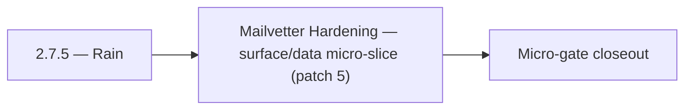

# 2.7.5 — Rain

- **Era:** `2.x` Email system — hub [`versions.md`](../versions.md) · minors start at [`2.0 — Email Foundation`](2.0%20%E2%80%94%20Email%20Foundation.md)
- **Minor:** [2.7 — Mailvetter Hardening](./2.7 — Mailvetter Hardening.md)
- **Codename:** Rain
- **Status:** planned

## Focus
Mailvetter Hardening — surface/data micro-slice (patch 5)

## Flowchart

## Micro-gate

| Track | Gate question | Answer / Evidence (fill at patch closeout) |
| --- | --- | --- |
| **Contract** | GraphQL email/jobs/upload or Lambda/Mailvetter REST changed? Diff vs `docs/backend/apis/`; bulk job idempotency? | Document at patch closeout. |
| **Service** | Finder/verifier/bulk stream smoke; provider routing + error envelopes unchanged or versioned? | Document smoke paths. |
| **Surface** | Email Studio, bulk job UI, or `/email` mailbox changed? Loading/error/progress contracts? | Document UX delta or N/A. |
| **Frontend** | Which routes/hooks must change for this patch? | Verifier progress + failed states vs jobs UI. Document at closeout. |
| **Data** | `email_finder_cache`, patterns, job rows, Mailvetter store, S3 artifacts — migrations + lineage? | Document migrations/lineage or N/A. |
| **Ops** | Multipart/queue alerts, rollback/runbook delta for email-impacting releases? | Document ops delta or N/A. |

## Tasks
### Surface
- 📌 Planned: Design `EmailRiskBadge` component spec: shows risk score as colored badge (green/yellow/red) on contact email field.
- `docs/frontend/contact-ai-ui-bindings.md`
- 📌 Planned: Ensure progress bars consume `processed/total/percentage` consistently.
- 📌 Planned: Dashboard contacts row: "Needs email enrichment" badge on SN-sourced contacts without email

### Data
- 📌 Planned: Migrations run in **deploy pipeline** only.
- 📌 Planned: Risk analysis result is transient (not persisted); document this in data lineage.
- 📌 Planned: Confirm `email` field is passed through correctly from SN lead card extraction

## Service task slices
> Merged from era task packs and analysis docs for this domain.

- Confirm contract and runtime slices are mapped to the parent minor objective.
- Attach service-level smoke evidence and known waivers in patch closeout.

## Evidence gate
Patch closeout includes contract diff, smoke output, data lineage delta, and ops note
