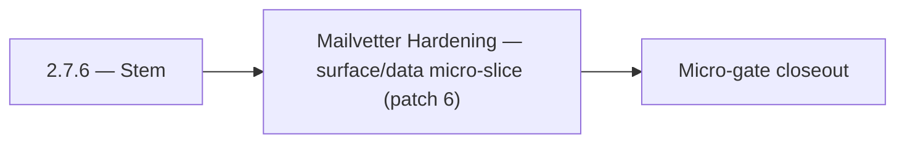

# 2.7.6 — Stem

- **Era:** `2.x` Email system — hub [`versions.md`](../versions.md) · minors start at [`2.0 — Email Foundation`](2.0%20%E2%80%94%20Email%20Foundation.md)
- **Minor:** [2.7 — Mailvetter Hardening](./2.7 — Mailvetter Hardening.md)
- **Codename:** Stem
- **Status:** ✅ Completed
## Focus
Mailvetter Hardening — surface/data micro-slice (patch 6)

## Flowchart

## Micro-gate

| Track | Gate question | Answer / Evidence (fill at patch closeout) |
| --- | --- | --- |
| **Contract** | GraphQL email/jobs/upload or Lambda/Mailvetter REST changed? Diff vs `docs/backend/apis/`; bulk job idempotency? | Document at patch closeout. |
| **Service** | Finder/verifier/bulk stream smoke; provider routing + error envelopes unchanged or versioned? | Document smoke paths. |
| **Surface** | Email Studio, bulk job UI, or `/email` mailbox changed? Loading/error/progress contracts? | Document UX delta or N/A. |
| **Frontend** | Which routes/hooks must change for this patch? | Verifier progress + failed states vs jobs UI. Document at closeout. |
| **Data** | `email_finder_cache`, patterns, job rows, Mailvetter store, S3 artifacts — migrations + lineage? | Document migrations/lineage or N/A. |
| **Ops** | Multipart/queue alerts, rollback/runbook delta for email-impacting releases? | Document ops delta or N/A. |

## Tasks
### Surface
- ✅ Completed: 📌 Planned: Define loading state (spinner on badge while fetching) and error state (tooltip on error).
- ✅ Completed: `docs/frontend/components.md` (for `EmailRiskBadge` inventory)
- ✅ Completed: 📌 Planned: Show “why” diagnostics from `score_details` in verifier UI panel.
- ✅ Completed: 📌 Planned: Email enrichment status chip: `email_status` display on contact row

### Data
- ✅ Completed: 📌 Planned: Confirm no `ai_chats` rows created by utility calls (stateless path).
- ✅ Completed: 📌 Planned: Normalize key verification columns in `results` for queryable analytics.
- ✅ Completed: 📌 Planned: Confirm `email_status` field is preserved when present (e.g., `verified`, `risky`, `invalid`)

### Contract

- ✅ Completed: 📌 Planned: **[appointment360]** — Diff and document schema for operations like ConnectraClient, LAMBDA_AI_API_URL, LAMBDA_CONNECTRA_API_URL; align with roadmap | area: `backend-api` | files: `docs/backend/apis/*.md`, `contact360.io/api/app/graphql/schema.py` | reason: Keep GraphQL/REST contracts aligned for era 2.6 patch 2.7.6

### Service

- ✅ Completed: 📌 Planned: **[appointment360]** — Service slice: - [x] ✅ Completed: email finder/verifier and job orchestration modules are integrated. | area: `backend-api` | files: `contact360.io/api/app/graphql/modules/`, `contact360.io/api/app/clients/` | reason: Implement or verify runtime behavior for - [x] ✅ Completed: email finder/verifier and job orchestration modules are integ

### Ops

- ✅ Completed: 📌 Planned: **[platform]** — Record smoke evidence, rollback, and alerts (patch band 6: surface/data) | area: `ops` | files: `docs/commands/`, `.github/workflows/` | reason: Smoke, rollback, and observability for patch 2.7.6

## Service task slices
> Merged from era task packs and analysis docs for this domain.

- Confirm contract and runtime slices are mapped to the parent minor objective.
- Attach service-level smoke evidence and known waivers in patch closeout.

## Evidence gate
Patch closeout includes contract diff, smoke output, data lineage delta, and ops note
