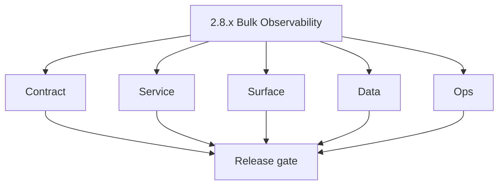
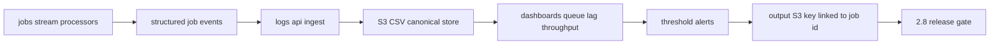

# Version 2.8 — Bulk Observability

- **Status:** planned  
- **Codename:** Bulk Observability  
- **Era:** 2.x (Contact360 email system)  
- **Roadmap:** **`logs.api` 2.x** — email workflow and bulk telemetry at scale; complements **`jobs` 2.x** processors  
- **Summary:** Make **bulk email jobs** measurable: emit structured **job events**, ingest into **logs.api** (S3 CSV lineage), build **queue lag** and **processor throughput** dashboards, tie **S3 output** keys to job id for support.  
- **Patch closure:** Every codenamed patch file includes **Micro-gate** + **Service task slices**. Era hub: [`versions.md`](../versions.md).

## Scope

- **Target:** `2.8.x` patches — observability only; avoid behavior change unless fixing broken metrics.  
- **In scope:** Event schema, dashboards, alert thresholds.  
- **Out of scope:** Credit reconciliation ( **`2.9`** ).  
- **Owners:** Platform + SRE.

## Flowchart

### Runtime focus (unique to this minor)

## Task tracks

### Contract

- 📌 Planned: Freeze **event types** for `email.job.started`, `email.job.progress`, `email.job.completed`, `email.job.failed` — **Service task slices** in `2.8.P` patch files (scope from former `logsapi-email-system-task-pack.md`).  
- 📌 Planned: Query API filters for admin/support.

### Service

- 📌 Planned: Jobs processors emit **consistent** `job_id`, `user_uuid`, `processor`, `checkpoint`.  
- 📌 Planned: logs.api **auth** for internal consumers only.

### Surface

- 📌 Planned: Admin or internal Grafana **dashboards** linked from runbook.

### Data

- 📌 Planned: Retention and **PII** redaction rules for CSV payloads.  
- 📌 Planned: Partition strategy for high volume.

### Ops

- 📌 Planned: On-call runbook: interpret metrics for stuck bulk job.

## Task Breakdown

| Slice | Outcome |
| --- | --- |
| jobs | Instrumentation |
| logs.api | Ingest + store |
| Ops | Dashboards + alerts |

## Immediate next execution queue

- 📌 Planned: Sample query: top failing jobs last 24h.  
- 📌 Planned: Cardinality review (avoid unbounded labels).

## Cross-service ownership

| Service | Focus |
| --- | --- |
| `contact360.io/jobs` | Emit events |
| `lambda/logs.api` | Store/query |
| Observability | Dashboards |

## Codebase file targets (Bulk Observability)

Grounded in:
- `docs/codebases/jobs-codebase-analysis.md`
- `docs/codebases/logsapi-codebase-analysis.md` (canonical store is S3 CSV)

| Slice | Primary codebases | Start files | What must be true by 2.8 calibrate |
| --- | --- | --- | --- |
| Event emission | `contact360.io/jobs` | processors + `job_events` writes | Events include `job_id`, `processor`, `processed/total`, `checkpoint`, `output_s3_key` |
| Ingest + storage | `lambda/logs.api` | `app/services/log_service.py`, `app/models/log_repository.py` | Writes are queryable in SLA windows |
| Query filters | `lambda/logs.api` | query endpoints | Filters by `user_uuid`, `job_id`, `request_id`, time window |
| Dashboards/runbooks | Ops tooling | Grafana/admin | Runbook links exist and are current |

## Canonical store note (avoid docs drift)

logs.api stores events in **S3 CSV** (the codebase analysis explicitly flags drift where some docs describe MongoDB). Treat docs parity as a gate during `2.8.x`.

## References

- [`docs/codebases/logsapi-codebase-analysis.md`](../codebases/logsapi-codebase-analysis.md)  
- **Service task slices** in `2.8.P` patch files (scope from former `logsapi-email-system-task-pack.md`)  
- **Service task slices** in `2.8.P` patch files (scope from former `jobs-email-system-task-pack.md`)

## Backend API and Endpoint Scope

- logs.api **write** from jobs/workers; **read** for admin tools.

## Database and Data Lineage Scope

- S3 CSV paths; optional index in PG for recent events.

## Frontend UX Surface Scope

- Internal dashboards only unless exposed in admin app.

## UI Elements Checklist

- 📌 Planned: Job timeline in support tool (if any)  
- 📌 Planned: N/A for end-user app

## Flow / Graph Delta for This Minor

- **Delta:** Adds **closed-loop visibility** for `2.4` bulk spine.

## Audit and Compliance Notes

- Logs must not contain **raw CSV rows** without policy; mask emails where required.

## Patch ladder (`2.8.0` – `2.8.9`)

### Micro-gate reference (apply at every `2.N.P`)

| Track | Gate question (must answer Yes or document waiver) |
| --- | --- |
| **Contract** | GraphQL email/jobs/upload or Lambda/Mailvetter REST changed? Diff vs `docs/backend/apis/`; bulk job idempotency documented? |
| **Service** | Finder/verifier/bulk paths still smoke; provider routing + error envelopes OK or versioned? |
| **Surface** | Email Studio, bulk job UI, or `/email` mailbox changed? Loading/error/progress contracts? |
| **Frontend** | Which routes/hooks apply (see **Frontend UX Surface Scope** / checklist in minor)? |
| **Data** | `email_finder_cache`, patterns, jobs, Mailvetter, S3 artifacts — migrations + lineage? |
| **Ops** | Multipart/queue durability, alerts, rollback/runbook delta for email releases? |

**Patch intent bands:** `.0` charter · `.1`–`.3` core path · `.4`–`.6` hardening · `.7`–`.8` integration · `.9` minor freeze / handoff.

Theme: **Lens** — codenames in per-patch `2.8.P — *.md` files.

| Patch | Codename | Contract | Service | Surface | Data | Ops |
| --- | --- | --- | --- | --- | --- | --- |
| `2.8.0` | Measure | Metrics definitions frozen | Emit baseline events | N/A | S3 CSV partitions created | Baseline dashboards |
| `2.8.1` | Trace | Trace/request propagation frozen | request_id/trace_id emitted | Debug drilldown | Correlation fields stored | Query recipes |
| `2.8.2` | Log | Event schema v1 frozen | Ingest stable | Admin/support views (if any) | Retention/query window specified | Cost monitoring |
| `2.8.3` | Aggregate | Rollup definitions frozen | Aggregation jobs | KPI cards | Rollups stored | Alerting inputs |
| `2.8.4` | Dashboard | Dashboard contract frozen | Data sources stable | Grafana/admin boards | Partitioning verified | Links in runbook |
| `2.8.5` | Threshold | SLO thresholds frozen | SLO computed | Degraded banner (optional) | Error budget stored | Threshold alarms |
| `2.8.6` | Alert | Pager policy frozen | Alerts firing correctly | N/A | Alert events stored | On-call drill |
| `2.8.7` | Report | Weekly report format frozen | Report generated | Admin download | Report artifact stored | Weekly cadence |
| `2.8.8` | Archive | Archive policy frozen | Lifecycle policies applied | “Archived telemetry” UX | Cold storage keys | Retrieval runbook |
| `2.8.9` | Calibrate | Final schema freeze | Regression suite green | N/A | Docs parity verified | Final sign-off |

## Release Gate and Evidence

### Master Task Checklist

- 📌 Planned: Dashboard links in runbook

### Backend API and Endpoints

- 📌 Planned: Ingest smoke test

### Database and Data Lineage

- 📌 Planned: Retention doc

### Frontend UX

- 📌 Planned: N/A or admin URL

### UI Elements

- 📌 Planned: Checklist above

### Flow and Graph

- 📌 Planned: Runtime Mermaid reviewed

### Validation

- 📌 Planned: Synthetic job generates visible trail

### Release Gate

- 📌 Planned: Sign-off for **`2.9` Email Credit & Audit Maturity**

## Patches

| Patch | Codename | Doc |
| --- | --- | --- |
| `2.8.0` | Void | [`2.8.0` — Void](2.8.0 — Void.md) |
| `2.8.1` | Seed | [`2.8.1` — Seed](2.8.1 — Seed.md) |
| `2.8.2` | Sprout | [`2.8.2` — Sprout](2.8.2 — Sprout.md) |
| `2.8.3` | Roots | [`2.8.3` — Roots](2.8.3 — Roots.md) |
| `2.8.4` | Soil | [`2.8.4` — Soil](2.8.4 — Soil.md) |
| `2.8.5` | Rain | [`2.8.5` — Rain](2.8.5 — Rain.md) |
| `2.8.6` | Stem | [`2.8.6` — Stem](2.8.6 — Stem.md) |
| `2.8.7` | Branch | [`2.8.7` — Branch](2.8.7 — Branch.md) |
| `2.8.8` | Leaf | [`2.8.8` — Leaf](2.8.8 — Leaf.md) |
| `2.8.9` | Bloom | [`2.8.9` — Bloom](2.8.9 — Bloom.md) |
