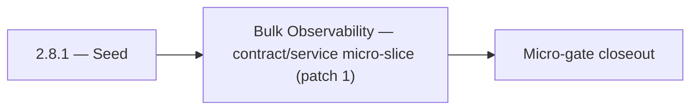

# 2.8.1 — Seed

- **Era:** `2.x` Email system — hub [`versions.md`](../versions.md) · minors start at [`2.0 — Email Foundation`](2.0%20%E2%80%94%20Email%20Foundation.md)
- **Minor:** [2.8 — Bulk Observability](./2.8 — Bulk Observability.md)
- **Codename:** Seed
- **Status:** ✅ Completed
## Focus
Bulk Observability — contract/service micro-slice (patch 1)

## Flowchart

## Micro-gate

| Track | Gate question | Answer / Evidence (fill at patch closeout) |
| --- | --- | --- |
| **Contract** | GraphQL email/jobs/upload or Lambda/Mailvetter REST changed? Diff vs `docs/backend/apis/`; bulk job idempotency? | Document at patch closeout. |
| **Service** | Finder/verifier/bulk stream smoke; provider routing + error envelopes unchanged or versioned? | Document smoke paths. |
| **Surface** | Email Studio, bulk job UI, or `/email` mailbox changed? Loading/error/progress contracts? | Document UX delta or N/A. |
| **Frontend** | Which routes/hooks must change for this patch? | Telemetry timelines if enabled — `logsapi` bindings. Document at closeout. |
| **Data** | `email_finder_cache`, patterns, job rows, Mailvetter store, S3 artifacts — migrations + lineage? | Document migrations/lineage or N/A. |
| **Ops** | Multipart/queue alerts, rollback/runbook delta for email-impacting releases? | Document ops delta or N/A. |

## Tasks
### Contract
- ✅ Completed: 📌 Planned: Query API filters for admin/support.
- ✅ Completed: 📌 Planned: Align `AnalyzeEmailRiskInput` in GraphQL schema (`17_AI_CHATS_MODULE.md`) with REST schema.
- ✅ Completed: 📌 Planned: Freeze v1 endpoints: `POST /v1/emails/validate`, `POST /v1/emails/validate-bulk`, `GET /v1/jobs/:job_id`, `GET /v1/jobs/:job_id/results`.
- ✅ Completed: 📌 Planned: Freeze multipart lifecycle API contract: `initiate`, presigned **part URL**, `register` part, `complete`, `abort`.

### Service
- ✅ Completed: 📌 Planned: logs.api **auth** for internal consumers only.
- ✅ Completed: 📌 Planned: Add fallback to Gemini if HF JSON task fails for email risk analysis.
- ✅ Completed: 📌 Planned: Add explicit `failed` job status path for partial/system failures.
- ✅ Completed: 📌 Planned: **Bulk failure recovery:** client retry strategy, server-side cleanup of abandoned multipart sessions.

### Surface

- ✅ Completed: 📌 Planned: **[emailapis]** — Verify UX for route `/email` and bindings (patch 2.8.1 band 1) | area: `frontend-page` | files: `contact360.io/app/...` | reason: Dashboard/extension surface for era 2 must match gateway contracts

### Data

- ✅ Completed: 📌 Planned: **[appointment360]** — Update PostgreSQL/ES/S3 lineage notes if this patch touches persistence or exports | area: `data-lineage` | files: `docs/backend/database/`, `migrations/` | reason: Migrations, indexes, and lineage evidence for this patch

### Ops

- ✅ Completed: 📌 Planned: **[platform]** — Record smoke evidence, rollback, and alerts (patch band 1: charter/P0) | area: `ops` | files: `docs/commands/`, `.github/workflows/` | reason: Smoke, rollback, and observability for patch 2.8.1

## Service task slices
> Merged from era `2.x` email system task packs (P0→`.0`–`.2`, P1→`.3`–`.6`, Ops→`.7`–`.9`).

### logs.api
- Define and freeze era **`2.x`** logging schema additions and compatibility notes.
- Update endpoint/reference matrix: `docs/backend/endpoints/logsapi_endpoint_era_matrix.json`.
- Document **query filters** for support/admin: by `user_uuid`, `job_id`, `request_id`, time window.
- Implement/validate service behavior for era **`2.x`** event sources (jobs processors, gateway, Lambdas) and query expectations.
- Verify auth, error envelope, and health behavior for consuming services (**internal** consumers only unless explicitly exposed).
- Document **S3 CSV** storage and lineage impact for era **`2.x`** (canonical store pattern).
- Record **retention**, **trace IDs**, and **query-window** expectations.

### Jobs
- Freeze contracts for `email_finder_export_stream`, `email_verify_export_stream`, and `email_pattern_import_stream` (inputs, outputs, terminal states).
- Keep endpoint and **status semantics** aligned with UI progress expectations (percent, processed/total, failure counts).
- Document **checkpoint** fields: byte offset or row cursor, idempotent resume rules.
- Define **`job_node.data`** metadata for **`2.x` billing alignment**: `user_uuid`, `billing.correlation_id`, optional `credit_estimate`, `rows_total` — see `version_2.9`.
- **Retry policy:** which failures are worker-retriable vs terminal; no duplicate credit charge on successful retry (coordinate with gateway).
- Validate stream processor behavior for **large CSV** inputs (memory bounds, backpressure).
- Enforce **retry and checkpoint** semantics for email flows; kill/restart worker test passes.
- Concurrency targets per roadmap: finder stream **3**, verifier stream **5** (tune via config; document).
- Batch calls to `emailapis` / `emailapigo` / Mailvetter with **bounded concurrency** and backoff.
- Document input/output **CSV lineage** and error envelopes in `job_response` / job store.
- Record **checkpoint-byte** and **processed-row** meaning for email workflows.

## Evidence gate
Patch closeout includes contract diff, smoke output, data lineage delta, and ops note
