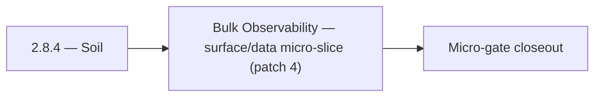

# 2.8.4 — Soil

- **Era:** `2.x` Email system — hub [`versions.md`](../versions.md) · minors start at [`2.0 — Email Foundation`](2.0%20%E2%80%94%20Email%20Foundation.md)
- **Minor:** [2.8 — Bulk Observability](./2.8 — Bulk Observability.md)
- **Codename:** Soil
- **Status:** planned

## Focus
Bulk Observability — surface/data micro-slice (patch 4)

## Flowchart

## Micro-gate

| Track | Gate question | Answer / Evidence (fill at patch closeout) |
| --- | --- | --- |
| **Contract** | GraphQL email/jobs/upload or Lambda/Mailvetter REST changed? Diff vs `docs/backend/apis/`; bulk job idempotency? | Document at patch closeout. |
| **Service** | Finder/verifier/bulk stream smoke; provider routing + error envelopes unchanged or versioned? | Document smoke paths. |
| **Surface** | Email Studio, bulk job UI, or `/email` mailbox changed? Loading/error/progress contracts? | Document UX delta or N/A. |
| **Frontend** | Which routes/hooks must change for this patch? | Telemetry timelines if enabled — `logsapi` bindings. Document at closeout. |
| **Data** | `email_finder_cache`, patterns, job rows, Mailvetter store, S3 artifacts — migrations + lineage? | Document migrations/lineage or N/A. |
| **Ops** | Multipart/queue alerts, rollback/runbook delta for email-impacting releases? | Document ops delta or N/A. |

## Tasks
### Surface
- 📌 Planned: Admin or internal Grafana **dashboards** linked from runbook.
- 📌 Planned: Add `useEmailRisk(email)` hook stub to dashboard (disabled until `5.x` full rollout).
- 📌 Planned: Map `/email` dashboard verifier tab to v1 contract fields.
- 📌 Planned: Extension popup: show "Email missing — will be found" indicator per profile if `email` is absent

### Data
- 📌 Planned: Retention and **PII** redaction rules for CSV payloads.
- 📌 Planned: Document in `contact_ai_data_lineage.md`: email PII is passed to HF API; review HF data retention policy.
- 📌 Planned: Add job events timeline table (queued, started, completed, failed, retried).
- 📌 Planned: Define: contacts inserted with `email=null` should be eligible for email finder pipeline

## Service task slices
> Merged from era `2.x` email system task packs (P0→`.0`–`.2`, P1→`.3`–`.6`, Ops→`.7`–`.9`).

### logs.api
- Document impacted admin/support pages (if any) for era **`2.x`**.
- Document relevant hooks/services/contexts and UX states (loading/error/progress).
- Document **S3 CSV** storage and lineage impact for era **`2.x`** (canonical store pattern).
- Record **retention**, **trace IDs**, and **query-window** expectations.
- **Bulk scale:** partitioning, file rollover size, and max events/sec assumptions; cardinality limits on labels for metrics export.
- Implement/validate service behavior for era **`2.x`** event sources (jobs processors, gateway, Lambdas) and query expectations.
- Verify auth, error envelope, and health behavior for consuming services (**internal** consumers only unless explicitly exposed).

### Jobs
- Document email **bulk** pages using job status, timeline, and retry controls.
- Cover mapping checkboxes/radio controls and **progress bar** states (match Mailvetter/job percent contract).
- Document input/output **CSV lineage** and error envelopes in `job_response` / job store.
- Record **checkpoint-byte** and **processed-row** meaning for email workflows.
- Link **output S3 key** to `job_id` for support (see `logsapi` pack).
- Validate stream processor behavior for **large CSV** inputs (memory bounds, backpressure).
- Enforce **retry and checkpoint** semantics for email flows; kill/restart worker test passes.
- Concurrency targets per roadmap: finder stream **3**, verifier stream **5** (tune via config; document).
- Batch calls to `emailapis` / `emailapigo` / Mailvetter with **bounded concurrency** and backoff.

## Evidence gate
Patch closeout includes contract diff, smoke output, data lineage delta, and ops note
