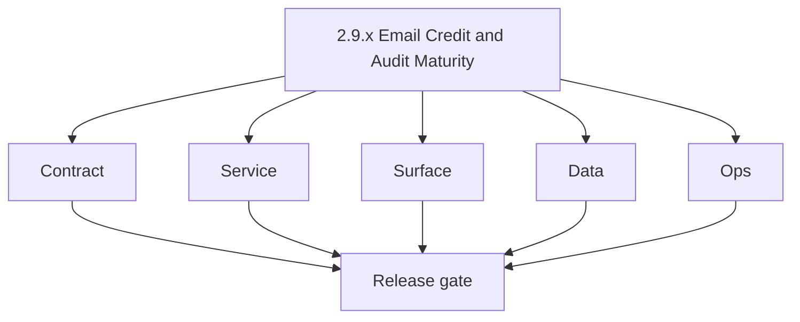
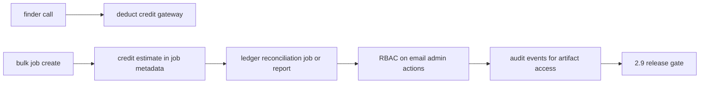

# Version 2.9 — Email Credit & Audit Maturity

- **Status:** ✅ Completed
- **Codename:** Email Credit & Audit Maturity
- **Era:** 2.x (Contact360 email system)
- **Roadmap:** Cross-cutting — aligns **1.x** billing/credit discipline with **2.x** email usage (finder per call, bulk estimates)
- **Summary:** **Reconcile** credit deduction with usage ledger for email features; tighten **RBAC** on email mutations; govern **PII in CSV** uploads and outputs; ensure **audit** events for admin/support access to email artifacts.
- **Patch closure:** Every codenamed patch file includes **Micro-gate** + **Service task slices**. Era hub: [`versions.md`](../versions.md).

## Scope

- **Target:** `2.9.x` patches — policy + enforcement, not new email algorithms.
- **In scope:** Gateway rules, job metadata for credits, audit log categories.
- **Out of scope:** Payment automation ( **`1.x`** minors).
- **Owners:** Platform + Compliance.

## Flowchart

### Runtime focus (unique to this minor)

## Task tracks

### Contract

- ✅ Completed: 📌 Planned: **[appointment360]** — refine duplicate task (was: 📌 planned: **[appointment360]** — refine duplicate task (was…) | patch `2.9.0` band `0` | reason: specialize this file vs sibling patches; see docs/codebases/appointment360-codebase-analysis.md
- ✅ Completed: 📌 Planned: **[appointment360]** — refine duplicate task (was: ✅ completed: 📌 planned: **job create** accepts `credit_estim…) | patch `2.9.0` band `0` | reason: specialize this file vs sibling patches; see docs/codebases/appointment360-codebase-analysis.md

- ✅ Completed: 📌 Planned: **[appointment360]** — refine duplicate task (was: 📌 planned: **[architecture]** — product **graphql** remains …) | patch `2.9.0` band `0` | reason: specialize this file vs sibling patches; see docs/codebases/appointment360-codebase-analysis.md
### Service

- ✅ Completed: 📌 Planned: **[appointment360]** — refine duplicate task (was: 📌 planned: **[appointment360]** — refine duplicate task (was…) | patch `2.9.0` band `0` | reason: specialize this file vs sibling patches; see docs/codebases/appointment360-codebase-analysis.md
- ✅ Completed: 📌 Planned: **[appointment360]** — refine duplicate task (was: ✅ completed: 📌 planned: idempotent credit charge on **retry*…) | patch `2.9.0` band `0` | reason: specialize this file vs sibling patches; see docs/codebases/appointment360-codebase-analysis.md

- ✅ Completed: 📌 Planned: **[appointment360]** — refine duplicate task (was: 📌 planned: **[architecture]** — **go/gin satellites** in sco…) | patch `2.9.0` band `0` | reason: specialize this file vs sibling patches; see docs/codebases/appointment360-codebase-analysis.md
### Surface

- ✅ Completed: 📌 Planned: **[appointment360]** — refine duplicate task (was: ✅ completed: 📌 planned: app shows **estimated** bulk cost be…) | patch `2.9.0` band `0` | reason: specialize this file vs sibling patches; see docs/codebases/appointment360-codebase-analysis.md

- ✅ Completed: 📌 Planned: **[appointment360]** — refine duplicate task (was: 📌 planned: **[architecture]** — **next.js** customer surface…) | patch `2.9.0` band `0` | reason: specialize this file vs sibling patches; see docs/codebases/appointment360-codebase-analysis.md
### Data

- ✅ Completed: 📌 Planned: **[appointment360]** — refine duplicate task (was: ✅ completed: 📌 planned: reconciliation query: usage vs s3 ro…) | patch `2.9.0` band `0` | reason: specialize this file vs sibling patches; see docs/codebases/appointment360-codebase-analysis.md
- ✅ Completed: 📌 Planned: **[appointment360]** — refine duplicate task (was: ✅ completed: 📌 planned: pii tagging on buckets used for emai…) | patch `2.9.0` band `0` | reason: specialize this file vs sibling patches; see docs/codebases/appointment360-codebase-analysis.md

- ✅ Completed: 📌 Planned: **[appointment360]** — refine duplicate task (was: 📌 planned: **[architecture]** — **postgresql-first** per `do…) | patch `2.9.0` band `0` | reason: specialize this file vs sibling patches; see docs/codebases/appointment360-codebase-analysis.md
- ✅ Completed: 📌 Planned: **[appointment360]** — refine duplicate task (was: 📌 planned: **[architecture]** — **redis exit**: campaign (as…) | patch `2.9.0` band `0` | reason: specialize this file vs sibling patches; see docs/codebases/appointment360-codebase-analysis.md
### Ops

- ✅ Completed: 📌 Planned: **[appointment360]** — refine duplicate task (was: ✅ completed: 📌 planned: weekly reconciliation report or note…) | patch `2.9.0` band `0` | reason: specialize this file vs sibling patches; see docs/codebases/appointment360-codebase-analysis.md

- ✅ Completed: 📌 Planned: **[appointment360]** — refine duplicate task (was: 📌 planned: **[architecture]** — **observability**: correlate…) | patch `2.9.0` band `0` | reason: specialize this file vs sibling patches; see docs/codebases/appointment360-codebase-analysis.md
## Task Breakdown

| Slice | Outcome |
| --- | --- |
| Gateway | Credit rules |
| Jobs | Metadata |
| Compliance | PII + audit |

## Immediate next execution queue

- 📌 Planned: Sample reconciliation for one tenant.
- 📌 Planned: Admin access log review.

## Cross-service ownership

| Service | Focus |
| --- | --- |
| `contact360.io/api` | Credits + RBAC |
| `contact360.io/jobs` | Job metadata |
| `s3storage` | Bucket policy |
| `logs.api` | Audit categories |

## Codebase file targets (Credits + Audit Maturity)

Grounded in `docs/codebases/appointment360-codebase-analysis.md`, `docs/codebases/jobs-codebase-analysis.md`, `docs/codebases/s3storage-codebase-analysis.md`, `docs/codebases/logsapi-codebase-analysis.md`.

| Slice | Primary codebases | Start files | What must be true by 2.9 balance |
| --- | --- | --- | --- |
| Credit rules + enforcement | `contact360.io/api` | billing/usage services + email/jobs modules | Credit is deducted once per operation; retries are idempotent |
| Job metadata for billing | `contact360.io/jobs` | `job_node.data` + processors | `user_uuid`, `billing.correlation_id`, `credit_estimate`, `rows_total` present |
| PII bucket governance | `lambda/s3storage` | storage policy + metadata | Email CSV objects are encrypted, retained per policy, and discoverable for audit |
| Audit event categories | `lambda/logs.api` | schema + query filters | Admin/support access produces queryable audit trail |

## Credit reconciliation flow (implementation-aligned)

Minimum reconciliation artifact for `2.9.x`:

1. Pick one `user_uuid` (or tenant/workspace).
2. Collect:
   - gateway credit deduction events (`email.credit.deduct`)
   - jobs created + processed row counts (`job_node` / `job_events`)
   - output object row counts (S3 metadata/stats if available)
3. Produce a report showing:
   - expected credits vs charged credits
   - mismatches and root cause category (retry/dedup/partial-failure)

This should align with `docs/audit-compliance.md` and `docs/1.x` credit discipline.

## References

- [`docs/versions.md`](../versions.md) — era `1.x` minors/patches under [`docs/1. Contact360 user and billing and credit system/`](../1.%20Contact360%20user%20and%20billing%20and%20credit%20system/)
- [`docs/audit-compliance.md`](../audit-compliance.md)
- **Service task slices** in `2.9.P` patch files (scope from former `jobs-email-system-task-pack.md`)

## Backend API and Endpoint Scope

- GraphQL: email + jobs + usage mutations/queries involved in charging.

## Database and Data Lineage Scope

- Credits, usage, job rows, S3 object metadata.

## Frontend UX Surface Scope

- Pre-flight bulk cost, insufficient credit errors.

## UI Elements Checklist

- 📌 Planned: Estimated credits label
- 📌 Planned: Insufficient credit modal
- 📌 Planned: Admin-only download behind role check

## Flow / Graph Delta for This Minor

- **Delta:** Connects **commercial** controls to **email** volume paths completed in `2.0`–`2.4`.

## Audit and Compliance Notes

- All **admin** downloads of user CSV require **actor + reason** where policy mandates.

## Patch ladder (`2.9.0` – `2.9.9`)

### Micro-gate reference (apply at every `2.N.P`)

| Track | Gate question (must answer Yes or document waiver) |
| --- | --- |
| **Contract** | GraphQL email/jobs/upload or Lambda/Mailvetter REST changed? Diff vs `docs/backend/apis/`; bulk job idempotency documented? |
| **Service** | Finder/verifier/bulk paths still smoke; provider routing + error envelopes OK or versioned? |
| **Surface** | Email Studio, bulk job UI, or `/email` mailbox changed? Loading/error/progress contracts? |
| **Frontend** | Which routes/hooks apply (see **Frontend UX Surface Scope** / checklist in minor)? |
| **Data** | `email_finder_cache`, patterns, jobs, Mailvetter, S3 artifacts — migrations + lineage? |
| **Ops** | Multipart/queue durability, alerts, rollback/runbook delta for email releases? |
| **Architecture** | Go/Gin satellites only via Python GraphQL gateway (`contact360.io/api`); Next.js `NEXT_PUBLIC_GRAPHQL_URL`; Postgres-first / Redis exit per `docs/docs/data-stores-postgres.md`. |

**Patch intent bands:** `.0` charter · `.1`–`.3` core path · `.4`–`.6` hardening · `.7`–`.8` integration · `.9` minor freeze / handoff.

Theme: **Ledger** — codenames in per-patch `2.9.P — *.md` files.

| Patch | Codename | Contract | Service | Surface | Data | Ops |
| --- | --- | --- | --- | --- | --- | --- |
| `2.9.0` | Deduct | Cost constants frozen | Deduct once per operation | Estimated cost UI | Cost fields stored | Anomaly detection |
| `2.9.1` | Record | Credit/audit event schema frozen | Emit credit events | Activity history shows deltas | Events queryable | Alert on spikes |
| `2.9.2` | Reconcile | Reconciliation report format frozen | Reconciliation job/report | Admin view (optional) | Reconciliation artifact stored | Weekly cadence |
| `2.9.3` | Audit | RBAC + audit categories frozen | Role checks enforced | Admin-only controls | Audit fields stored | Access reviews |
| `2.9.4` | Assert | CI assertions frozen | Guardrails enforced | Copy/legal text updated | Policy evidence | CI gate |
| `2.9.5` | Review | Review workflow contract | Manual review tools | Admin review UI | Review logs | Escalation runbook |
| `2.9.6` | Correct | Correction semantics frozen | Refund/adjust tools | Admin correction UI | Correction ledger | Alerting |
| `2.9.7` | Certify | Certification checklist frozen | Completeness checks | Audit timeline view | Completeness report | Certification gate |
| `2.9.8` | Export | Export format frozen | Export generation | Download audit report | Stored in S3 | Secure TTL |
| `2.9.9` | Balance | Freeze for exit gate | Regression suite green | UI stable | Retention enforced | Final sign-off |

## Release Gate and Evidence

### Master Task Checklist

- 📌 Planned: Reconciliation artifact attached

### Backend API and Endpoints

- 📌 Planned: Credit block tests

### Database and Data Lineage

- 📌 Planned: PII policy link

### Frontend UX

- 📌 Planned: Bulk estimate screenshot

### UI Elements

- 📌 Planned: Checklist above

### Flow and Graph

- 📌 Planned: Runtime Mermaid reviewed

### Validation

- 📌 Planned: No double charge on forced retry

### Release Gate

- 📌 Planned: Sign-off for **`2.10` Email System Exit Gate**

## Patches

| Patch | Codename | Doc |
| --- | --- | --- |
| `2.9.0` | Void | [`2.9.0` — Void](2.9.0 — Void.md) |
| `2.9.1` | Seed | [`2.9.1` — Seed](2.9.1 — Seed.md) |
| `2.9.2` | Sprout | [`2.9.2` — Sprout](2.9.2 — Sprout.md) |
| `2.9.3` | Roots | [`2.9.3` — Roots](2.9.3 — Roots.md) |
| `2.9.4` | Soil | [`2.9.4` — Soil](2.9.4 — Soil.md) |
| `2.9.5` | Rain | [`2.9.5` — Rain](2.9.5 — Rain.md) |
| `2.9.6` | Stem | [`2.9.6` — Stem](2.9.6 — Stem.md) |
| `2.9.7` | Branch | [`2.9.7` — Branch](2.9.7 — Branch.md) |
| `2.9.8` | Leaf | [`2.9.8` — Leaf](2.9.8 — Leaf.md) |
| `2.9.9` | Bloom | [`2.9.9` — Bloom](2.9.9 — Bloom.md) |
