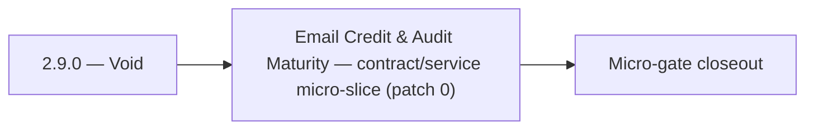

# 2.9.0 — Void

- **Era:** `2.x` Email system — hub [`versions.md`](../versions.md) · minors start at [`2.0 — Email Foundation`](2.0%20%E2%80%94%20Email%20Foundation.md)
- **Minor:** [2.9 — Email Credit & Audit Maturity](./2.9 — Email Credit & Audit Maturity.md)
- **Codename:** Void
- **Status:** planned

## Focus
Email Credit & Audit Maturity — contract/service micro-slice (patch 0)

## Flowchart

## Micro-gate

| Track | Gate question | Answer / Evidence (fill at patch closeout) |
| --- | --- | --- |
| **Contract** | GraphQL email/jobs/upload or Lambda/Mailvetter REST changed? Diff vs `docs/backend/apis/`; bulk job idempotency? | Document at patch closeout. |
| **Service** | Finder/verifier/bulk stream smoke; provider routing + error envelopes unchanged or versioned? | Document smoke paths. |
| **Surface** | Email Studio, bulk job UI, or `/email` mailbox changed? Loading/error/progress contracts? | Document UX delta or N/A. |
| **Frontend** | Which routes/hooks must change for this patch? | Credit + audit indicators; role-gated controls. Document at closeout. |
| **Data** | `email_finder_cache`, patterns, job rows, Mailvetter store, S3 artifacts — migrations + lineage? | Document migrations/lineage or N/A. |
| **Ops** | Multipart/queue alerts, rollback/runbook delta for email-impacting releases? | Document ops delta or N/A. |

## Tasks
### Contract
- 📌 Planned: Document **credit cost** per finder row vs verify row vs bulk row — gateway constants.
- Response: `{"risk_score": <0-100>, "analysis": "<string>", "is_role_based": <bool>, "is_disposable": <bool>}`
- 📌 Planned: Add/verify a mapping shim at the gateway boundary so `AnalyzeEmailRiskInput.model` invokes the intended HF model.
- 📌 Planned: Freeze webhook callback payload contract.

### Service
- 📌 Planned: Block bulk start when **insufficient** credits (consistent with `1.x`).
- 📌 Planned: Validate HF API response against `EmailRiskAnalysisResponse` schema; handle malformed JSON from LLM.
- 📌 Planned: Harden bulk job path: dedupe, plan checks, queueing, worker updates.
- 📌 Planned: Harden **missing-part** and **duplicate-registration** failure handling.

## Service task slices
> Merged from era `2.x` email system task packs (P0→`.0`–`.2`, P1→`.3`–`.6`, Ops→`.7`–`.9`).

### Appointment360 (gateway)
- Define EmailQuery { findEmails, findEmailsBulk, verifySingleEmail, verifyEmailsBulk } types
- Define EmailMutation { addEmailPattern, addEmailPatternBulk }
- Define JobQuery { job(jobId), jobs(limit,offset,status,jobType) }
- Define JobMutation { createEmailFinderExport, createEmailVerifyExport, createEmailPatternImport, retryJob }
- Define shared SchedulerJob GraphQL type with status, timeline, dag, result_url
- Define EmailFinderInput, EmailVerifierInput, BulkEmailInput, EmailPatternInput types
- Implement LambdaEmailClient in app/clients/lambda_email_client.py
- Wire findEmails query → LambdaEmailClient.find_single(email_input)
- Wire findEmailsBulk query → LambdaEmailClient.find_bulk(...)
- Wire verifySingleEmail query → LambdaEmailClient.verify_single(...)
- Wire verifyEmailsBulk query → LambdaEmailClient.verify_bulk(...)
- Wire addEmailPattern mutation → LambdaEmailClient.add_pattern(...)
- Implement TkdjobClient in app/clients/tkdjob_client.py
- Wire createEmailFinderExport mutation → TkdjobClient.create_email_export(...)
- Wire createEmailVerifyExport mutation → TkdjobClient.create_email_verify(...)
- Wire createEmailPatternImport mutation → TkdjobClient.create_email_pattern_import(...)
- Wire job(jobId) query → TkdjobClient.get_job_status(job_id)
- Wire jobs() query → TkdjobClient.list_jobs(...)
- Remove inline debug file writes from email/queries.py and jobs/mutations.py
- Add credit deduction: deduct per email find/verify operation
- /email page, Finder tab → query findEmails / query findEmailsBulk binding
- /email page, Verifier tab → query verifySingleEmail / query verifyEmailsBulk binding
- CSV upload on Email Verifier/Finder → mutation createEmailFinderExport / createEmailVerifyExport
- Jobs list table on /email → query jobs(jobType:"email_export") binding
- Job status progress bar → polling query job(jobId) every 2s
- useEmailFinderSingle hook: call findEmails, show spinner while pending
- useEmailFinderBulk hook: upload CSV, create export job, poll status
- useEmailVerifierSingle hook: call verifySingleEmail
- useJobStatus hook: polling wrapper for query job(jobId)
- Record activity on email export creation: write to activities table
- Track credit consumption per email finder/verifier call
- Ensure tkdjob job_id is stored if job is deferred (for polling)
- Configure LAMBDA_EMAIL_API_URL and LAMBDA_EMAIL_API_KEY in .env.example
- Configure TKDJOB_API_URL and TKDJOB_API_KEY in .env.example

### logs.api
- Define and freeze era **`2.x`** logging schema additions and compatibility notes.
- Update endpoint/reference matrix: `docs/backend/endpoints/logsapi_endpoint_era_matrix.json`.
- Document **query filters** for support/admin: by `user_uuid`, `job_id`, `request_id`, time window.
- Implement/validate service behavior for era **`2.x`** event sources (jobs processors, gateway, Lambdas) and query expectations.
- Verify auth, error envelope, and health behavior for consuming services (**internal** consumers only unless explicitly exposed).
- Document **S3 CSV** storage and lineage impact for era **`2.x`** (canonical store pattern).
- Record **retention**, **trace IDs**, and **query-window** expectations.

## Evidence gate
Primary charter artifact created and linked in the parent minor doc
