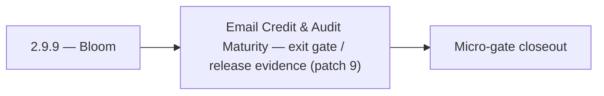

# 2.9.9 — Bloom

- **Era:** `2.x` Email system — hub [`versions.md`](../versions.md) · minors start at [`2.0 — Email Foundation`](2.0%20%E2%80%94%20Email%20Foundation.md)
- **Minor:** [2.9 — Email Credit & Audit Maturity](./2.9 — Email Credit & Audit Maturity.md)
- **Codename:** Bloom
- **Status:** planned

## Focus
Email Credit & Audit Maturity — exit gate / release evidence (patch 9)

## Flowchart

## Micro-gate

| Track | Gate question | Answer / Evidence (fill at patch closeout) |
| --- | --- | --- |
| **Contract** | GraphQL email/jobs/upload or Lambda/Mailvetter REST changed? Diff vs `docs/backend/apis/`; bulk job idempotency? | Document at patch closeout. |
| **Service** | Finder/verifier/bulk stream smoke; provider routing + error envelopes unchanged or versioned? | Document smoke paths. |
| **Surface** | Email Studio, bulk job UI, or `/email` mailbox changed? Loading/error/progress contracts? | Document UX delta or N/A. |
| **Frontend** | Which routes/hooks must change for this patch? | Credit + audit indicators; role-gated controls. Document at closeout. |
| **Data** | `email_finder_cache`, patterns, job rows, Mailvetter store, S3 artifacts — migrations + lineage? | Document migrations/lineage or N/A. |
| **Ops** | Multipart/queue alerts, rollback/runbook delta for email-impacting releases? | Document ops delta or N/A. |

## Tasks
### Ops
- 📌 Planned: Add test: `save-profiles` with contacts that have `email` → verify `email` written to Connectra
- 📌 Planned: Add test: `save-profiles` with contacts that lack `email` → verify null written (not PLACEHOLDER)
- 📌 Planned: Monitor: downstream email API errors due to malformed SN email data
- `docs/codebases/salesnavigator-codebase-analysis.md`
- `docs/backend/apis/SALESNAVIGATOR_ERA_TASK_PACKS.md`
- `docs/backend/database/salesnavigator_data_lineage.md`

## Service task slices
> Merged from era `2.x` email system task packs (P0→`.0`–`.2`, P1→`.3`–`.6`, Ops→`.7`–`.9`).

### Appointment360 (gateway)
- Add Postman environment variables for Lambda Email + tkdjob
- Write integration test: findEmails round-trip with mocked LambdaEmailClient
- Write integration test: createEmailFinderExport → poll job(jobId) → status = done

### logs.api
- Add observability checks and release validation evidence for era **`2.x`**.
- Capture rollback and incident-runbook notes for logging-impacting releases.
- Dashboards: **queue lag**, **processor throughput**, **error rate by processor** (tie to `version_2.8`).

## Evidence gate
Micro-gate table filled and handoff note to `2.10.0` recorded
