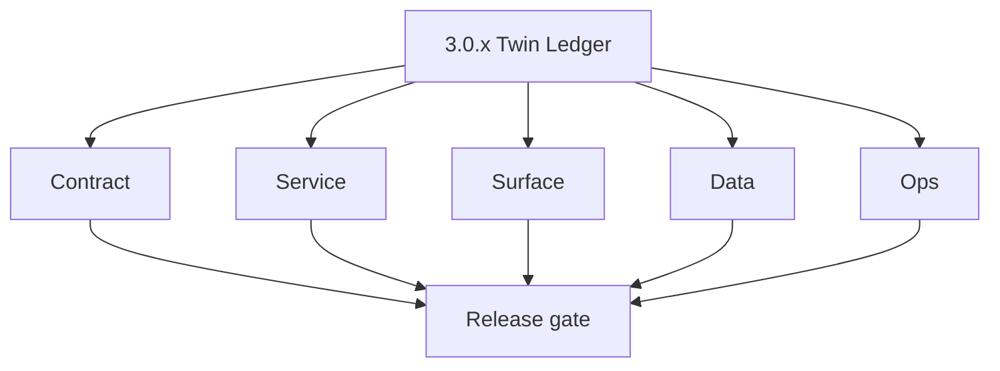
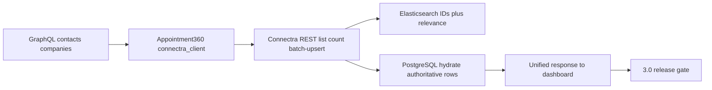

# Version 3.0 — Twin Ledger

- **Status:** planned  
- **Codename:** Twin Ledger  
- **Era:** 3.x (Contact360 contact and company data system)  
- **Roadmap:** Foundation for **3.x** — authoritative **PostgreSQL + Elasticsearch** plane for contacts/companies; first-party read/write paths before deep VQL and UX polish.  
- **Summary:** **Dual-store bootstrap**: healthy Connectra indices and tables, `batch-upsert` and **two-phase read** (`ListByFilters` / `CountByFilters`) proven end-to-end; Appointment360 **contacts** and **companies** GraphQL modules wired to Connectra via `connectra_client` with baseline `vql_converter` and mappers (full correctness in **`3.1`** / **`3.2`**).  
- **Patch closure:** Every codenamed patch file includes **Micro-gate** + **Service task slices**. Era hub: [`versions.md`](../versions.md).

## Scope

- **Target:** `3.0.x` patches — infrastructure + horizontal spine, not extension/SN primary era (**`4.x`**).  
- **Out of scope:** Sales Navigator mapper depth (**`3.6`**); full drift automation (**`3.7`**); per-tenant rate-limit model (**`3.9`**).  
- **Owners:** Connectra + Platform API + Dashboard (read-only smoke).

## Flowchart

### Runtime focus (unique to this minor)

## Task tracks

### Contract

- 📌 Planned: Freeze baseline REST surface per [`connectra-service.md`](connectra-service.md): `POST /contacts/`, `POST /contacts/count`, `POST /contacts/batch-upsert`, company equivalents, `GET /health`.  
- 📌 Planned: GraphQL module boundaries for contacts/companies documented in [`docs/backend/apis/03_CONTACTS_MODULE.md`](../backend/apis/03_CONTACTS_MODULE.md) and [`04_COMPANIES_MODULE.md`](../backend/apis/04_COMPANIES_MODULE.md).

### Service

- 📌 Planned: Connectra: index bootstrap/mapping scripts validated; `BulkUpsertToDb` happy path for representative contact + company fixtures.  
- 📌 Planned: Appointment360: `ConnectraClient` methods for list, count, batch-upsert, filters stub or minimal implementation with timeouts configured (`CONNECTRA_*` env).
- ⬜ Incomplete: **`extension/contact360` — dedup race condition**: `save_service.py` `deduplicate_profiles` keeps highest completeness-score profile, but if two browser tabs are scraping simultaneously and both call `/v1/save-profiles`, the same contact may be upserted twice before dedup can run; add idempotency key (`X-Idempotency-Key`) to `POST /v1/save-profiles` to make Connectra upsert idempotent.
- 📌 Planned: **`extension/contact360` — company UUID stability**: `generate_company_uuid` uses company name + URL via UUID5; test what happens when company URL changes (LinkedIn vanity URL rename) — document whether UUID changes or is preserved.
- 📌 Planned: **`extension/contact360` — contact provenance fields**: ensure `source=sales_navigator`, `lead_id`, `search_id`, `connection_degree`, `data_quality_score` are populated in all payloads sent to Connectra's `bulk_upsert_contacts`.
- ⬜ Incomplete: **`contact360.io/sync` (Connectra) — no `source` field in contacts schema**: the `contacts` PG table (`db/postgres/001_baseline.sql`) has no `source` column; when records arrive via CSV import vs Sales Navigator vs API the origin is indistinguishable; add `source TEXT` column (e.g. `sales_navigator`, `csv_import`, `api`) and populate in `PgContactFromRowData`.
- ⬜ Incomplete: **`contact360.io/sync` (Connectra) — SN provenance fields absent from schema**: `lead_id`, `search_id`, `connection_degree`, `data_quality_score` are sent by the SN salesnavigator Lambda but are NOT present in the `contacts` table or `contact.pgsql.go` struct; add these columns to `001_baseline.sql` and model, and populate from raw row data.
- ⬜ Incomplete: **`contact360.io/sync` (Connectra) — `uploadURLTTL` hardcoded**: `uploadController.go` declares `const uploadURLTTL = 24 * time.Hour` and ignores `conf.S3StorageConfig.S3UploadURLTTL`; replace with `time.Duration(conf.S3StorageConfig.S3UploadURLTTL) * time.Hour`.
- 📌 Planned: **`contact360.io/sync` (Connectra) — no migration tool**: `db/postgres/001_baseline.sql` is manually applied; add `golang-migrate` or `goose` with versioned migration files so schema changes are tracked, reproducible, and rollback-safe.
- 📌 Planned: **`contact360.io/sync` (Connectra) — cursor-based pagination**: `contactService.ListByFilters` populates `cursors` map from ES hits but the API response does not include cursor/sort-after values; surface cursor in `ContactResponse` and expose `next_cursor` in `POST /contacts/` response for seamless pagination.
- 📌 Planned: **`contact360.io/sync` (Connectra) — audit trail for data changes**: add `created_by TEXT` and `updated_by TEXT` columns to `contacts` and `companies` tables (populated with actor identity from `X-API-Key` or request context) for compliance and lineage tracking.

### Surface

- 📌 Planned: Dashboard smoke: `/contacts` and `/companies` load with empty or seed dataset (see [`dashboard-search-ux.md`](dashboard-search-ux.md)).
- 📌 Planned: **`app`:** `ContactsDataTable` component with bulk selection, inline actions, and export (Pro+ gated).
- 📌 Planned: **`app`:** `CompaniesDataTable` with company profile drilldown.
- 📌 Planned: **`app`:** `VQLQueryBuilder` component (if VQL ready in 3.0, otherwise stub for 3.1 delivery).
- 📌 Planned: **Frontend references:** [`contacts_page.json`](../frontend/pages/contacts_page.json), [`companies_page.json`](../frontend/pages/companies_page.json).

### Data

- 📌 Planned: UUID5 rules understood and documented — [`enrichment-dedup.md`](enrichment-dedup.md).  
- 📌 Planned: `filters` / `filters_data` tables present for facet bootstrap if filter sidebar is enabled.

### Ops

- 📌 Planned: Health checks and alarms for Connectra + API dependency chain.  
- 📌 Planned: Document dev/prod URLs in [`docs/architecture.md`](../architecture.md) if not already.
- ✅ Completed: **contact360.io/jobs** — `contact360_import_prepare` processor streams CSV from S3, batches rows via `Contact360ImportBatchService`, writes contacts to Connectra PG + ES in configurable batches (`CONTACT360_IMPORT_PG_BATCH_SIZE`, `CONTACT360_IMPORT_ES_BULK_SIZE`).
- ✅ Completed: **contact360.io/jobs** — `contact360_export_stream` processor queries OpenSearch via VQL (BQL), pages through results using `CONTACT360_EXPORT_PAGE_SIZE`/`CONTACT360_EXPORT_SLICE_COUNT`, streams records to S3 CSV.
- ⬜ Incomplete: **contact360.io/jobs** — `contact360_export_stream` processor uses OpenSearch scroll/slice pagination; if the export job fails mid-way, the OpenSearch scroll context is leaked and never cleaned up — add explicit scroll context expiry (`scroll_id` tracking in `job_response`) and a cleanup step in the failure handler.
- ⬜ Incomplete: **contact360.io/jobs** — `contact360_import_prepare` processor hardcodes `BATCH_SIZE = 500` at module level ignoring `CONTACT360_IMPORT_PG_BATCH_SIZE` from `Settings`; replace the module-level constant with `settings.CONTACT360_IMPORT_PG_BATCH_SIZE` to allow runtime configuration.
- 📌 Planned: **contact360.io/jobs** — add `contact360_dedup_stream` processor to identify and resolve duplicate contacts within a workspace using UUID5 collision detection and configurable merge strategy (keep-highest-completeness); schedule as a nightly job via the scheduler.
- ✅ Completed: **contact360.io/app (Dashboard)** — Contacts page fully implemented: `app/(dashboard)/contacts/page.tsx` with VQL query builder (lazy-loaded), contacts filters sidebar, data table with view mode toggle (grid/list), bulk selection, pagination, export modal, import CSV modal, bulk insert modal, and saved searches modal.
- ✅ Completed: **contact360.io/app (Dashboard)** — Companies page fully implemented: `app/(dashboard)/companies/page.tsx` with filter sidebar, data display with grid/list view toggle, add company modal, import company modal, export modal, and pagination.
- ✅ Completed: **contact360.io/app (Dashboard)** — `contactsService.ts` implements full VQL query interface with `VQLQueryInput` (filters, select_columns, company_config, pagination, order_by, search_after) mapping to GraphQL variables; `VQLQueryBuilder` component provides a visual interface for building VQL filter trees.
- ⬜ Incomplete: **contact360.io/app (Dashboard)** — `contactsService.ts` comments explicitly state "Do NOT call updateContact, deleteContact per API constraints" — contacts and companies cannot be edited or deleted from the UI; if this constraint is intentional (append-only ledger model), document it in the UI with a tooltip or note; if it is a temporary API limitation, track the unlock in the era docs.
- ⬜ Incomplete: **contact360.io/app (Dashboard)** — `useContactExport` and `useCompanyExport` hooks trigger a bulk export job via `contactsService.exportContacts` but the download is gated by `Feature.BULK_EXPORT` (Pro users only); free users who select contacts see no clear upgrade prompt explaining why export is disabled — add a feature gate tooltip/modal linking to the billing page.
- 📌 Planned: **contact360.io/app (Dashboard)** — implement saved search sharing: `useSavedSearches` hook allows users to save and load VQL filter sets per user, but there is no UI to share a saved search across team members; add a "Copy link" or "Share with team" action to the saved searches modal.

## Task breakdown

| Slice | Outcome |
| --- | --- |
| Connectra | Indices + core APIs alive |
| Appointment360 | GraphQL → Connectra round-trip |
| App | Minimal list/count visible |

## Immediate next execution queue

- 📌 Planned: E2E: create contact via `batch-upsert` → list by uuid filter → count sanity.  
- 📌 Planned: E2E: company same path.  
- 📌 Planned: Archive one **HAR** or scripted proof for release notes.

## Cross-service ownership

| Service | Focus |
| --- | --- |
| `contact360.io/sync` | PG+ES dual write + read |
| `contact360.io/api` | Modules + client |
| `contact360.io/app` | Smoke routes |

## References

- [`docs/codebases/connectra-codebase-analysis.md`](../codebases/connectra-codebase-analysis.md)  
- [`docs/codebases/appointment360-codebase-analysis.md`](../codebases/appointment360-codebase-analysis.md)  
- **Service task slices** in `3.0.P` patch files (scope from former `connectra-contact-company-task-pack.md`)

Frontend components and hooks (3.0 baseline):

- **Components:** `ContactsDataTable`, `CompaniesDataTable`, `VQLQueryBuilder` (stub), `ContactProfileCard`, `CompanyProfileCard`
- **Hooks:** `useContacts`, `useCompanies`, `useContactFilters`, `useVQLQuery`, `contactsService`
- **Context:** `ContactsFilterContext` (active filter state for the data table)

## Backend API and endpoint scope

Connectra REST table in `connectra-service.md`; GraphQL operations per contacts/COMPANIES module docs.

## Database and data lineage scope

Contacts/companies PG tables + ES indexes; optional `filters_data` derivation after first upserts.

## Frontend UX surface scope

Contacts/companies pages shell and table placeholder or seed data — full UX in **`3.4`**.

## Patch ladder (`3.0.0` – `3.0.9`)

### Micro-gate reference (apply at every `3.N.P`)

| Track | Gate question (must answer Yes or document waiver) |
| --- | --- |
| **Contract** | GraphQL, Connectra REST, or VQL changed? `docs/backend/apis/` + endpoint matrices updated? |
| **Service** | List/count/batch-upsert and gateway paths still smoke; idempotency documented? |
| **Surface** | Dashboard contacts/companies or related admin UX changed? |
| **Frontend** | Which routes/hooks apply (see minor UX scope / `dashboard-search-ux.md`)? |
| **Data** | PG+ES lineage, enrichment/dedup, job artifacts — docs + migrations? |
| **Ops** | Queues, drift tooling, logs PII rules, runbooks — delta recorded? |

**Patch intent bands (universal ladder):** `.0` Charter · `.1` Connectra · `.2` Gateway · `.3` Dashboard · `.4` Jobs/S3 · `.5` Satellite · `.6` Observability · `.7` Hardening · `.8` Evidence · `.9` Gate / handoff.

Theme: **Bootstrap** — codenames in per-patch `3.0.P — *.md` files.

| Patch | Codename | Focus |
| --- | --- | --- |
| `3.0.0` | Charter | Contract freeze for baseline REST + GraphQL ownership |
| `3.0.1` | Connectra | Index mapping + list/count smoke |
| `3.0.2` | Gateway | `connectra_client` + env wiring |
| `3.0.3` | Dashboard | Route smoke `/contacts`, `/companies` |
| `3.0.4` | Jobs / S3 | `n/a` or presign upload only if import stub exists |
| `3.0.5` | Satellite | `n/a` — defer enrichers |
| `3.0.6` | Observability | Baseline health logs |
| `3.0.7` | Hardening | Timeouts, error envelopes on Connectra errors |
| `3.0.8` | Evidence | Postman/seed script for batch-upsert |
| `3.0.9` | Gate | Sign-off → handoff **`3.1` VQL Engine** |

## Release gate and evidence

### Master task checklist

- 📌 Planned: Twin Ledger DoD: dual-store read/write proof attached

### Backend API and endpoints

- 📌 Planned: `connectra-service.md` matches deployed routes

### Database and data lineage

- 📌 Planned: Enrichment/dedup doc reviewed for this release

### Frontend UX

- 📌 Planned: Smoke recording or ticket link

### Validation

- 📌 Planned: At least one list + count + batch-upsert flow green

### Release gate

- 📌 Planned: Approve start of **`3.1`**

## Patches

| Patch | Codename | Doc |
| --- | --- | --- |
| `3.0.0` | Charter | [`3.0.0` — Charter](3.0.0 — Charter.md) |
| `3.0.1` | Connectra | [`3.0.1` — Connectra](3.0.1 — Connectra.md) |
| `3.0.2` | Gateway | [`3.0.2` — Gateway](3.0.2 — Gateway.md) |
| `3.0.3` | Dashboard | [`3.0.3` — Dashboard](3.0.3 — Dashboard.md) |
| `3.0.4` | Jobs - S3 | [`3.0.4` — Jobs - S3](3.0.4 — Jobs - S3.md) |
| `3.0.5` | Satellite | [`3.0.5` — Satellite](3.0.5 — Satellite.md) |
| `3.0.6` | Observability | [`3.0.6` — Observability](3.0.6 — Observability.md) |
| `3.0.7` | Hardening | [`3.0.7` — Hardening](3.0.7 — Hardening.md) |
| `3.0.8` | Evidence | [`3.0.8` — Evidence](3.0.8 — Evidence.md) |
| `3.0.9` | Gate | [`3.0.9` — Gate](3.0.9 — Gate.md) |

## Release Gate and Evidence

### Master Task Checklist
- 📌 Planned: Track-level closure evidence linked

### Backend API and Endpoints
- 📌 Planned: Endpoint/contract parity verified
- ✅ Completed: **contact360.io/api** — `app/graphql/modules/contacts/` and `app/graphql/modules/companies/` modules fully implemented: `createContact`, `updateContact`, `batchCreateContacts`, `createCompany`, `updateCompany` mutations + `contact`, `contacts` (VQL), `company`, `companies` (VQL), `contactFilterData`, `companyFilterData` queries all routed through `ConnectraClient`.
- ✅ Completed: **contact360.io/api** — `app/graphql/modules/saved_searches/` implements `createSavedSearch`, `updateSavedSearch`, `deleteSavedSearch` mutations + `savedSearches`, `savedSearch` queries backed by `SavedSearchRepository`.
- ✅ Completed: **contact360.io/api** — Jobs module `createContact360Export` and `createContact360Import` mutations trigger tkdjob for bulk contact export/import workflows via `TkdjobClient`.
- ✅ Completed: **contact360.io/api** — `app/utils/vql_converter.py` implements `convert_to_vql()` and `build_where_clause()` to transform GraphQL filter inputs into Connectra VQL format.
- ⬜ Incomplete: **contact360.io/api** — `contacts/mutations.py` `createContact` docstring says "This is a placeholder - actual implementation would create contact in database or via Connectra" — the mutation calls `create_connectra_entity()` but there is no write-back confirmation that the contact is persisted on the Connectra side; verify Connectra's POST endpoint accepts the payload and returns a UUID.
- 📌 Planned: **contact360.io/api** — `app/graphql/modules/relationships/` module exists but needs review — verify relationship types (contact-company, contact-contact) are queryable and mutations are wired.
- 📌 Planned: **contact360.io/api** — `app/graphql/modules/imports/` and `app/graphql/modules/exports/` modules exist — verify they expose top-level `ImportMutation` / `ExportMutation` resolvers distinct from the `jobs/` module or document that jobs is the canonical path.

### Database and Data Lineage
- 📌 Planned: Migration and lineage references linked

### Frontend UX
- 📌 Planned: UX/route behavior evidence linked

### UI Elements
- 📌 Planned: Components/checklist closeout captured

### Flow and Graph
- 📌 Planned: Runtime graph reflects implementation

### Validation
- 📌 Planned: Smoke/CI/lint checks recorded

### Release Gate
- 📌 Planned: Minor ready for handoff to next minor
